# IDA的使用

根据程序的位数选择对应位数的 IDA 打开程序。（附件是 64 位的
一般没有特殊需求，我们直接默认点击 OK 就好了

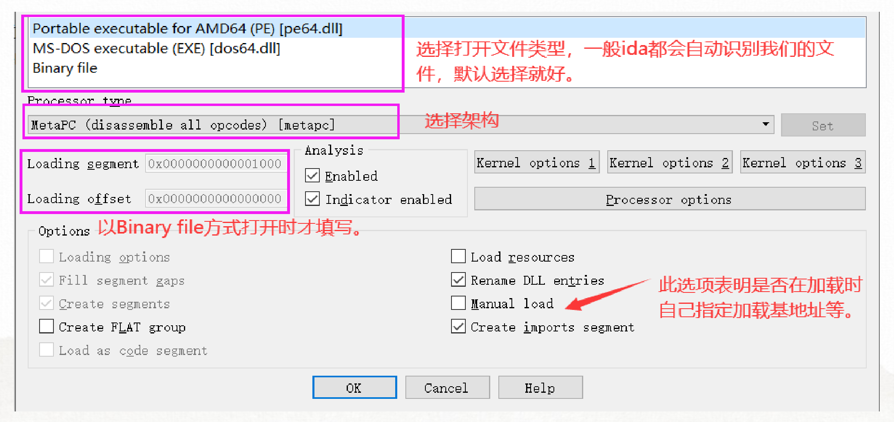

在 functions windows里面找到main

然后在右边的窗口里按 F5 就可以跳出反汇编窗口

> buuctf-easyre

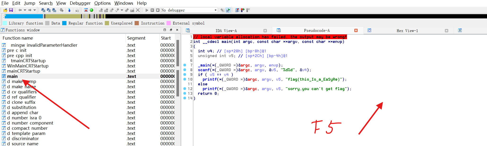

https://blog.csdn.net/weixin_45723661/category_11348511.html

### IDA 功能界面介绍


\- 蓝色 : `.text section`
\- 深蓝 : 用户写的函数编译后的代码区
\- 浅蓝 : 编译器自己添加的函数，像启动函数，异常函数等等 ..
\- 粉红色 : `.idata section`
有关输入表的一些数据信息
\- 军绿色： `.rdata section`
纯数据，只读
\- 灰色 : 为了段对齐而留下的空隙
\- 黑色 : 禁区

#### 汇编代码界面注释

`shift + ;`

伪代码注释

`/`

* G跳转
* N改名

#### imports

程序从动态链接库中导入的要使用的函数

#### exports

程序导出给其它程序使用的函数

### 字符串窗口

`shift + F12`

双击字符串找到位置

在DATA XREF里面可以找到谁访问了这个地址

> buuctf-reverse_1

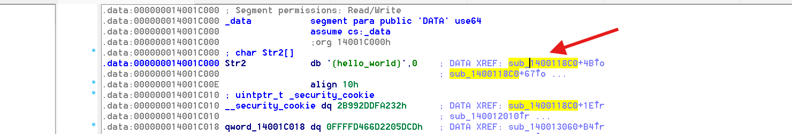

在数字上按R可以转换成字符

#### 这个是带换行的

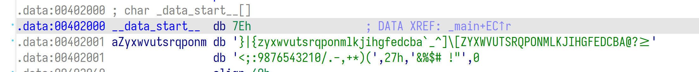

* 按A转换成字符串
* D 转换成数据
* C 转换成汇编代码
* U 转换成原始字节

### export data

shift + E 可以导出

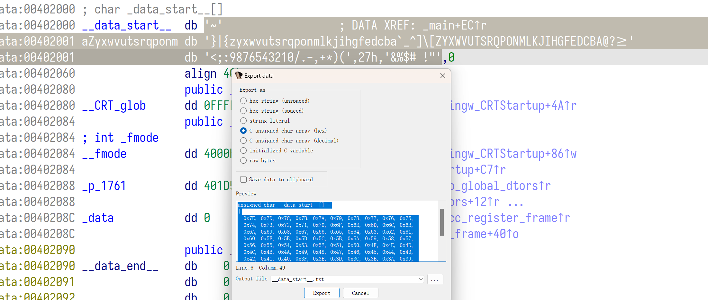

TODO: 

总结 SimpleRev

### 调整基地址

Edit 里面 Segment 里面 Rebase Program, 然后输入基地址就可以和 x64dbg 地址对齐

#### 跳转地址

按 G 跳转


## Linux 调试

使用windows下面的ida pro 调试Linux下面的程序需要使用ida的远程调试功能。
首先将ida文件夹中的dbgsrv/linux_serverx64文件放入需要调试程序的同级文件夹中。再使用chmod a+x linux_serverx64 改变该文件的权限。

把要调试的文件也要+x运行权限

然后连接

再application和inputfile里填入要调试的**绝对路径** ，host里面填ip地址，密码不用填，然后就可以了

> buuctf-level3

下断点进调试看 base64数组被改变的值


### RSA

> buuctf - signin

``` cpp
  __gmpz_init_set_str(v7, "ad939ff59f6e70bcbfad406f2494993757eee98b91bc244184a377520d06fc35", 16LL);
  __gmpz_init_set_str(v6, v9, 16LL);
  __gmpz_init_set_str(v4, "103461035900816914121390101299049044413950405173712170434161686539878160984549", 10LL);
  __gmpz_init_set_str(v5, "65537", 10LL);
```

看到这些整数可能是RSA `E=65537, N = 1034....` 

`__gmpz_init_set_str`这是一个 GNU 高精度算法库

这三个参数分别是多精度整数变量，字符串，进制 

`__gmpz_powm(v6, v6, v5, v4) `这个的意思其实就是 计算v6的v5次方并对v4取模，结果写入v6。

10346103590081691412139010129904904441395040517371217043416168653

http://www.factordb.com/index.php 这个可以查质数分解


整数到bytes

``` python
print(unhexlify(hex(M)[2:]))
# si = int.from_bytes(s) # byte to int
# rsa.transform.int2bytes(c) # alternative
```

题解

``` python
import math
from Crypto.Util.number import inverse
from binascii import unhexlify

e = 65537
n = 103461035900816914121390101299049044413950405173712170434161686539878160984549
p = 282164587459512124844245113950593348271
q = 366669102002966856876605669837014229419
c = 0xad939ff59f6e70bcbfad406f2494993757eee98b91bc244184a377520d06fc35

d = inverse(e, math.lcm(p-1,q-1))

M = pow(c, d, n)
print(rsa.transform.int2bytes(M))	
# 或者
decrypted = rsa.PrivateKey(n,e,d,p,q).blinded_decrypt(c)
print(rsa.transform.int2bytes(decrypted))
```

从 key 文件里面读取

``` python
from Crypto.PublicKey import RSA

f = open("pub.key", "rb")
pkdata = f.read()
pk = RSA.import_key(pkdata)

n = pk.n
e = pk.e
print(n)
print(e)
```


## 壳

用 exeinfope 可以看有没有壳， 或者用file指令

### UPX

> buuctf-新年快乐

可以看出来是UPX的壳

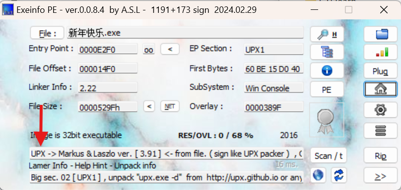

file指令会有

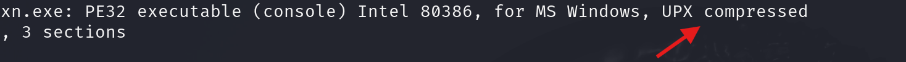

解壳

``` shell
upx -d xx.exe
```


# 安卓/JAVA

jdk安装https://www.oracle.com/java/technologies/downloads/#jdk22-windows

### jadx

安装https://github.com/skylot/jadx/releases/tag/v1.5.0

可以打开文件, 把 APK 传进去，在左边可以看到源代码

打开windows gui的那个


# IOS逆向

https://www.i4.cn/

装爱思助手

越狱，要制作启动盘

https://www.bilibili.com/video/BV1or421G7vo/?spm_id_from=333.788.videopod.sections&vd_source=2c1227d0a7d29725db75d3fc52e6089b


### Frida

``` shell
pip install frida-tools
```


### Ghigra


#### x64dbg

gitbub 上有

# Unity

> BUUCTF [BJDCTF2020]BJD hamburger competition 

第一次接触 Unity的逆向题
这种关键代码一般都在 `assembly-csharp.dll` 里面，加载到dnspy里面，左边点开可以看到源代码


# Python

``` shell
pip install uncompyle6
```

用这个命令

用online 的比较好https://www.lddgo.net/en/string/pyc-compile-decompile

# GO

https://github.com/sibears/IDAGolangHelper

可以装这个插件


# 代码分析

> buuctf lucky guy

``` cpp
((((unsigned int)((unsigned __int64)j >> 32) >> 31) + (_BYTE)j) & 1
  - ((unsigned int)((unsigned __int64)j >> 32) >> 31) == 1
```

等价于

`j % 2 == 1`

### 复用代码解密

> buuctf 刮开有奖

这里面的函数IDA会判断错误，需要改正, 类型改了代码也要记得改

#### 答案在其他函数里

> buuctf [2019红帽杯]easyRE

往main的下面找找

## 花指令

有时候IDA反编译不了，这个时候要改指令，通常是jnz指令

> buuctf Maze


如何nop:

1. `Edit/Patch program/Change byte`将要修改的byte改成90，修改完后`Edit/Patch program/Apply patches to input file`保存修改后的文件，
2. 或者`Edit/Patch program/Assemble`直接输入`nop`，然后同样要保存


#### 把报错的函数编译一下

> [MRCTF2020]Xor

把报错的函数点进去反编译一下，然后再回来编译就可以了

### 数据类型判断

``` cpp
__int64 v6[6];
for ( i = 0; i <= 5; ++i )
  {
    printf("%s", "input: ");
    a2 = (char **)((char *)v6 + 4 * i);
    __isoc99_scanf("%d", a2);
  }
```

这个v6应该是 4byte, 因为 `(char *)v6 + 4 * i)` 是4字节


## 加密算法

### TEA加密

``` cpp
v3 = *a1;
v4 = a1[1];
v5 = 0;
for ( i = 0; i <= 0x3F; ++i )
{
    v5 += 1166789954;
    v3 += (v4 + v5 + 11) ^ ((v4 << 6) + *a2) ^ ((v4 >> 9) + a2[1]) ^ 0x20;
    v4 += (v3 + v5 + 20) ^ ((v3 << 6) + a2[2]) ^ ((v3 >> 9) + a2[3]) ^ 0x10;
}
*a1 = v3;
result = v4;
a1[1] = v4;
return result;
```

解密

``` cpp
unsigned int a[6] = {0xDF48EF7E,550153460, 3774025685, 1548802262, 2652626477,0x84F30420};
unsigned int table[4] = {2,2,3,4};
unsigned int decoded[6];
for (int j = 0;j < 6; j += 2) {
    int v5 = 0x458BCD42 * 64;
    unsigned int v3 = a[j], v4 = a[j+1];
    for (int i = 0;i <= 63; ++i) {
        v4 -= (v3 + v5 + 20) ^ ((v3 << 6) + table[2]) ^ ((v3 >> 9) + table[3]) ^ 0x10;
        v3 -= (v4 + v5 + 11) ^ ((v4 << 6) + table[0]) ^ ((v4 >> 9) + table[1]) ^ 0x20;
        v5 -= 0x458BCD42;
    }
    decoded[j] = v3;
    decoded[j+1] = v4;
}
```

要把v3，v4的类型写对，否则计算结果不对


### 解方程z3

``` shell
pip install z3-solver
```

> buuctf [ACTF新生赛2020]Universe_final_answer


### MD5

``` python
from Crypto.Hash.MD5 import MD5Hash
from binascii import hexlify
token = "1001"
print(hexlify(MD5Hash(token.encode()).digest())[:20].upper())
```


## init 函数修改

https://www.cnblogs.com/NozoMizo/articles/17737745.html


# Windows API

### FindResourceA

> buuctf CrackRTF

``` c
hResInfo = FindResourceA(0, (LPCSTR)0x65, "AAA");
if (!hResInfo)
    return 0;
```

`FindResourceA` 函数用于查找一个指定的资源。

- 第一个参数是模块句柄，这里为 `0`，表示当前模块。
- 第二个参数 `(LPCSTR)0x65` 是资源的标识符（ID），这里使用的是资源ID `0x65`。
- 第三个参数 `"AAA"` 是资源的类型名称。

如果 `FindResourceA` 返回 `NULL`，则表示资源没有找到，函数立即返回 `0`。

**用 Resource Hacker 可以提取 exe 的资源**

`SizeofResource` 获取指定资源的大小，结果赋值给 `nNumberOfBytesToWrite`，表示将要写入的字节数

### LoadResource

`LoadResource` 函数将资源加载到内存中，返回资源的句柄 `hResData`。

如果加载失败，返回 `NULL`，函数返回 `0`。

#### LockResource

``` c
lpBuffer = LockResource(hResData);
```

`LockResource` 锁定资源并返回一个指向资源数据的指针 `lpBuffer`。通过这个指针可以访问资源内容

### CreateFile

``` c
hFile = CreateFileA("dbapp.rtf", 0x10000000u, 0, 0, 2u, 0x80u, 0);
if (hFile == (HANDLE)-1)
    return 0;
```

`CreateFileA` 用于创建或打开文件，这里试图创建一个名为 `"dbapp.rtf"` 的文件。

- `0x10000000u`：`GENERIC_WRITE`，表示文件以写入模式打开。
- `0` 和 `0`：表示不使用文件共享和默认安全属性。
- `2u`：`CREATE_ALWAYS`，表示总是创建文件，即使文件已经存在也会覆盖。
- `0x80u`：`FILE_ATTRIBUTE_NORMAL`，表示文件的普通属性。

如果文件创建失败，返回 `(HANDLE)-1`，函数返回 `0`。

### WriteFile

``` cpp
if (!WriteFile(hFile, lpBuffer, nNumberOfBytesToWrite, &NumberOfBytesWritten, 0))
    return 0;
```

`WriteFile` 将 `lpBuffer` 中的数据写入到文件 `hFile`，写入的字节数为 `nNumberOfBytesToWrite`。

`&NumberOfBytesWritten` 用于接收实际写入的字节数。

如果 `WriteFile` 失败，函数返回 `0`。

## 多线程

> buuctf Youngter-drive
>
> `counter = 29` 
>
> 最终加密 `TOiZiZtOrYaToUwPnToBsOaOapsyS` 
>
> 线程1：若counter>-1每次调用对counter位置加密, 并且每次-1
>
> 线程2：若counter>-1 每次 -1
>
> 所以加密基数或者偶数部分
>
> 

CreateMutexW:作用是找出当前系统是否已经存在指定进程的实例.

CreateThread:CreateThread是一种微软在Windows API中提供了建立新的线程的函数，该[函数](https://baike.baidu.com/item/函数/301912?fromModule=lemma_inlink)在[主线程](https://baike.baidu.com/item/主线程/9600138?fromModule=lemma_inlink)的基础上创建一个新线程。[线程](https://baike.baidu.com/item/线程/103101?fromModule=lemma_inlink)终止运行后，线程对象仍然在系统中，必须通过CloseHandle函数来关闭该线程对象。

CloseHandle:关闭一个内核对象。其中包括文件、文件映射、进程、线程、安全和同步对象等。在CreateThread成功之后会返回一个hThread的handle，且内核对象的计数加1，CloseHandle之后，引用计数减1，当变为0时，系统删除内核对象。

WaitForSingleObject:WaitForSingleObject函数用来检测hHandle事件的信号状态，在某一线程中调用该函数时，线程暂时挂起，如果在挂起的dwMilliseconds毫秒内，线程所等待的对象变为有信号状态，则该函数立即返回；如果时间已经到达dwMilliseconds毫秒，但hHandle所指向的对象还没有变成有信号状态，函数照样返回。

在这里就相当于，第一个线程调用该函数，然后这里的WaitForSingleObject函数用来检测之前线程的信号状态，暂时挂起

多线程例子：

``` cpp
#include <iostream>
#include <windows.h>

HANDLE hMutex;

int arr[100];
int last = 0;

DWORD WINAPI thread01(LPVOID lvParameter) {
	for (int i = 0; i < 100; ++i) {
		WaitForSingleObject(hMutex, INFINITE);
		if (last == 100) break;
		arr[last] = 1;
		last++;
		std::cout << "thread 1 work on " << last - 1 << std::endl;
		ReleaseMutex(hMutex);
	}
	return 0;
}

DWORD WINAPI thread02(LPVOID lvParameter) {
	for (int i = 0; i < 100; ++i) {
		WaitForSingleObject(hMutex, INFINITE);
		if (last == 100) break;
		arr[last] = 1;
		last++;
		std::cout << "thread 2 work on " << last - 1 << std::endl;
		ReleaseMutex(hMutex);
	}
	return 0;
}

int main()
{
	hMutex = CreateMutexA(NULL, FALSE, (LPCSTR)"Test");
	if (hMutex == NULL) {
		std::cout << "ERROR" << std::endl;
		return 1;
	}

	HANDLE hTread1 = CreateThread(NULL, 0, thread01, NULL, 0, NULL);
	if (hTread1 == NULL) {
		std::cout << "ERROR" << std::endl;
		return 1;
	}
	
	HANDLE hTread2 = CreateThread(NULL, 0, thread02, NULL, 0, NULL);
	if (hTread2 == NULL) {
		std::cout << "ERROR" << std::endl;
		return 1;
	}

	WaitForSingleObject(hTread1, INFINITE);
	WaitForSingleObject(hTread2, INFINITE);

	
	CloseHandle(hTread1);
	CloseHandle(hTread2);
	
	CloseHandle(hMutex);
	return 0;
}
```

这题里面


# 游戏逆向

### 任务管理器找进程

打开任务管理器

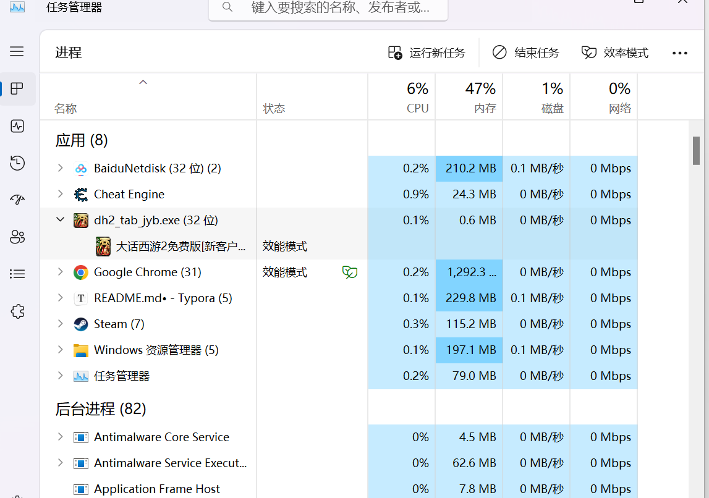

然后右键，转到详细信息就有了


## CE

资源网址:https://wpfx.org/

[CE](D:\Software\Cheat_Engine_7.5\Cheat Engine 7.5)

[ollydbg](‪E:\Tools\OD\OllyICE\OD.exe)

搜字符串的时候把代码页勾上，可以搜出更多

#### 找血量

可以换装备，被怪打

#### 搜byte

可以勾选快速扫描，4字节对齐，这样可以加快速度


#### 天龙八部

TODO: p37

记得启动器里面选32位

`axery123@changyou.com`

`123axery`

`岳朋 男 211481198401154411`

##### 人物状态

rcx + 234

1A34D9946D0 + 234

rcx = rax+80

rax=1A30B1C01D0

Game.exe+593935 

## 汇编指令

#### lea

```
lea eax, dword ptr [ebp-8]
```

把右边的地址复制给左边

#### pushad, popad

把8个寄存器全部push到栈上面

#### rep movs

循环 ecx 次，每次把 esi 地址的内容复制给 edi 地址的内容，然后esi,edi 增加4

### 栈

#### ebp 

栈顶

* $ebp$ 是保持上次的ebp值 $push \ ebp, mov \ ebp, esp$

* $[ebp+4]$ 是回去的地址

* $[ebp+8]$ 是传入的第一个参数

## OllyDBG

[ollydbg](E:\Tools\OD\OllyICE\OD.exe)

汉化包

https://github.com/lennylxx/ollydbg-zh/releases

复制到根目录之后，可以在file里面选择gui language为中文

### 快捷键

* 回车: 进入 call
* F9: 运行
* F8: 步过 把call运行完
* F7: 步入： 运行到call的开头
* `-` 后退
* `+` 前进
* F2：断点
* F4：运行到当前指向的命令
* Ctrl+F9: 执行到返回
* Ctrl+G: 查看地址,APT代码 

### x64dbg

* 再选项里吗可以设置关闭断点

* 带参数调试 ： 文件，改变命令行
* 高亮寄存器：快捷键H，再选项中打开

### 命令

* API断点: `bp MessageBoxA`
* dd输出地址的值  `dd eax`

### 查找字符串

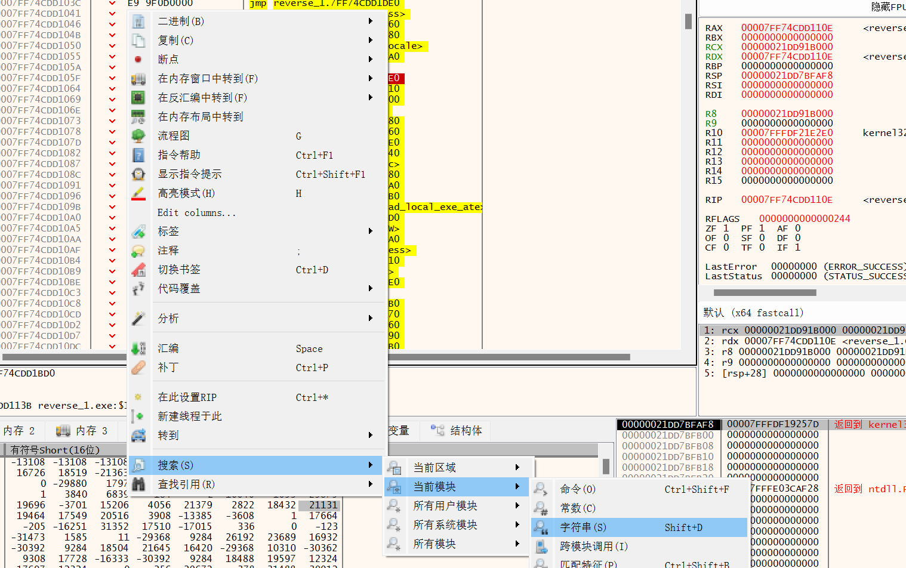


### 附加进程

文件 ,  附加j进程，选择想要的进程

点击三角形让程序运行，

如果卡住了可以按 $T$ , 然后右键 Resume all threads

#### OD界面

$E$ 是模块，选择游戏模块

$C$ 是初始界面

查找注释：

先在E窗口找到主程序，然后右键查找用户定义的注释

#### 跳转

Ctrl+G打开调整，输入内存地址或者 `ws2_32.send`

x64dbg是 `game + 2ECE21` 可以加入基地址

可以跳到这个模块的send函数

### OD断点

右键可以下断点

#### 内存断点

内存访问的时候断

#### 硬件断点

只能4个

可以在内存地址右键，硬件断点，硬件写入，Byte

来查找谁写入了这个位置

#### F2断点

可以下任意多个

#### api断点

`bp ws2_32.send`

#### 条件断点

shift + F2

`[76ad5000]==06aa72a0`


### 发包

#### 发包函数

* send
* sendto
* WSASend
* WSPSend: 在 `ws2_32.WEP` 下面有个 `call esi` 这个是

一般是 `ws2_32.send` 在这个模块里，如果不是的话，需要指定模块名字


## 易语言

https://www.dywt.com.cn/ 产品下载 5.93

下载易语言安装补丁 (`CTF/逆向`)

把 `e.exe` 替换过去, linker 里面的内容也拖过来替换

然后打开替换来的 `link.e` 用易语言打开，然后运行一下就好了 

#### 使用

* ctrl + L: 添加变量

#### 编译

编译，静态编译，

静态的会打包所有需要的dll

#### 常用设置

程序，程序配置对话框：可以配置图标，描述

工具

* 支持库配置里全勾上

* 系统设置，
  * 通常：可以取消编译时检查死循环
  * 存根，可以设置请求管理员权限

#### 自定义数据类型

就是c的struct

#### 基本函数

到文本: 转换成字符串

#### if

``` e
如果 (时间 % 2)
```

没有else的

``` e
如果真 ()
```

判断 是switch

#### for

j 从 1 到 100

``` e
计次循环首(100, j)
s = s+j
计次循环尾()
```

#### while

``` e

a ＝ 1
判断循环首 (a ＜ 10)
    a ＝ a ＋ 1
判断循环尾 ()
标签1.标题 ＝ 到文本 (a)

```

#### Dll命令

比如 Messagebox

### 组件

#### 时钟

时钟周期

### Visual Studio

https://visualstudio.microsoft.com/de/ 下载就行了

然后只勾选c++和windows,扩展开发,在C++桌面开发里面额外勾选MFC

文件，账户选项，搜索字体，可以调整字体大小

#### 反汇编

打个断点运行后，右键选择 `转到反汇编`

右键可以选择是否显示变量名

##### 内存

在调试，窗口，内存里面找

内存里面可以 `&a` 来找到变量 $a$ 的地址内容

#### MFC DLL

选择静态链接

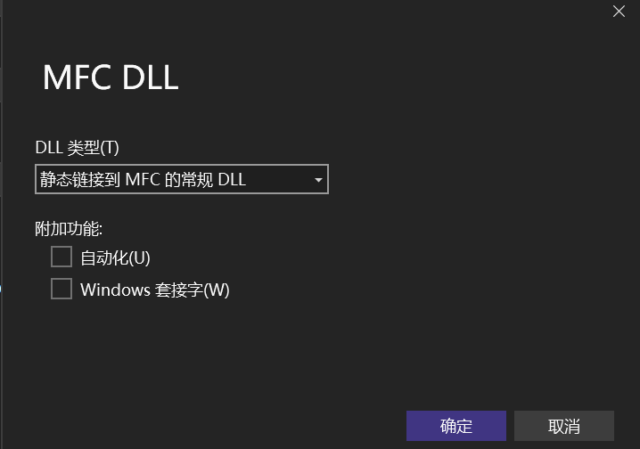

视图，其他窗口，资源视图，把他选出来

然后右键添加资源，选择Dialog

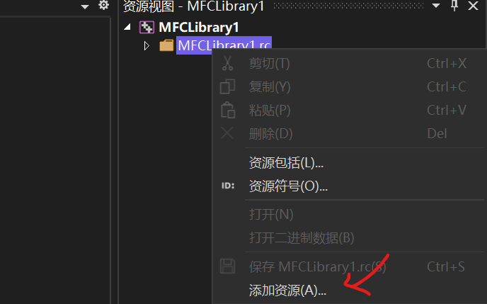

确定和取消按钮可以自己删掉

#### 32位程序

可以选择在debug 旁边 选择 x86来写win32程序

#### 项目，TL1属性

可以选择windows sdk版本

使用的字符集

#### 工具箱

视图，工具箱，里面有组件

视图，属性窗口也要选

#### 创建类

右键dialog的空白处，添加类作为创建的这个dialog的类名，可以取名`XXDialog`

在DLL的主cpp文件中

``` cpp

TLDialog* dialog;

DWORD WINAPI ShowDialog(LPARAM lpData) {
	dialog = new TLDialog; // 分配空间
	dialog->DoModal(); // 阻塞的方式 模态窗口
	delete dialog; // 释放空间
	FreeLibraryAndExitThread(theApp.m_hInstance, 1); // 释放DLL 退出线程
	return TRUE;
}

// CMFCLibrary1App 初始化

BOOL CMFCLibrary1App::InitInstance()
{
	CWinApp::InitInstance();
	::CreateThread(NULL, NULL, (LPTHREAD_START_ROUTINE)ShowDialog, NULL, NULL, NULL); // 创建线程
	return TRUE;
}
```

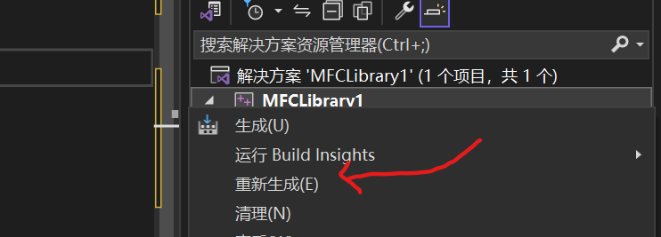

右键重新生成来编译

在CE中查找好基地址和便宜

> 练习：查找新天龙八部怀旧的人物状态

``` cpp
try
{
    DWORD base_addr = (DWORD)GetModuleHandleA("Game.exe") + 0x5946DC;
    DWORD offset1 = *(DWORD*)base_addr + 0x0c;
    DWORD offset2 = *(DWORD*)offset1 + 0x14c;
    DWORD addr = *(DWORD*)offset2;
    outputdebug("人物信息：人物状态: %d", addr);
}
catch (const std::exception&)
{
    outputdebug("Error!");
    return;
}
```

然后是输出在debug信息的代码

``` cpp
void outputdebug(char* pszFormat, ...) {

#ifdef DEBUG

	char szbufFormat[0x1000];
	char szbufFormatGame[0x1100] = "";
	va_list argList;
	va_start(argList, pszFormat);
	vsprintf_s(szbufFormat, pszFormat, argList);
	strcat_s(szbufFormatGame, szbufFormat);
	OutputDebugStringA(szbufFormatGame);
	va_end(argList);

#endif

}
```

这个dubug信息可以在 DebugView来看

用管理员权限打开DebugView, 然后打开监视核心，可以选择过滤字符串。

#### 汇编代码注入

call 函数的时候要记得先放在寄存器里

Detach之后再注入

``` asm
pushad
mov ecx, 0x3F080A28
mov eax, 0x6a5e60
call eax
popad
```

ecx:

``` asm
[[[Game.exe+5946FC]+ 60]+ 154]
```

## 天龙八部怀旧


#### 背包数组

cnt:

``` asm
[[i*4+[[Game.exe+594724]+181c4]]+0x14]+0x58
```

base

``` asm
[[Game.exe+594724]+181c4]
```

名字

[[base+i*4]+2c]+18]

* `+2c,+1c` 说明
* `+2c,+20` 使用等级
* `+2c,+40` 耐久

#### NPC 遍历

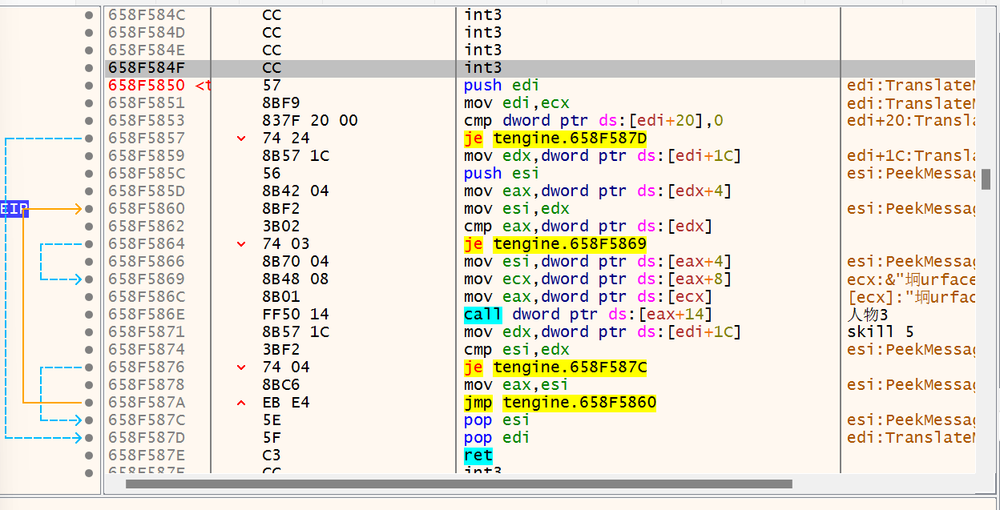

这是一个链表

``` cpp
esi = [[[edi+1c]+4]+4];
while (esi != [edi+1c]) {
    call([[[esi+8]]+14])
    esi = [esi+4];
}
```

#### 血量遍历

先用CE搜索浮点数找到血量百分比

``` asm
[[[[[[[[[0x117CCB8]+0x54]+0x4]]]+0x14]+0x148]+0x10]+0x8]=target
```


