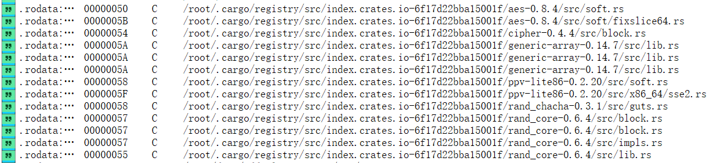
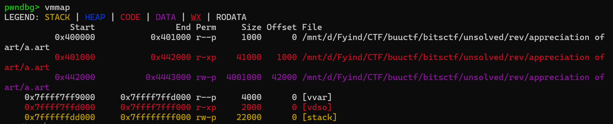

# BITSCTF2025 Write Up

## Cryptography

### The most wanted lagomorph

给了一串密文

``` text
簾簿 簾簽 簽籶 簽籀 簿簼 簼簻 簾簻 簽籁 簾簿 簿米 籀簽 簾籂 簽米 簾簼 籀簽 簽籴 簾籂 簼簻 簿籵 籀籂 簾簽 簽簿 簽簿 簼簻 簾簾 簽簿 簾簻 簼簾 簽米 簽簽 簾籶 簿籲 簾籂 簾簽 簾籂 簼簻 簿簼 簾簾 簼簺 簾簾 簾簻 簽籀 簿簽 籀簿 簾簽 簼簻 簿籴 籀籀 簽籲 簿籴 簽籲 簼簽 簾簼 簽簽 簽簿 簼簹 簽籲 簼簹 簾簿 籀籂 簾籶 簾簾 簿籴 籀簽 簿簾 簽簿 簿簽 簽簽 簾簾 簽簽 簽籲 簾簼 簾籂 簾籁 簽籶 簾簾 簿簾 簾簿 簽籶 簾簾 簾簿 簾簽 簽籶 籀簻 簽米 簼簹 簼簾 籀籂 簾籶 簽簽 簾簻 簼簻 簾簺 簼簻 簿籁 簼簿 簾籂 簼簺 簿籁 簾籶 簾簼 簼簼 簽簿 簾簺 簾籀 簿籴 簽籲 簼簾 簿簻 簽簽 簽籲 簾簾
```

这里可以想到  `ROT8000`  加密，首先做一遍 ROT8000

``` txt
56 54 4m 47 63 32 52 48 56 6j 74 59 4j 53 74 4k 59 32 6l 79 54 46 46 32 55 46 52 35 4j 44 5m 6i 59 54 59 32 63 55 31 55 52 47 64 76 54 32 6k 77 4i 6k 4i 34 53 44 46 30 4i 30 56 79 5m 55 6k 74 65 46 64 44 55 44 4i 53 59 58 4m 55 65 56 4m 55 56 54 4m 72 4j 30 35 79 5m 44 52 32 51 32 68 36 59 31 68 5m 53 33 46 51 57 6k 4i 35 62 44 4i 55
```

发现它很像Hex, 但是 abcdef 变成了 ijklm

先做一次 ROT13

``` txt
56 54 4z 47 63 32 52 48 56 6w 74 59 4w 53 74 4x 59 32 6y 79 54 46 46 32 55 46 52 35 4w 44 5z 6v 59 54 59 32 63 55 31 55 52 47 64 76 54 32 6x 77 4v 6x 4v 34 53 44 46 30 4v 30 56 79 5z 55 6x 74 65 46 64 44 55 44 4v 53 59 58 4z 55 65 56 4z 55 56 54 4z 72 4w 30 35 79 5z 44 52 32 51 32 68 36 59 31 68 5z 53 33 46 51 57 6x 4v 35 62 44 4v 55
```

发现变成了 vwxyz, 可以用 Atbash Cipher 就变回 abcde了

``` txt
56 54 4a 47 63 32 52 48 56 6d 74 59 4d 53 74 4c 59 32 6b 79 54 46 46 32 55 46 52 35 4d 44 5a 6e 59 54 59 32 63 55 31 55 52 47 64 76 54 32 6c 77 4e 6c 4e 34 53 44 46 30 4e 30 56 79 5a 55 6c 74 65 46 64 44 55 44 4e 53 59 58 4a 55 65 56 4a 55 56 54 4a 72 4d 30 35 79 5a 44 52 32 51 32 68 36 59 31 68 5a 53 33 46 51 57 6c 4e 35 62 44 4e 55
```

然后把hex转成字符

``` txt
VTJGc2RHVmtYMStLY2kyTFF2UFR5MDZnYTY2cU1URGdvT2lwNlN4SDF0N0VyZUlteFdDUDNSYXJUeVJUVTJrM05yZDR2Q2h6Y1hZS3FQWlN5bDNU
```

看看base64

``` txt
U2FsdGVkX1+Kci2LQvPTy06ga66qMTDgoOip6SxH1t7EreImxWCP3RarTyRTU2k3Nrd4vChzcXYKqPZSyl3T
```

然后标题是 The most wanted lagomorph, google搜索`"The most wanted lagomorph"`  后是 `dennis` 的兔子

有一个Cipher叫 Rabbit Cipher , 把 dennis 作为密码可以用 CapfEncoder 解密

``` txt
BITSCTF{f3rb_1_kn0w_wh47_w3_4r3_60nn4_d0_70d4y}
```

### Alice n bob in wonderland

一道ECDSA的题。首先Alice和Bob会互发消息，每条消息有密文和签名。

然后使用 IV作为 random 的种子, 使用ECDSA进行签名。

``` python
aes_key = shared_secret[:16]
iv = shared_secret[16:]
random.seed(int(iv.hex(),16))
```

然后我们是作为ManInTheMiddle的位置，可以转发Alice的消息给Bob, 也可以伪造消息给Bob. 但是注意它们会验证签名，并且在验证的时候给出 Ciphertext的解密，并且如果失败二次就停止了。也就是有一次解密Oracle的机会。

首先我们可以拿到IV的值，通过构造 $C_1,C_2=\text{0x00},C_3=C_1$ 然后异或 $P_1,P_3$ 就可以得到 IV.

另一个弱点
``` python
def sign(message, private_key:SigningKey):
    message = message.encode()
    k = random.randint(1, SECP256k1.order - 1)  
    signature = private_key.sign(message,hashfunc=hashlib.sha256 ,k=k)
    return signature
```

在签名message的时候，密钥是用random生成的，也就是如果我们拿到了种子，就可以掌握签名密钥.

然后通过

``` python
def compute_shared_secret(private_key, public_key):
    shared_point = private_key.privkey.secret_multiplier * public_key.pubkey.point
    shared_secret_bytes = shared_point.to_bytes()
    return hashlib.sha256(shared_secret_bytes).digest()

shared_secret = compute_shared_secret(alice_private_key, bob_public_key)
```

这是计算 `shared_secret` 的方式，而AES密钥包含在 `shared_secret` 里面

所以思路就是: 

*  先拿到IV
* 然后就有 k, 也就是 `private_key`
* 然后可以知道 `shard_secret` ，知道AES的密钥

最后给Alice发送消息

``` python
print(f"\nSend to Aice:")
        ciphertext_forged = bytes.fromhex(input("Ciphertext (hex): "))
        signature_forged = bytes.fromhex(input("Signature (hex): "))
        
        plaintext = decrypt(ciphertext_forged)
        print("Debug: ",plaintext)
        verified = verify(plaintext,signature_forged,bob_public_key)
        
        if verified and plaintext.decode() == "Can I have the key again, I think I forgot where I kept the key.":
            print("Very good, now we wait.")
            ciphertext = encrypt(secret)
            signature = sign(secret,alice_private_key)
            print(f"\nIntercepted from Alice:\nCiphertext: {ciphertext.hex()}\nSignature: {signature.hex()}\n")
```

这里的 secret 就是flag了

完整代码：

``` python
from pwn import *
import re
from binascii import hexlify, unhexlify
from hashlib import sha256
import random
from ecdsa import SigningKey, SECP256k1, VerifyingKey
from Crypto.Cipher import AES
from Crypto.Util.Padding import pad, unpad

def xor(a,b):
    return bytearray([x^y for (x,y) in zip(a,b)])

io = process(["py","chall.py"])
msg = io.recvuntil(b"Ciphertext (hex): ").decode()
print(msg)
alice_public_key_hexstr = re.search(r"Alice's public key:\s*([0-9a-fA-F]+)", msg).group(1) 
bos_public_key_hexstr = re.search(r"Bob's public key:\s*([0-9a-fA-F]+)", msg).group(1)

alice_public_key = VerifyingKey.from_string(unhexlify(alice_public_key_hexstr), curve=SECP256k1)
bob_public_key = VerifyingKey.from_string(unhexlify(bos_public_key_hexstr), curve=SECP256k1)

alice_ciphertext_1 = re.search(r"Ciphertext:\s*([0-9a-fA-F]+)", msg).group(1)
alice_signature_1 = re.search(r"Signature:\s*([0-9a-fA-F]+)", msg).group(1)

c1 = b"1"*16 + b"\x00"*16 + b"1"*16
c1_hex = hexlify(c1)
io.sendline(c1_hex)
print(io.recvuntil(b"Signature (hex): ").decode())

io.sendline(c1_hex)
msg = io.recvuntil(b"Ciphertext (hex): ").decode()
print(msg)
pt_hexstr = re.search(r"and this is what they found:\s*([0-9a-fA-F]+)", msg).group(1)

pt_bytes = unhexlify(pt_hexstr)
iv_bytes = xor(pt_bytes[:16], pt_bytes[32:48])
print(iv_bytes)

random.seed(int(iv_bytes.hex(),16))

    # k = random.randint(1, SECP256k1.order - 1)  
def sign(message, private_key:SigningKey, k):
    signature = private_key.sign(message,hashfunc=hashlib.sha256 ,k=k)
    return signature


io.sendline(alice_ciphertext_1.encode())
io.sendlineafter(b"Signature (hex): ", alice_signature_1.encode())

# io.sendline(c1_hex)
# print(io.recvuntil(b"Signature (hex): ").decode())
k = random.randint(1, SECP256k1.order - 1)
k = random.randint(1, SECP256k1.order - 1)

# io.sendline(hexlify(sig_c1))
io.recvuntil(b"Ciphertext: ")
ciphertext = bytes.fromhex(io.readline().decode())
io.recvuntil(b"Signature: ")
signature = bytes.fromhex(io.readline().decode())
bob_sigature = signature
print("BEFORE")

def compute_shared_secret(private_key, public_key):
    shared_point = private_key.privkey.secret_multiplier * public_key.pubkey.point
    shared_secret_bytes = shared_point.to_bytes()
    return hashlib.sha256(shared_secret_bytes).digest()

r = int.from_bytes(signature[:32])
s = int.from_bytes(signature[32:])
z = int.from_bytes(sha256(b"msg2").digest()) % SECP256k1.order
print(r,s)

io.sendlineafter(b"Ciphertext (hex): ", ciphertext.hex().encode())
io.sendlineafter(b"Signature (hex): ", signature.hex().encode())

maybe_d = (((s * k) - z) * pow(r, -1, SECP256k1.order)) % SECP256k1.order
bob_private_key = SigningKey.from_secret_exponent(maybe_d, curve=SECP256k1)

shared_secret = compute_shared_secret(bob_private_key, alice_public_key)
assert(shared_secret[16:] == iv_bytes)
aes_key = shared_secret[:16]
# print(io.recv(512).decode())
print(io.recvuntil(b"Send to Aice:").decode())
chosen_plaintext = b"Can I have the key again, I think I forgot where I kept the key."

cipher = AES.new(aes_key, AES.MODE_CBC, iv_bytes)
ciphertext = cipher.encrypt(pad(chosen_plaintext, AES.block_size))
k = random.randint(1, SECP256k1.order - 1)
signature = bob_private_key.sign(chosen_plaintext,hashfunc=sha256 ,k=k)
io.sendlineafter(b"Ciphertext (hex): ", ciphertext.hex().encode())
io.sendlineafter(b"Signature (hex): ", signature.hex().encode())

# then alice should send us the flag encrypted...
# ... along with a signature that we can ignore
# print(io.recv(512).decode())

io.readuntil(b"Ciphertext: ")
flag_ciphertext = bytes.fromhex(io.readline().decode())
io.readuntil(b"Signature: ")
flag_signature = bytes.fromhex(io.readline().decode())
cipher = AES.new(aes_key, AES.MODE_CBC, iv_bytes)
plaintext = unpad(cipher.decrypt(flag_ciphertext), AES.block_size)
# flag = plaintext[59:].decode()
print(plaintext.decode())
# n = SECP256k1.order
# s = pow(k,-1,n) * (z + r*d)
```

### Noob RSA returns

在RSA加密完后，额外给了一个
$$
K=(A \cdot p^2 - C\cdot p+D) \cdot d
$$
第一个思路是质因数分解，但是不太可能，因为质因数很大。

通过同于方程求解也不行，因为 $p$ 是高次方的

但是RSA有个结论 
$$
e \cdot d \equiv 1 \bmod \Phi(n)
$$
它可以写成
$$
e\cdot d \equiv 1 + z\cdot \Phi(n)
$$
这里 $d$ 是关于 $\Phi(n)$ 的逆，通常很大 $e≈\Phi(n)$ 所以 $z≈e$ , 测试下来, $z$ 的值在 $[0,e]$ 直接可以枚举 $z$

然后Python代码

``` python
from sympy import Eq, symbols, solve
from tqdm import tqdm
from Crypto.Util.number import long_to_bytes
e = 65537
n = 94391578028846794543970306963076155289398888845132329034244336898352288130614402434536624297683695128972774452047972797577299176726976054101512298009248486464357336027594075427866979990479026404794249095503495046303993475122649145761379383861274918580282133794104162177538259963029805672413580517485119968223
ct = 39104570513649572073989733086496155533723794051858605899505397827989625611665929344072330992965609070817627613891751881019486310635360263164859429539044097039969287153948226763672953863052936937079161030077852648023719781006057880499973169570114083902285555659303311508836688226455433255342509705736365222119
K = 20846957286553798859449981607534380028938425515469447720112802165918184044375264023823946177012518880630631981155207307372567493851397122661053548491580627249805353321445391571601385814438186661146844697737274273249806871709168307518276727937806212329164651501381607714573451433576078813716191884613278097774416977870414769368668977000867137595804897175325233583378535207450965916514442776136840826269286229146556626874736082105623962789881101475873449157946816513513532838149452759771630220014344325387486921028690085783785067988074331005737389865053848981113695310344572311901555735038842261745556925398852334383830822697851

C = 0xbaaaaaad
D = 0xdeadbeef
A= 0xbaadf00d


p = symbols("p",integer=True)
START=42675
# START=1
flag = False
for z in tqdm(range(START,e+1)):
    equation = Eq(K*e, (A*p**2 - C*p + D)*(1+z*(n/p-1)*(p-1)))
    solutions = solve(equation, p)

    for sol in solutions:
        if sol.is_integer:
            print(sol)
            flag = True
            break
    if flag:
        break
# p = 10406216443192169173533723167461845081683996237790486467542778667477564930803546070928131853072839096935544813786122096301171127932695303325352097678393621

phi = (n//p-1)*(p-1)
d = pow(e, -1, phi)
m = pow(ct, d, n)

print(long_to_bytes(m).decode())
```

### RSA Bummer

TODO: 没看懂

https://github.com/IC3lemon/CTF-reports/tree/main/BITSCTF-2025/crypto/RSA%20Bummer

solution:

``` python
#!/usr/bin/env python3
from pwn import remote, context, log
from math import gcd
from Cryptodome.Util.number import long_to_bytes, inverse
from gmpy2 import iroot

context.log_level = "debug"

def rsa_decrypt_modp(c, e, p):
    g = gcd(e, p - 1)
    if g == 1:
        d = inverse(e, p - 1)
        return pow(c, d, p)
    else:
        e_prime = e // g
        t = (p - 1) // g
        d_prime = inverse(e_prime, t)
        X = pow(c, d_prime, p)
        log.info("Computed X = m^g mod p: {}".format(X))
        root, exact = iroot(X, g)
        if exact:
            log.info("Successfully extracted integer g-th root using gmpy2")
          
            return int(root)
        else:
            raise Exception("No valid g-th root found")

def recv_until_keyword(r, keyword):

    while True:
        line = r.recvline().decode().strip()
        log.debug("Received: " + line)
        if keyword in line:
            return line

def get_lucky_output(r, x):

    
    r.recvuntil("Enter your lucky number : ")
    r.sendline(str(x))
    line = r.recvline().decode().strip()
    if "Your lucky output" not in line:
        line = r.recvline().decode().strip()
    val = int(line.split(':')[-1].strip())
    r.recvline()
    return val

def main():
    HOST = "chals.bitskrieg.in"
    PORT = 7001

    r = remote(HOST, PORT)
    

    line = recv_until_keyword(r, "Pseudo_n")
    pseudo_n = int(line.split('=')[-1].strip())
    log.info("Parsed Pseudo_n = {}".format(pseudo_n))
    

    line = recv_until_keyword(r, "e =")
    e = int(line.split('=')[-1].strip())
    log.info("Parsed e = {}".format(e))
    

    cts = []
    for i in range(3):
        line = recv_until_keyword(r, "Ciphertext")
        ct = int(line.split('=')[-1].strip())
        cts.append(ct)
        log.info("Parsed Ciphertext {}: {}".format(i+1, ct))
    F3 = get_lucky_output(r, 3)
    log.info("F(3) = {}".format(F3))
    F4 = get_lucky_output(r, 4)
    log.info("F(4) = {}".format(F4))
    
    n_val = F3 + 4 * F4
    log.info("Recovered n (p * r) = {}".format(n_val))

    r_val = gcd(n_val, pseudo_n)
    log.info("Recovered r = {}".format(r_val))
    p_val = n_val // r_val
    log.info("Recovered p = {}".format(p_val))

    flag_parts = []
    for idx, ct in enumerate(cts, start=1):
        m_int = rsa_decrypt_modp(ct, e, p_val)
        part = long_to_bytes(m_int)
        log.info("Decrypted part {}: {}".format(idx, part))
        flag_parts.append(part)
    
    flag = b"".join(flag_parts)
    log.success("Flag: {}".format(flag.decode()))
    r.close()

if __name__ == "__main__":
    main()

#F(x) is the output of the func 'lmao' you can get that F(x)+(x+1)F(x+1)=p*r. send 2 small values to the server and use the printed value which is psudo_n=(r*(e^p mod q)) then gcd(psudo_n,n) you can get r then p=n/r  decrypt mod p will give the flag
```


### Leaky Game

TODO 

https://github.com/E-HAX/writeups/tree/main/2025/bitsctf/osint/leaky_game


## Reverse Engineering

### Praise Our RNG Gods

Given is a Python Byte Code
```
```0 LOAD_CONST 0 (0)
2 LOAD_CONST 1 (None)
4 IMPORT_NAME 0 (random)
6 STORE_NAME 0 (random)

...

14 LOAD_CONST 3 (322420958)
16 BINARY_OP 12 (^)
18 BINARY_OP 5 () 
20 LOAD_CONST 4 (2969596945L)
22 BINARY_OP 5 ()
24 STORE_FAST 1 (password)

26 LOAD_FAST 1 (password)
28 RETURN_VALUE```

```

`BINARY_OP 5 () ` 这里应该是乘法，用过验证回复的数字得到

Using a website https://www.codeconvert.ai/assembly-to-python-converter
,we can decode it to python code.

``` python
import random
import os

seed = int.from_bytes(os.urandom(8), "big")
random.seed(seed)

flag = "REDACTED"

def generate_password():
    global i
    password = (random.getrandbits(32) ^ i ^ 195894762) ^ 322420958
    return password

print("Vault is locked! Enter the password to unlock.")

i = 1

while True:
    password = generate_password()
    attempt = input("> ")

    if not attempt.isdigit():
        print("Invalid input! Enter a number.")
        continue

    difference = abs(password - int(attempt))

    if difference == 0:
        print("Access Granted! Here is your flag:")
        print(flag)
        break

    print(f"Access Denied! You are {difference} away from the correct password. Try again!")
    i += 1

```

The problem is, the password shoud be a 32bit integer,however when we connnect to the `nc chals.bitskrieg.in 7007` , it replies a 64 bit integer.

UPD: Found it, the result was wrong. The actual generate password should be

``` python
def generate_password():
    global i
    password = random.getrandbits(32) *  ( i ^ 195894762 ^ 322420958) * 2969596945
    return password
```

The solution should be that the random library of python
uses Mersenne Twister Algorithm, which is not secure.
If we know some consecutive random numebrs generated,
we can predict the next one.

Reference: (In Chinese) https://liam.page/2018/01/12/Mersenne-twister/

还有另一个方便的方法, 使用 `mt19937predictor` 这个python包

> [MT19937介绍 BLOG](https://book.jorianwoltjer.com/cryptography/pseudo-random-number-generators-prng#python-import-random-mersenne-twister)

先pip安装

``` shell
pip install mersenne-twister-predictor
```

使用：

``` python
import random
from mt19937predictor import MT19937Predictor

predictor = MT19937Predictor()

for _ in range(624):
    x = random.getrandbits(32)
    predictor.setrandbits(x, 32)  # Submit samples here

# When enough samples are given, you can start predicting:
assert random.getrandbits(32) == predictor.getrandbits(32)
```

### Reverse Mishap

用IDA打开，查找String

``` text
.rodata:0000000000094013	00000050	C	/rustc/051478957371ee0084a7c0913941d2a8c4757bb9/library/core/src/char/methods.rs
```

可以发现这是 Rust 的程序，`051478957371ee0084a7c0913941d2a8c4757bb9` 这个

去rust 的 github里搜索这个，在pull request里发现是 `1.80.0 Release` 版本

然后看依赖项



发现依赖 `generic-array` 之类的依赖，建立 `Cargo.toml` 里面写

``` toml
[package]
name = "demo"
version = "0.1.0"
edition = "2021"

[dependencies]
rand_core = "0.6.4"
rand_chacha = "0.3.1"
generic-array = "0.14.7"
cipher = "0.4.4"
aes = "0.8.4"
ppv-lite86 = "0.2.20"
rand = "0.8"
```

这里要用一个IDA插件叫 [capa](https://github.com/mandiant/capa/)

``` shell
pip install capa
pip install pip install flare-capa
pip install pyqt5
```

然后把 `capa/ida/plugin/capa_explorer.py` 拷贝到IDA的plugin文件夹下。就可以在IDA里用 Edit, Plugin 里打开了

https://blog.diefunction.io/ctf/bitsctf-reverse-mishap

发现运行不了，我然后换一种方式：先下载capa的windows Release，拷贝到要分析的文件的同文件夹下

然后运行cmd，首先clone rules

``` shell
git clone https://github.com/mandiant/capa-rules.git
```

然后运行

``` shell
capa -r capa-rules/ <my_rust_binary>
```

之前插件运行不了的原因是，这个capa有BUG!! 在IDA 9.0的时候 `bin_search` 被替换成了 `bin_search3` 所以报错了。首先进入

``` shell
C:\Users\<username>\AppData\Local\Programs\Python\Python313\Lib\site-packages\capa\features\extractors\ida
```

里面找到 `helpers.py` 把里面的 `bin_search` 替换成 `bin_search3` 就可以了

 然后安装Rust依赖，首先去Rust官网下载https://www.rust-lang.org/learn/get-started 

使用 `rustc --version`  可以验证安装

使用下面的生成一个demo

``` shell
cargo new demo
cd demo
```

然后进去修改配置文件

``` toml
[package]
name = "demo"
version = "0.1.0"
edition = "2021"

[dependencies]
rand_core = "0.6.4"
rand_chacha = "0.3.1"
generic-array = "0.14.7"
cipher = "0.4.4"
aes = "0.8.4"
ppv-lite86 = "0.2.20"
rand = "0.8"
```

我发现需要用ubuntu来写rust，因为到手的不是windows的文件

去ubuntu安装rust

``` shell
curl --proto '=https' --tlsv1.2 -sSf https://sh.rustup.rs | sh
```

安装完可以 `source $HOME/.cargo/env` 一下

把这个编译出来后，用IDA生成SIG签名，然后在Load到我们要分析的程序，会发现有一些函数就可以被识别出来了。

但是大部分还没被识别出来。之后再看。这个太难了。

### Appreciation of Art

用GDB调试一下，可以装pwngdb这个插件

使用 `b *0x401001` 可以在某个地址下断点

也用IDA试了一下，发现根本没办法调试，只有一个start函数，而且很大，IDA无法反编译

先用 GDB打开，在运行时候dump meory，具体操作

``` shell
gdb a.art
```

然后输入 `r` 然程序跑起来等待输入。然后control+C打断程序，然后dump memory

``` shell 
vmmap
```

输出



把Code 的那一段dump下来 `0x442000 - 0x4443000`

``` shell
dump memory pie.dmp 0x442000 0x4443000
```

然后退出，cat这个memory (VSCODE 里的hex editor打开，然后搜索也行)

``` txt
@���F��I��H���@�@�@no memory!


␦123456789:;<=>?@abcdefghijklmnopqrstuvwxyz[\]^_`abcdefghijklmnopqrstuvwxyz{|}~������������������������������������������������������������������������������������������������������������������������������������������������������������������������������������������������������������������������������������������������������������������������������������������������������������������������������������������������������������������������������������������������ in : unknown format!
���What is the name of the character hiding in this binary (lowercase with underscores if needed): gg here's your flag %s
Are you hallucinating?
�J��E��`�J��"���J��#���`What is the name of the character hiding in this binary (lowercase with underscores if needed): ���N��VA���o���dBITSCTF{1_l0v3_0bfu5c4t1ng_thi1ng5_r4nd0mly_0e54826a}*?((#.2?*6;.#*/).shstrtab.text.data
```

在里面发现了flag.

## Hardware

### oldSkool

这个题关于 Radio Signal Processing, 这里给了一个 `iq` 文件 TODO：没看懂

``` python
import numpy as np
import matplotlib.pyplot as plt
from scipy.signal import hilbert
from scipy.io import wavfile

# 1. Wczytanie pliku IQ
file_path = "modulated.iq"
iq_data = np.fromfile(file_path, dtype=np.complex64)

# 2. Parametry
Fs = 24000  # Sampling rate 24kHz
Fc = 1550000  # Przybliżona nośna (np. 1550 kHz)
t = np.arange(len(iq_data)) / Fs

# 3. Przemiana częstotliwości (mixing)
demod_signal = iq_data * np.exp(-1j * 2 * np.pi * Fc * t)

# 4. Demodulacja AM (obwiednia)
audio_signal = np.abs(hilbert(demod_signal.real))

# 5. Normalizacja i zapis do pliku WAV
audio_signal = (audio_signal / np.max(np.abs(audio_signal)) * 32767).astype(np.int16)
wavfile.write("output.wav", Fs, audio_signal)

print("Demodulacja zakończona! Otwórz output.wav, aby odsłuchać.")

```

### %lution

首先这是一个 `signal` 文件，我们用 [Universal Radio Hacker](https://github.com/jopohl/urh/releases) 打开这个文件，可以得到二进制码，在 Cyberchef 里用from binary拿到flag

## MISC

### Ghost Protocol

TODO

https://github.com/V1rg1lee/writeups/tree/main/2025-BITSkrieg/ghosting-protocol

### Seed fund

TODO

https://github.com/V1rg1lee/writeups/tree/main/2025-BITSkrieg/seed-fund

## DFIR

### virus camp

TODO

https://odintheprotector.github.io/2025/02/09/bitsctf2025-dfir.html

## 其他Writeups链接

https://github.com/Vatsallavari/BITSCTF/tree/main

https://mindcrafters.xyz/writeups/hardware-bitskrieg/

https://github.com/rerrorctf/writeups/blob/main/2025_02_07_BITSCTF25/crypto/alice_n_bob_in_wonderland/writeup.md

https://zwique.gitbook.io/zwique_notes/writeups/random-ctf-writeup/noob-rsa-returns

https://mindcrafters.xyz/writeups/rev-bitskrieg/#appreciation-of-art
