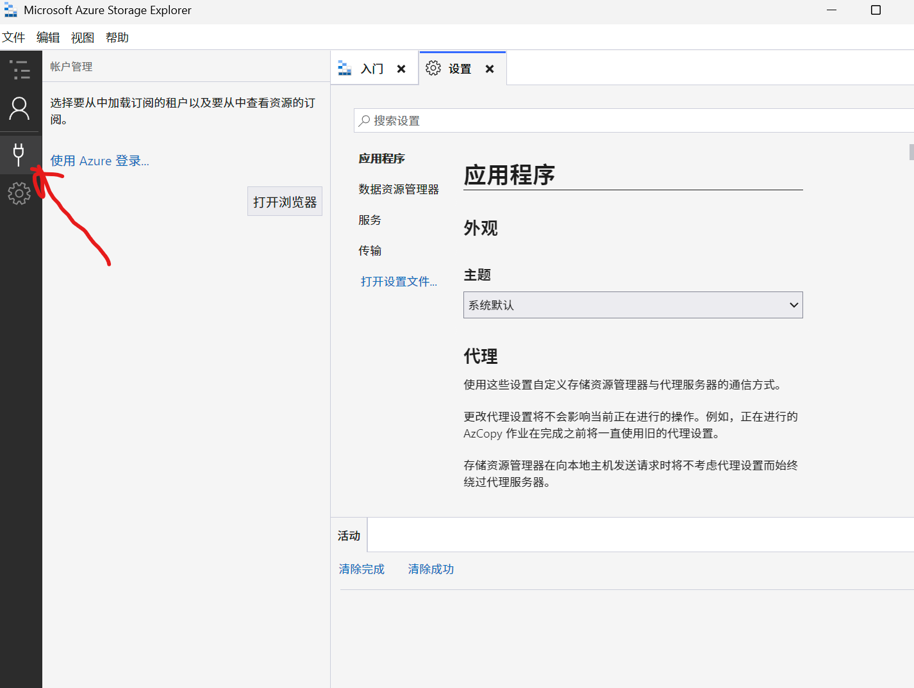

# My Aquarium

I have this website with some of my favorite sea animal images and facts. I have a secret document containing an my favorite animal, can you find it?

The website is running at [http://connect.umbccd.net:20010](http://connect.umbccd.net:20010/)

## writeup

打开之后有一个网页，

有几个Button:

* See Sea Animals: 有一些图片
* See Animal Facts，跳转到 https://onlineaquarium.blob.core.windows.net/aquarium/resources/sea-animal-facts.txt 有一些文字，
* Take this quiz.. 有一个quiz，查看源代码没什么有用的

只有 See Animal Facts 有疑问，通过chatGPT，可以发现

### 这是 **Azure Blob Storage** 的公共资源链接

- `onlineaquarium.blob.core.windows.net` 是 **Azure Blob Storage** 的标准访问域名格式
- `aquarium` 是 **storage container 名**
- `/resources/sea-animal-facts.txt` 是存储在其中的文件路径

> **简言之：这是一个公开托管在 Azure 上的文本文件**

我们使用 Azure Storage Explorer 来访问

下载：https://github.com/microsoft/AzureStorageExplorer/releases



打开这个，选择，Blob容器或目录，然后选择匿名，尝试登录那个容器 https://onlineaquarium.blob.core.windows.net/aquarium/resources/sea-animal-facts.txt ，把这个粘贴到Blob 容器或目录 URL里面

发现连接成功了，退回到上级目录，发现了 `SecretFavouriteAnimal.txt` 

然后访问：https://onlineaquarium.blob.core.windows.net/aquarium/resources/SecretFavoriteSeaAnimal.txt

就可以得到flag：

``` shell
DawgCTF{Bl0b_F15h_4re_S1lly}
```

