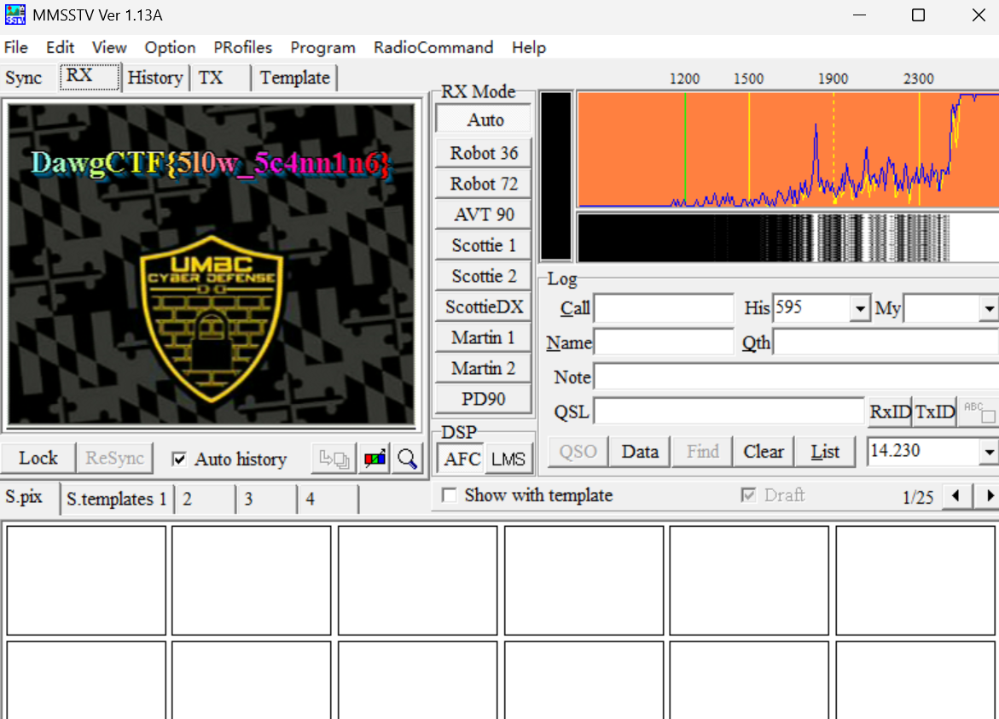

# Mystery Signal II

I was listening to my scanner when I heard a strange signal. Can you decode it?

Download Challenge File(s): [Click Here](https://github.com/UMBCCyberDawgs/dawgctf-sp25/tree/main/Mystery Signal II)

## Writeup

首先拿到了一个MP3文件，像外星语。

### 分析 MMSSTV

先把MP3转成WAV（非必须）

``` shell
ffmpeg -i MysterySignal_2.mp3 out.wav
```

在Windows的时候，使用虚拟声卡

下载 VB-Cable：
 👉 https://vb-audio.com/Cable/

安装好后，会有

* **CABLE Input**（你播放时选择它）
* **CABLE Output**（MMSSTV 监听它）

### 设置MMSSTV

下载MMSSTV：https://hamsoft.ca/pages/mmsstv.php

打开MMSSTV，在Option里选择Setup MMSSTV ,在Misc里面，选择In为CABLE Output

### 播放

然后把默认播放设备选择 CABLE Input，然后用ffplay播放 （其实可以不用转换成wav，直接放MP3也可以）

``` shell
ffplay -nodisp -autoexit out.wav
```

然后就能看到Flag了


