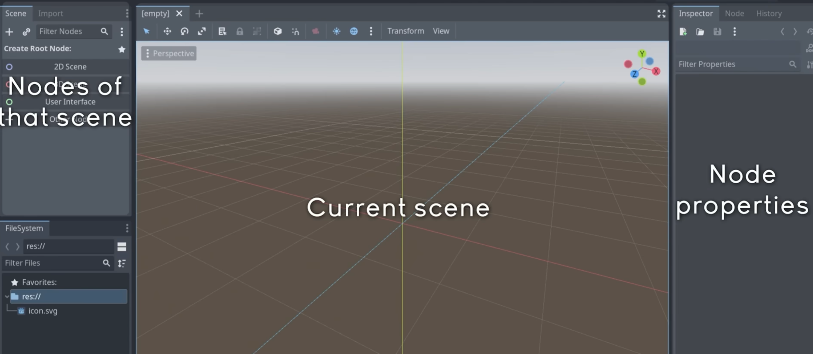
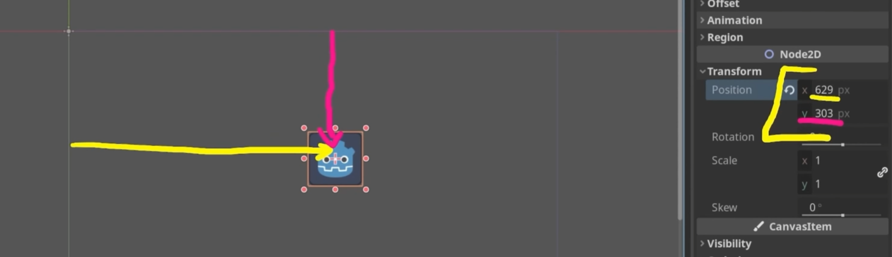
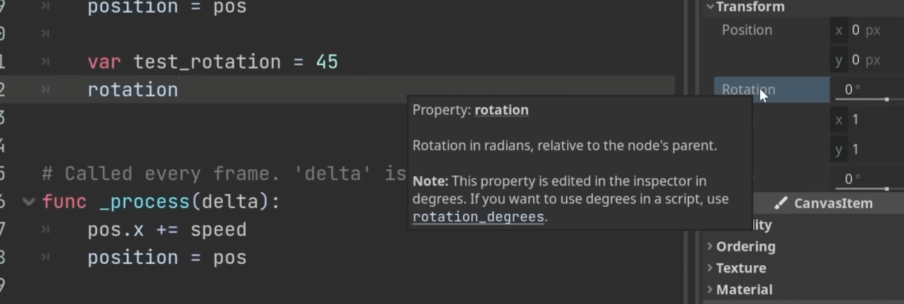

# Godot

视频：https://www.bilibili.com/video/BV15C4y1P716?spm_id_from=333.788.player.switch&vd_source=2c1227d0a7d29725db75d3fc52e6089b

入门项目：https://github.com/clear-code-projects/UltimateGodotIntro2D

## 节点Nodes

基础的元素，图像，声音，计时器...

可以把节点组合起来创建游戏的各个部分

## 场景

Ctrl+Shift+O: 打开场景快捷键

组织节点，显示简单

可以理解为画布，或者文件夹

可以把一个场景放在另一个场景中

### 子场景

Ctrl+Shift+A可以实例化场景，可以放在另一个场景里面

### Godot显示UI



这是Godot显示的各个部分

在顶部可以切换 2D,3D

2D的里面有一个蓝色的小框，是游戏当前显示的画面

## 节点

Ctrl+A是快捷键创建节点

### Node2D

是2D的一个点，可以用于组织，比如命名Level

旋转level就在旋转所有子节点

#### Position

相对父节点的位置

#### global\_position

在全局的位置

### Sprite2D

可以显示图像的节点

* Texture: 纹理，可以加入图片，直接拖入图片就可以添加
* Offset, Transform: 可以水平，垂直翻转...

* Region: 可以显示图像的一部分

节点的坐标



x是横坐标，y是纵坐标

### 改变类型

右键change type可以改变

也要在script的extends后面更改成对应的类型

### Timer

计时器

# GDScript

GDScript is python

## Variables

``` js
var a_string: String = 'test'
var arr :  Array[int] = [1,2,3,4]
@export var speed : int = 1000 
```

### export

可以在面板显示变量

## Const

``` js
const max_speed = 500
```

## 函数

``` go
func test(para_a: int, para_b: String) -> bool:
	return true
```

### 随机数

* `randi` 返回一个整数随机数

## 类

script总是加在一个Node上，

当我们用GDscript添加代码的时候，会创建一个类，默认的attribute和method会自动添加

### builtin内置函数

#### \_ready()

当Node添加到树上时会调用

#### \_process(delta)

在游戏的每一帧运行

delta是当前帧生成的时间

### 获得其他节点

#### get\_node()

``` go
get_node(nodepath)

get_node("Logo").rotation_degrees = 90
```

获得其他节点

也可以拖动

可以设置以唯一节点访问，这样拖进来是短的名字

#### \$符号

``` go
$nodepath
```

### 添加脚本后

``` godot
extends Sprite2D
```

extends后面的要匹配类的类型

### 更新坐标

``` go
extends Sprite2D

func _ready() -> void:
	position = Vector2(200,200)
	
```


## 获得attribute名字

把鼠标悬停就可以了



## 文档

Ctrl 点击对应的字，就可以打开文档

Ctrl+W可以关闭文档

# 输入

Project, Project Setting, Input Map里面可以添加动作，比如left

右边的 \+ 号可以添加按键, 创建一个left比如说

在GDScript里面，可以用 Input

``` go
Input.is_action_pressed("left")
```

## 方向移动

### get\_vector

用getvector比较方便，通过绑定4个方向的按键来返回方向

## Vector2

### RIGHT

Vector2\.RIGHT 右向量

### normalized

normalized 可以把模变成1

### angle

得到角度，弧度制

#### rad to dag

`rad_to_dag`可以把弧度转换成角度

## 鼠标

### 鼠标位置

``` godot
get_global_mouse_position()
```

# 物理

## 节点

### Area2D

可以检测其他节点是否进入区域

Player之类的可以移动的

* `body_entered`
* rotation 旋转，弧度表示
* `rotation_degrees` 旋转，角度表示

### StaticBody2D

墙，之类的，可以被碰撞

### RigidBody2D

需要高级物理特性的实体

比如手榴弹，可以自己移动的

* gravity scale: 重力
* Physical Matrial 物理材质，可以新建弹跳
  * Fiction: 摩擦力
  * bounce: 弹力
* Damp: 阻尼

### CharactorBody2D

由代码控制的实体，比如player, enemies

* velocity 移动速度
* `move_and_slide()` 带碰撞的更新位置，包含delta
* `look_at()` 可以旋转到某个向量

## 形状

一个物理体必须有个形状

### CollisionShape2D

Shape里面选择 Rectangle之类的，然后调整

按alt，可以双向调整形状

# 信号

在Node右边里面可以看到列出的信号，可以双击使用某个信号

## 自定义信号

### 创建信号

``` godot
signal player_entered_game
signal laser(pos)
```

### 触发信号

``` godot
player_entered_game.emit()
```

# 自定义场景

有时候需要动态的创建场景

``` godot
var laser_scene: PackedScene = preload("xxx.tscn")

var laser = laser_scene.instantiate()
add_child(laser)
```

## 带提示的instantiate

``` godot
var grenade = grenade_scene.instantiate() as RigidBody2D
```

# 相机

## Camera

用Camera添加

* Smooth 平滑移动，可以设置成5
* zoom 缩放

## 窗口分辨率

Project Setting, Display 里面

# 关卡设计

## Region

选择它刚开始什么都没有

* Edit Region 可以编辑要显示的纹理，也可以选择比较大的区域，但是会拉伸边界像素，可以到Texture里面的Repeat更改Enable就可以复制了

### Visibility

* Modulate 可以改变颜色， 会影响子结点
* Self Modulate 调节自己的颜色

## Tilemap

可以选择某些各自，防到特定的地方

* TileSet 里面新建一个，在底下可以看到TileSet和TileMap
  * physical layer 可以设置碰撞图层
* Tile Shape可以选择瓷砖形状
* Tile Size 可以设置大小

### TileSet

拖入图片可以加入一个TileSet

* Name 可以改名字
* Margin可以改边距
* Paint可以添加属性，
  * 设置完碰撞图层后，可以在physical layer 绘制碰撞区域
  * 三个点可以选择水平翻转，R快捷键也可以

### TileMap

选择图块，点到关卡上

# 图层

可以对不同的对象分配不同的图层，在Collision里面设置

## Layer

它在哪个图层

### 图层命名

Project Settings 里面的 2D Physics可以对图层命名, 设置好后，鼠标悬停在Layer上面可以看到注释

## Mask

可以与哪个图层交互

# 粒子

## GPUParticles2D

适用于GPU的粒子发射器

* amount 设置发射粒子数量

* Process Matrial 可以选择ParticalProcessMatrial

### ParticalProcessMatrial

* Spawn, position, emision shape: 可以设置发射粒子形状, direction改变方向
* accerleration, gravity 可以设置重力
* Shape, Scale 可以调整粒子大小
* Texture设置纹理
* Display, Color Curve: 设置颜色， Color Ramp设置渐变(To check)

# 光源

## PointLight2D

点光源

* Texture需要纹理
* Texture scale, 光照范围
* energy 光照强度
* Shadow 启动阴影

## LightOccluder2D

光遮挡器，可以绘制形状

* Filter 过滤器 PCF13 ,可以让阴影边界模糊化

## DirectionalLight2D

平行光

* Blend Mode: 加上模式和减去模式，减去模式可以让场景变暗

# 动画

## AnimatedSprite2D

播放一组图片

选择：载入后自动播放

## Sprite2D

### Animation

设置Hframe和Vframe是这里面有几行几列的图片

## AnimationPlayer

### Animation

点击创建新动画

右边可以设置动画时长

在Sprite2D的frame里面点右边的钥匙可以添加到animation


### queue\_free

删除节点

# UI

UI主要使用Control节点

## Control

### Label

标签

### TextureRect

纹理矩形，可以放置图片

* Expandmode : 如果图片太大调成fit height

## CanvasLayer

画布层，可以把UI绘制到上面，类似粘在相机上的玻璃。

### 锚点

固定在哪里

* Layout,  Anchors Preset, Custom 自定义位置
* Anchors point: 区域比例，`0.25` 就是 `25%`

### 容器

确定子结点位置的父节点

#### HBoxContainer

水平布局

### GridContainer

按网格，从左到右摆放

* Column 设置列数
* Theme Overrides, H Seperation 水平间距
* Horizontal allignment 水平对齐（居中）

## Theme

在 Theme 里面新建主题，可以设置

### 字体

主题的统一字体
