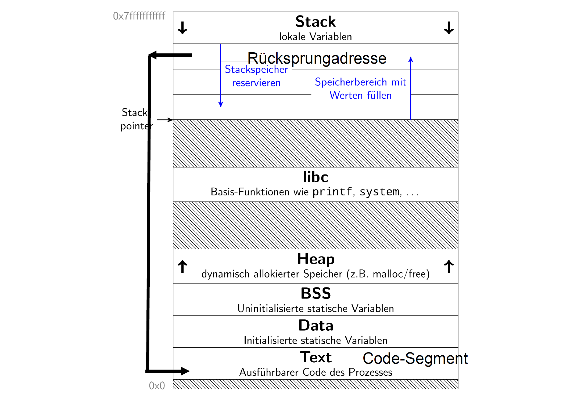

# IT Sicherheit 笔记

## Netzwerksicherheit

#### 保护数据传输

问题

* 有不同的协议WLAN（无线局域网）、BT（蓝牙）、5G、以太网、IP/TCP协议
* 不同的安全保障层次

> 应用层：例如单独的即时消息、单独的电子邮件
>
> 传输层：例如TCP连接、TLS（传输层安全）加密的数据传输

#### 分析端点的数据流量

* 防火墙: 过滤进出网络的数据包
* 入侵检测系统：检测可能的攻击痕迹（攻击者的“脚印”）

### 传输层的安全

保护目标：

* Authentifikation: 每一个设备/用户的身份认证
* Vertraulichkeit: 每次连接的数据加密
* Integrität: 数据包的完整性

问题：密钥交换

使用的方法：**AES-128 GCM**（高级加密标准）、**SHA256**（安全哈希算法256位）、**X509证书**

**静态预设的方法或动态“协商”**（即在通信过程中协商选择加密方法）

### TLS 1.3

通过HTTPS保障HTTP安全，通过 SMTP over TLS 保证SMTP安全

* 加密算法：规定了5种密码套件（Cipher Suites）, 只允许AEAD模式的密码
* 密钥交换：用 ECDH 密钥交换
* 身份验证：CR, X.509
* 数字签名：RSA 或者 ECDSA 

### TLS-Protokollablauf


目标：Clint A 安全地连接 Server B

* 初始化：Handshake-Protokoll:
  * 确定 Cipher-Suite
  * 身份认证
  * 去中心化生成共享密钥：$k_{a,b},k_{b,a}$ , 并且生成一个用于**握手消息的MAC密钥**（**kmac**）来确保消息的完整性和认证

* 加密数据交换：Application Data Protokoll
  * 客户端和服务器之间传输的**应用数据包**（如HTTP请求、邮件内容等）会进行**端到端加密**

### TLS-Handshake-Protokoll

广为流传的版本：Server B 对 A 验证自己，A不对Server B验证自己

#### Msg1: A to B

* A 随机生成 $R_A$
* A 生成 DH-Paar $(DH\text{-}e_A, DH\text{-}d_A)$
* 选择 Cipher-Suite $cs_A$ 

生成第一个消息 $m1 = \text{ClientHello,ID,}R_A,DH\text{-}d_A,cs_A$   

#### Msg 2: B生成，不发送

* B 生成 $R_B$, 选择 $cs_A$ 作为 Cipher-Suite, (let $cs=cs_A$)
* 生成  $(DH\text{-}e_B, DH\text{-}d_B)$ 

第二个消息 $m2 =  R_B,cs,ID,DH\text{-}e_B, cert(e_B)$

* 通过 $DH\text{-}e_A$ 和 $DH\text{-}d_B$ 生成 DH-Secret $s$
* 通过 $KDF(s||R_A||R_B)$ 生成密钥 $k_{a,b},k_{b,a},k_{mac}$
* 计算 $sig=Sig_{dB}(H(m1||m2))$
* 计算 $c=E_{k_{b,a}}(ApplicationData)$

#### Msg 3: B to A

$Finish=E_{k_{b,a}}(HMAC_{k_{mac}}(m1||m2||sig)$

$m3 = \text{ServerHello},m2,sig,Finish$ 

#### HTTP Request: A to B

* 验证签名 $Verify_{e_B}(Sig_{dB}(H(m1||m2))) == H(m1||m2)$
* 从 $m2$ 提取 $DH\text{-}e_B$ 和 $DH\text{-}e_A$ 计算 $s$
* 通过 $KDF(s||R_A||R_B)$ 生成密钥 $k_{a,b},k_{b,a},k_{mac}$
* 验证 HMAC: $HMAC_{k_{mac}}(m1||m2||sig) == D_{k_{b,a}}(Finish)$
* 生成结束 $Finish=E_{k_{a,b}}(HMAC_{k_{mac}}(m1||m3))$ 

发送 $Finish,$ HTTP Request

A之后用 $k_{a,b}$ 加密数据

#### B验证Finish

B验证 $Finish == E_{k_{a,b}}(HMAC_{k_{mac}}(m1||m3))$ 

B之后用 $k_{b,a}$ 加密数据

### TLS 1.3-Handshakes的种类

之前说的是 1-RTT (Round Trip Time)

#### 双方方互相验证的TLS1.3

* B发送ServerHello 的时候同时发送一个 Certificate Request
* A 会回复它的 Client-Certificate $cert(e_A)$ , 并且签名 $cert(e_A),D_{dA}(H(m1||m2))$
* B 再验证这个签名

#### 0-RTT

A 发送


## Systemsicherheit

### 操作系统的任务

* 通过 syscall 控制硬件
* 控制：内存，CPU, E/A, 文件管理
* Modi: Kernal-Mode: 执行特权命令; User-Mode: 执行普通命令


### 操作系统的保护/控制任务

* 标识符Identifikatoren: 进程,文件,文件的安全管理

* 访问控制
* 访问与信息流控制: ACL(访问控制列表), 权限能力，分类
* 安全启动：Secure Boot, Trusted Boot
* 安全运行环境： TEE
* RAM保护机制: Canaries, DEP 数据执行保护, ASLR地址空间布局随机化
* 虚拟化: Isolation, Hypervisor, VM-Monitor

### 内存保护

冯诺依曼架构universelle Interpretierbarkeit：程序指令和数据存储在同一存储器中，具有统一的地址空间。

#### 进程地址空间



### Buffer Overflow

#### Example 1

``` cpp
void a() {
	bool is_admin;
    char msg[128];
    gets(msg);
}
```

这个时候，`is_admin` 在 msg 的上面，Buffer Overflow的时候是从低地址往高地址overflow，可以覆盖掉 `is_admin`


#### Return To ShellCode

可以把 `shellcode` (可以打开shell的代码) 作为输入，然后控制返回地址，跳转到这个shellcode的地方开始执行。 

### Stack-Shielding

#### Stack Canary

在返回地址前面加一个随机数，如果随机数被覆盖了就说明有Buffer Overflow

这个保护措施通过GCC加的

Shadow Stack

Shadow-Stack 是一个独立且受保护的内存区域，用于安全存储函数调用的返回地址。它与常规栈相分离，以防止攻击者通过缓冲区溢出等手段篡改返回地址。

### DEP

Data Execution Prevention: 

* CPU-Feature  NX-bit (No-eXecute) 标记为不可运行

### ASLR

Address Space Layout  Randomization地址随机化

因为DEP不能保护Return Oriented Programming (ROP) 

* Linux 在每个程序启动的时候随机化
* Windows 在每次启动系统的时候随机化

但是代码段不会随机化

扩展：

* PIE(Position Independent Executable): 支持代码段随机化
* KASLR: Kernel ASLR对内核地址空间进行随机化，从而进一步提升内核态安全性。

### Virtual-Machine-Monitor (VMM)

目标：

* 将物理硬件资源抽象为虚拟化资源，供虚拟机使用.
* Isolation: 确保各虚拟机（VM）之间相互独立，不受干扰

VMM/Hypervisor:

* 是一种管理虚拟机的软件，负责创建、启动和运行虚拟机。
* 允许不同的操作系统在多个虚拟机中并行运行。
* Hypervisor 实现了虚拟机之间的隔离，防止一个虚拟机对另一个虚拟机的直接干扰或访问。
* Hypervisor 可以控制虚拟机的状态，包括暂停、重启、调整资源配置等。

### Container-Konzept

轻量化的虚拟化，以更高效地运行和管理应用程序。

容器将应用程序运行所需的所有组件打包成一个整体，包括：应用程序代码,相关服务,依赖的库与运行环境

* 容器在用户空间中以 **隔离进程** 的方式运行。
* 与传统虚拟机相比，容器的隔离性较弱，因为它们共享相同的内核。

优点是: 轻量高效，易于部署和维护

### 硬盘加密

保护系统中数据的机密性，特别是当攻击者拥有物理访问权限时。

> 例如，一台包含公司敏感数据的笔记本电脑被盗，攻击者拆下硬盘后，操作系统的保护措施不再生效，数据可能被轻易访问。

通过加密保护数据，只有在用户提供正确的密码（Passphrase）后，才能解密数据并访问。

在计算机关闭时，数据处于加密状态，无法被访问或读取。

#### 种类

* 通过特定应用程序对文件进行加密，例如 PDF 文件加密。
* 文件系统层面进行加密，比如 **fscrypt**（Linux）
* Device Mapper: 在硬盘和文件系统之间进行透明加密，例如 **BitLocker**（Windows）、**dm-crypt/LUKS**（Linux）

### 硬盘加密的局限性

* 在加密过程中，密钥需要始终存储在主存（RAM）中，以便操作系统和应用程序访问。这意味着在系统运行时，密钥始终暴露于内存中。
* Cold Boot Attacks: 即使设备关闭，DRAM（动态随机存取内存）芯片仍会在短时间内保持其数据状态。
* 硬盘加密无法防止恶意软件的入侵 (恶意软件可以在系统运行时监视并记录密码输入或直接访问密钥)

解决方案

* 将加密密钥存储在 CPU 的寄存器中
* AMD SME,Intel MKTME技术可以在硬件级别进行加密操作
* 使用受信执行环境，如 **Intel SGX** 或 **AMD SEV** 为加密操作提供一个安全的运行环境


## 信息安全管理

信息安全管理（ISM）是组织内部制定的一系列程序和规则，旨在确保信息安全的有效管理, 包括

* **控制与管理**：对信息安全进行持续的控制和监督，以确保其有效性。
* **保持与改进**：确保信息安全的管理措施能够长期有效运行，并通过持续的优化和改进保持高效性。

