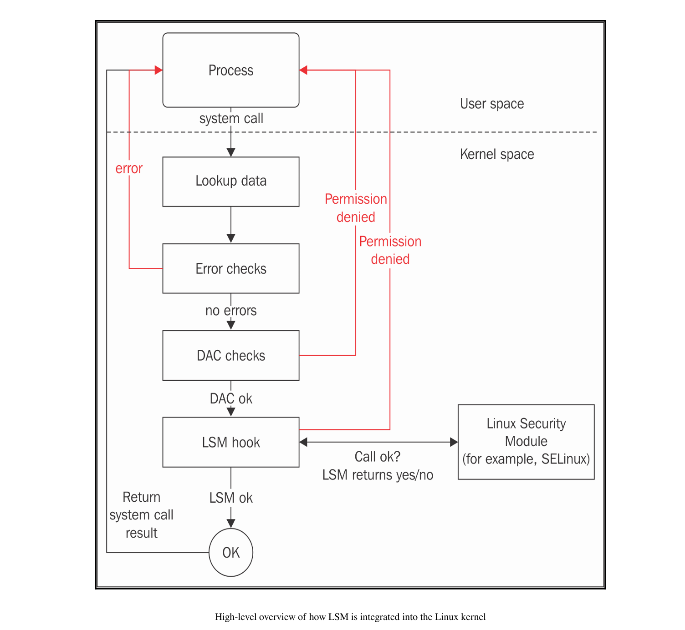
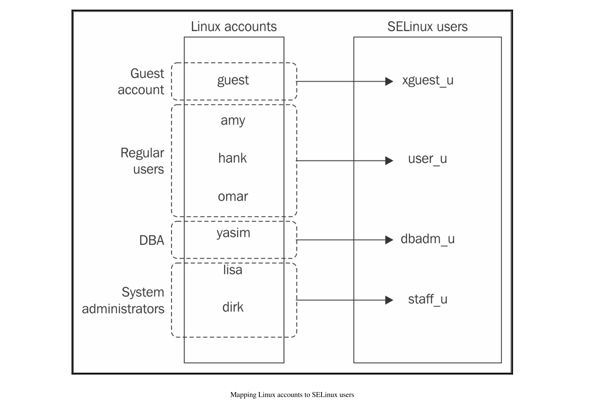
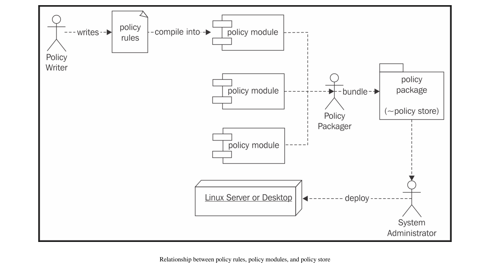
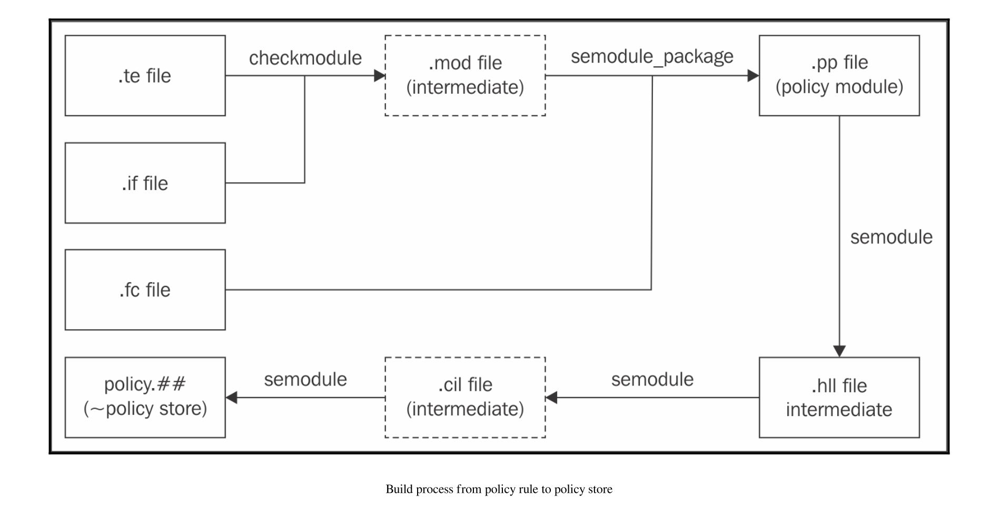

# SELinux 系统管理

## SELinux基本概念

### 为Linux提供更强安全性

Security Enhanced Linux(SELinux) 为了加强Linux的安全性能

原始Linux使用DAC (discretionary access control) 基于用户和组来管理访问控制。在SE Linux里，在DAC上层提供了MAC(mandatory access control) , 它是系统强制的访问控制。他的Policy是被security manager管理的，而不是被用户管理。

在特定设置下，甚至root也不能修改shadow文件（比如说）

通过 LSM (Linux Security Modules) SELinux可以轻易的集成到Linux内核里。

LSM在Linux kernel 2.6 之后有，他是一个框架framework, 在Linux 内核里提供hooks，使得安全函数可以通过hooks被调用。LSM本身不提供安全功能。除了SELinux使用LSM外，还有 AppArmor, Smack, TOMOYO Linux, Yama之类的



#### 用SELinux扩展DAC

SELinux不能覆盖 Linux DAC的permission deny. 因为它是在DAC决定之后进行决定的。

`setfacl` 可以设置权限

``` shell
setfacl -m u:lisa:rw /path/to/file
```

查看权限

``` shell
getfacl /path/to/file
```

#### SELinux的实现

* 通过 LSM 实现于 Linux 内核中的 SELinux 内核子系统
* 用于与 SELinux 交互的应用程序的库
* 供管理员与 SELinux 交互的工具
* 以及定义访问控制本身的策略。

### 标记资源和对象

SELinux根据主题（要求操作的）和对象（被操作的）决定接受访问还是拒绝访问。

进程的上下文是用于向 SELinux 标识该进程的内容。SELinux 对 Linux 的进程所有权没有概念，SELinux 唯一想知道的是该进程的上下文是什么，而这个上下文对用户和管理员来说表现为一个标签。

让我们来看一个示例标签：当前用户的上下文（如果你在一个启用了 SELinux 的系统上，可以自己尝试）：

```bash
$ id -Z
unconfined_u:unconfined_r:unconfined_t:s0-s0:c0.c1023
```

> `id` 命令返回关于当前用户的信息，在这里使用 `-Z` 参数（这是与基于 LSM 的安全子系统约定好的参数，用于显示额外的安全信息）。它向我们展示了当前用户的上下文（实际上是 `id` 进程自身执行时的上下文）。我们可以看到，上下文有一个字符串表示形式，并且看起来好像有五个字段（实际上只有四个字段——最后一个字段只是包含了一个 `:`）。

SELinux 开发者决定使用标签而不是真实的进程和文件（或其他资源）元数据来进行访问控制。这与 AppArmor 等其他强制访问控制系统不同，后者使用二进制文件路径（从而是进程名称）以及资源路径来进行权限检查。

#### 剖析 SELinux 上下文  

要形成一个上下文，SELinux 至少使用三个值，有时会用到四个值。以 Apache Web 服务器为例：  

```bash
$ ps -eZ | grep httpd
system_u:system_r:httpd_t:s0  511  ?   00:00:00 httpd
```

从上面可以看到，该进程被分配了一个包含以下字段的上下文： 

* system_u：这表示 SELinux 用户 
* system_r：这表示 SELinux 角色 
* httpd_t：这表示 SELinux 类型（在进程的情况下也称为域） 
* s0：这表示敏感度级别  

在使用 SELinux 时，上下文就是我们所需要的全部内容。SELinux 上下文与 LSM 安全属性对齐，并以标准化的方式暴露给用户空间（兼容多种 LSM 实现），从而方便最终用户和应用程序查询这些上下文。这些属性的一个有趣展示位置是在 `/proc` 伪文件系统中。在每个进程的 `/proc/<pid>` 路径下，我们可以找到一个名为 `attr` 的子目录，在该目录中可以找到以下文件：

```bash
$ ls /proc/<pid>/attr
current    fscreate     prev    exec       keycreate    sockcreate
```

如果读取这些文件，它们要么显示为空，要么显示一个 SELinux 上下文。如果为空，则表示该应用程序未为特定目的显式设置上下文，SELinux 上下文将从策略中推导出来，或者从其父进程继承。
这些文件的意义如下：

* current 文件显示进程当前的 SELinux 上下文。
* exec 文件显示通过此应用程序执行的下一个应用程序将被分配的 SELinux 上下文。它通常为空。
* fscreate 文件显示应用程序写入的下一个文件将被分配的 SELinux 上下文。它通常为空。
* keycreate 文件显示由该应用程序缓存在内核中的密钥将被分配的 SELinux 上下文。它通常为空。
* prev 文件显示此特定进程的前一个 SELinux 上下文。这通常是其父应用程序的上下文。
* sockcreate 文件显示应用程序创建的下一个套接字将被分配的 SELinux 上下文。它通常为空。
  如果一个应用程序有多个子任务，那么相同的信息可以在每个子任务目录中找到，路径为 `/proc/<pid>/task/<taskid>/attr`。

#### 通过类型强制访问 

SELinux 类型（SELinux 上下文的第三部分，对于进程称为域）是该进程对其自身和其他类型（可以是进程、文件、套接字、网络接口等）进行细粒度访问控制的基础。在大多数 SELinux 文献中，SELinux 的基于标签的访问控制机制被进一步细化为一种类型强制的强制访问控制系统：**当某些操作被拒绝时，类型层面缺乏细粒度访问控制通常是主要原因。** 
通过类型强制，SELinux 能够根据应用程序最初是如何被执行的来控制它被允许做什么：由用户交互启动的 Web 服务器与通过 init 系统启动的 Web 服务器会运行在不同的类型下，尽管它们的可执行文件和路径相同。从 init 系统启动的 Web 服务器更有可能被认为是可信的（因此被允许执行 Web 服务器应做的任何操作），而手动启动的 Web 服务器则不太可能被视为正常行为，因此会有不同的权限。  
大多数 SELinux 资料都会重点关注类型。尽管 SELinux 类型只是 SELinux 上下文的第三部分，但对于大多数管理员来说，它是最重要的部分。大多数文档甚至只会提到一个类型，例如 `httpd_t`，而不是完整的 SELinux 上下文。 
看看以下的 dbus-daemon 进程：  

```bash  
$ ps -eZ | grep dbus-daemon  
system_u:system_r:system_dbusd_t 4531 ? 00:00:00 dbus-daemon  
staff_u:staff_r:staff_dbusd_t 5266 ? 00:00:00 dbus-daemon  
```

在这个例子中，一个 `dbus-daemon` 进程是以名为 system_dbusd_t 的类型运行的系统 D-Bus 守护进程，而另一个则是以 `staff_dbusd_t` 类型运行的进程。尽管它们的二进制文件完全相同，但它们在系统中的用途不同，因此被分配了不同的类型。SELinux 使用这些类型来管理进程对其他类型的允许操作，包括 `system_dbusd_t` 如何与 `staff_dbusd_t` 交互。  
按照惯例，SELinux 类型通常以 `_t` 结尾，但这并不是强制性的。

#### 通过角色授予域访问权限

SELinux 角色（SELinux 上下文的第二部分）允许 SELinux 支持基于角色的访问控制。尽管类型强制是 SELinux 最常用（也是最广为人知）的部分，基于角色的访问控制是确保系统安全的重要方法，特别是防范恶意用户的尝试。SELinux 角色定义了进程可以运行的允许类型（域）。这些类型（域）反过来定义了权限。因此，SELinux 角色帮助确定用户（可以访问一个或多个角色）能够做什么和不能做什么。

按照惯例，SELinux 角色以 `_r` 后缀定义。在大多数启用了 SELinux 的系统上，以下角色可供分配给用户：

* `user_r`
  此角色适用于受限用户：`user_r` SELinux 角色仅允许拥有特定于最终用户应用程序的类型进程。包括用于切换到其他 Linux 用户的特权类型在此角色中是不允许的。
* `staff_r`
  此角色适用于非关键操作：SELinux `staff_r` 角色通常限制为与受限用户相同的应用程序，但具有切换角色的能力。这是操作员的默认角色（以便尽可能长时间地将这些用户保持在最低特权角色中）。
* `sysadm_r`
  此角色适用于系统管理员：`sysadm_r` SELinux 角色非常特权化，支持各种系统管理任务。然而，某些最终用户应用程序类型可能不被支持（尤其是那些可能用于潜在易受攻击或不可信软件的类型），以保持系统免受感染。
* `secadm_r`
  此角色适用于安全管理员：`secadm_r` SELinux 角色允许更改 SELinux 策略并操作 SELinux 控制。当需要在系统管理员和系统策略管理之间进行职责分离时，通常会使用此角色。
* `system_r`
  此角色适用于守护进程和后台进程：system_r SELinux 角色相当特权化，支持各种守护进程和系统进程类型。然而，最终用户应用程序类型和其他管理类型在此角色中是不允许的。
* 不受限角色（`unconfined_r`）适用于最终用户：此角色允许有限数量的类型，但这些类型非常特权化，因为它旨在以或多或少不受限的方式（不受到 SELinux 规则的限制）运行用户启动的任何应用程序。这种角色仅在系统管理员希望保护某些进程（主要是守护进程）的同时，让系统的其他操作几乎不受 SELinux 影响时才可用。

根据发行版的不同，还可能支持其他角色，例如 `guest_r` 和 `xguest_r`。建议查阅发行版文档以获取更多关于支持角色的信息。可以通过 seinfo 命令（在 RHEL 中为 `setools-console` 的一部分，或在 Gentoo 中为 `app-admin/setools` 的一部分）获取可用角色的概述：

```bash
# seinfo --role
role：14
auditadm_r
dbadm_r
...
unconfined_r
```

#### 通过用户限制角色

SELinux 用户（SELinux 上下文的第一部分）与 Linux 用户不同。与 Linux 用户信息不同的是，Linux 用户信息可以在用户工作于系统期间发生变化（例如通过 sudo 或 su 等工具），而 SELinux 策略可以（并且通常会）强制要求即使 Linux 用户本身发生了变化，SELinux 用户仍然保持不变。由于 SELinux 用户的不可变状态，可以实施特定的访问控制，以确保用户无法绕过授予他们的权限集，即使他们获得了特权访问。

一个这样的访问控制示例是某些 Linux 发行版（可选地）启用的基于用户的访问控制（UBAC）功能，该功能防止用户访问其他 SELinux 用户的文件，即使这些用户尝试使用 Linux DAC 控制来相互开放文件访问权限。

然而，SELinux 用户最重要的特性是，**SELinux 用户定义限制了（Linux）用户被允许进入的角色**。Linux 用户首先会被分配给一个 SELinux 用户——多个 Linux 用户可以被分配给同一个 SELinux 用户。一旦设定，该用户将无法切换到他不应该进入的 SELinux 角色。



按照惯例，SELinux 用户定义时带有 `_u` 后缀，尽管这并不是强制的。大多数发行版提供的 SELinux 用户以其所代表的角色命名，但结尾不是 `_r`，而是 `_u`。例如，对于 `sysadm_r` 角色，存在一个 `sysadm_u` SELinux 用户。

#### 通过敏感度控制信息流

SELinux 上下文的第四部分，即敏感度，并非总是存在（某些 Linux 发行版默认不启用敏感度标签）。然而，如果存在这部分标签，则它是 **SELinux 内部多级安全（MLS）支持所必需的**。敏感度标签允许对资源进行分类，并根据安全许可限制对这些资源的访问。这些标签由两部分组成：保密值（以 s 开头）和类别值（以 c 开头）。

在许多大型组织和公司中，文件会被标记为内部、机密或高度机密。SELinux 可以为进程分配针对这些资源的特定许可级别。通过 MLS，SELinux 可以配置为遵循 Bell-LaPadula 模型，这是一种可以概括为“不上读、不下写”的安全模型：基于进程的许可级别，该进程无法读取任何具有更高保密级别的内容，也无法写入（或以其他方式与之通信）任何具有较低保密级别的资源。SELinux 不使用内部、机密和其他标签，而是使用从 0（最低保密级别）到系统管理员定义的最高值的数字（这是可配置的，并在构建 SELinux 策略时设置）。

类别允许资源被标记一个或多个类别，并且也可以在这些类别上实施访问控制。使用类别的功能之一是支持在 Linux 系统内的多租户环境（例如，为多个客户提供应用程序的系统）。通过为属于某个租户的进程和资源分配特定的一组类别，而为另一个租户的进程和资源分配不同的类别，可以实现这一点。当一个进程未正确分配类别时，它无法对分配了其他类别的资源（或其他进程）执行任何操作。

在 SELinux 领域有一个不成文的惯例，即至少使用两个类别来区分租户。通过让服务从预定义的一组类别中随机选择两个类别分配给某个租户，同时确保每个租户拥有唯一的组合，这些服务可以获得适当的隔离。使用两个类别的做法并非强制，但已被 sVirt 和 Docker 等服务实现。

在这种意义上，类别可以被视为标签，只有当进程和目标资源的标签匹配时，才允许访问。由于多级安全并不常被使用，仅使用类别的优势体现在所谓的多类别安全（MCS）中。这是一个特殊的 MLS 情况，其中仅支持单个保密级别（s0）。

### 定义和分发策略

启用 SELinux 并不会自动开始执行访问控制。如果 SELinux 被启用但找不到策略，它将拒绝启动。这是因为策略定义了系统的运行行为（SELinux 应该允许的内容）。SELinux 策略通常以编译形式分发（就像软件一样），作为策略模块。这些模块随后会被汇总到一个单一的策略存储中，并加载到内存，以便 SELinux 在系统上强制执行策略规则。

作为一个基于源代码的元发行版，Gentoo 同样以源代码形式分发 SELinux 策略，这些策略在安装时会被编译和构建，就像它对其他软件所做的那样。

下图展示了策略规则、策略模块以及策略包之间的关系（策略包通常与策略存储是一一对应的）：



#### 编写 SELinux 策略

SELinux 策略编写者（目前）可以用三种可能的语言来编写策略规则：

- 标准 SELinux 源格式——这是一种可读性高且已被广泛接受的语言，用于编写 SELinux 策略。
- 引用策略风格——这种风格在标准 SELinux 源格式的基础上扩展了 M4 宏，以简化策略的开发。
- SELinux 公共中间语言（CIL）——这是一种计算机可读的（并且经过一定努力后人类也可读的）SELinux 策略格式。

大多数支持 SELinux 的发行版基于引用策略构建其策略（https://github.com/TresysTechnology/refpolicy/wiki），这是一个作为自由软件项目管理的、功能完备的 SELinux 策略集合。这使得发行版可以随附一个可用的策略集，而无需自行编写。许多项目贡献者是发行版开发者，他们试图将自己的发行版更改推送到引用策略项目中，这些更改会经过同行评审，以确保不会引入可能危及任何平台安全性的规则。如果没有引用策略项目提供的大量 M4 宏，编写可重用的策略模块将变得非常麻烦。

SELinux CIL 格式相对较新（RHEL 7.2 尚不支持它），尽管它已经被广泛使用（最近的 SELinux 用户空间会在后台将所有内容转换为 CIL），但对于策略编写者来说，直接使用它的情况还不算普遍。

例如，考虑我们之前讨论过的 Web 服务器规则，这里再次列出以方便您理解：允许标记为 `httpd_t` 的进程绑定到标记为 `http_port_t` 的 TCP 端口。

在标准 SELinux 源格式中，该规则如下所示：

```
allow httpd_t http_port_t : tcp_socket { name_bind };
```

采用引用策略风格时，此规则包含在以下宏调用中：

```
corenet_tcp_bind_http_port(httpd_t)
```

在 CIL 语言中，该规则可表示如下： 

``` shell
(allow httpd_t http_port_t (tcp_socket (name_bind)))  
```

在大多数表示形式中，我们可以看出这条规则的内容： 
主体（执行动作的对象）；在此例中，这是标记为 `httpd_t` 类型的一组进程。 
目标资源或对象（动作的目标）；在此例中，这是标记为 `http_port_t` 类型的一组 TCP 套接字 （`tcp_socket`）。在引用策略风格中，这由函数名称暗示。 
动作或权限；在此例中，这是绑定到端口的动作（`name_bind`）。在引用策略风格中，这由函数名称暗示。 
策略将强制执行的结果；在此例中，这是允许该动作（`allow`）。在引用策略风格中，这由函数名称暗示。  

策略通常是为某个应用程序或一组应用程序编写的。因此，前面的例子将是为 Web 服务器编写的策略的一部分。  

策略编写者通常会为每个应用程序或应用程序集创建三个文件： 
一个 `.te` 文件，包含类型强制规则。 
一个 `.if` 文件，包含接口和模板定义，使策略编写者能够轻松使用新生成的策略规则来增强其他策略。可以将其与其他编程语言中的头文件进行比较。 
一个 `.fc` 文件，包含文件上下文表达式。这些是为文件系统上的资源分配标签的规则。  

完成后的策略随后会被打包成一个 SELinux 策略模块。  

#### 通过模块分发策略 

最初，SELinux 采用单一的、整体式的策略方法：所有可能的访问控制规则都维护在一个策略文件中。很快人们意识到，这种方法从长远来看是不可管理的，于是开发模块化策略的想法应运而生。

在模块化方法中，策略开发者可以为特定的应用程序（或一组应用程序）、角色等**编写独立的策略集。这些策略随后会被构建并作为策略模块进行分发。**需要针对特定应用程序访问控制的平台会加载定义该应用程序访问规则的 SELinux 策略模块。

策略模块的构建过程如下一图表所示。它还展示了即使策略规则本身不是用 CIL 编写的，CIL 是如何发挥作用的。对于尚不支持 CIL 的发行版，semodule 会直接从 .pp 文件转到策略文件。



在最新的 SELinux 用户空间中，`*.pp` 文件（即 SELinux 策略模块）被视为用高级语言（HLL）编写的。不要以为这意味着它们是人类可读的：这些文件是二进制文件。这里的考虑是，SELinux 希望支持使用多种格式编写 SELinux 策略，只要它有能够将这些文件转换为 CIL 的解析器即可。将二进制模块格式标记为高级语言使得 SELinux 项目能够在向后兼容的方式下引入高级语言和 CIL 之间的区别。

在分发 SELinux 策略模块时，大多数 Linux 发行版会将 `*.pp` SELinux 策略模块放置在 `/usr/share/selinux`中，通常位于以策略存储命名的子目录内（例如 targeted）。在那里，这些模块已准备好供管理员激活。

激活模块时，`semodule` 命令（policycoreutils 包的一部分）会将这些模块复制到专用目录中：`/etc/selinux/targeted/modules/active/modules`（RHEL）或 `/var/lib/selinux/mcs/active/modules`（Gentoo）。此位置由 SELinux 用户空间的版本定义——较新的版本使用 `/var/lib` 位置。当所有模块被聚合到一个位置后，最终的策略二进制文件会被编译，生成 `/etc/selinux/targeted/policy/policy.30`（或其他数字），并加载到内存中。

在 RHEL 上，SELinux 策略由 `selinux-policy-targeted`（或 -minimum 或 -mls）包提供。在 Gentoo 上，它们由各种 `sec-policy/selinux-*` 包提供（Gentoo 为每个模块使用单独的包，从而减少普通系统上加载的 SELinux 策略数量）。

#### 将模块打包成策略存储

策略存储包含一个完整的策略，并且任何时候系统上只能有一个策略处于活动状态。管理员可以切换策略存储，但这通常需要系统重启，甚至可能需要重新标记整个系统（重新标记是指重置该系统上所有文件和资源的上下文）。

可以通过 `sestatus`（SELinux 状态，由 policycoreutils 包提供）查询系统上的活动策略，如下所示：

```
# sestatus | grep "Loaded policy name"
Loaded policy name:             targeted
```

在此示例中，当前加载的策略（存储）名为 targeted。SELinux 在下次重启时将使用的策略名称在 `/etc/selinux/config` 配置文件中作为 SELINUXTYPE 参数定义。

通常是系统的初始化系统（无论是兼容 SysV 的初始化系统还是 systemd）负责加载 SELinux 策略，从而在系统上实际激活 SELinux 支持。初始化系统读取配置，定位策略存储，并将策略文件加载到内存中。如果初始化系统不支持此功能（换句话说，它不是 SELinux 感知的），则可以通过 load_policy 命令加载策略，该命令是 policycoreutils 包的一部分。

### 区分策略

最常见的 SELinux 策略存储名称是 strict、targeted、mcs 和 mls。不过，分配给策略存储的名称并不固定，因此这只是一个惯例问题。因此，建议查阅发行版文档以确认策略的正确名称应该是什么。尽管如此，名称通常会提供一些关于通过策略启用的 SELinux 选项的信息。

#### 支持 MLS

可以启用的选项之一是 MLS 支持。如果禁用了 MLS 支持，那么 SELinux 上下文中将不会有包含敏感性信息的第四字段，从而使进程和文件的上下文如下所示：`staff_u:sysadm_r:sysadm_t`

要检查 MLS 是否已启用，只需查看上下文是否确实没有这样的第四字段即可，也可以从 sestatus 输出中的 Policy MLS Status 行获取：

 ``` shell
$ sestatus | grep MLS 
Policy MLS Status: disabled 
 ```

另一种方法是查看伪文件 `/sys/fs/selinux/mls`。值为 0 表示禁用，而值为 1 表示启用：

通常启用 MLS 的策略存储是 targeted、mcs 和 mls，而 strict 一般禁用 MLS。

#### 处理未知权限

权限（例如读取、打开和锁定）既在 Linux 内核中定义，也在策略本身中定义。然而，有时较新的 Linux 内核支持当前策略尚不理解的权限。

以 block_suspend 权限（能够阻止系统挂起）为例。如果 Linux 内核支持（并检查）此权限，但加载的 SELinux 策略尚未理解该权限，那么 SELinux 必须决定如何处理该权限。SELinux 可以配置为执行以下操作之一：  

- allow：假设所有不被理解的操作都是允许的  
- deny：假设没有人被允许执行此操作  
- reject：停止并中断系统  

这通过 `deny_unknown` 值进行配置。要查看未知权限的状态，请查找 sestatus 中的 `Policy deny_unknown status` 行：  

```
# sestatus | grep deny_unknown  
Policy deny_unknown status:   denied
```

管理员可以通过 `/etc/selinux/semanage.conf` 文件中的 `handle-unknown` 变量（使用 allow、deny 或 reject）自行设置。RHEL 默认允许未知权限，而 Gentoo 默认拒绝它们。

#### 支持无限制域

SELinux 策略可以非常严格，尽可能接近应用程序的实际行为来限制它们，但它也可以对应用程序允许的行为非常宽松。许多 SELinux 策略中都包含一个概念，即无限制域。启用后，这意味着某些 SELinux 域（进程上下文）几乎可以做任何它们想做的事情（当然，仍然受限于常规 Linux DAC 权限的边界），只有少数域在行为上真正受到限制（受限）。

无限制域被引入，**以便在管理员不想完全限制整个系统，而只想限制其中少数运行的应用程序的桌面和服务器上激活 SELinux**。通常，这些实现专注于限制面向网络的服务（如 web 服务器和数据库管理系统），同时允许最终用户和管理员不受限制地操作。

在其他 MAC 系统中，例如 AppArmor，无限制是系统设计的固有部分，因为它们仅对明确定义的应用程序或用户进行限制。然而，SELinux 被设计为一个完整的强制访问控制系统，因此即使对于那些不需要任何限制的应用程序，也需要提供访问控制规则。通过将这些应用程序标记为无限制，SELinux 几乎不会施加额外的限制。

我们可以通过 seinfo 查看系统上是否启用了无限制域，使用它查询 unconfined_t SELinux 类型的策略。在支持无限制域的系统上，该类型将是可用的：  
```
# seinfo -tunconfined_t  
unconfined_t
```

而在不支持无限制域的系统上，该类型将不在策略中：  
```
# seinfo -tunconfined_t  
ERROR: could not find datum for type unconfined_t
```

大多数启用无限制域的发行版将其策略称为 targeted，但这只是一个并不总是遵循的惯例。因此，始终最好使用 seinfo 咨询策略。RHEL 启用了无限制域，而在 Gentoo 上，这可以通过 unconfined USE 标志进行配置。

#### 限制跨用户共享

当 UBAC 启用时，某些 SELinux 类型将受到额外约束的保护。这将确保一个 SELinux 用户无法访问另一个用户的文件（或其他特定资源），即使这些用户通过常规 Linux 权限共享数据。UBAC 对资源间的信息流提供了某些额外的控制，但它远非完美。本质上，它是用来隔离 SELinux 用户的。

SELinux 中的约束是一种访问控制规则，它使用上下文的所有部分来做出决策。与纯粹基于类型的类型强制规则不同，约束可以考虑 SELinux 用户、SELinux 角色或敏感度标签。约束通常在开发时一次性制定并保持不变，否则大多数策略编写者在开发过程中不会修改约束。

包括 RHEL 在内的许多 Linux 发行版都禁用了 UBAC。Gentoo 允许用户通过 Gentoo 的 ubac USE 标志选择是否启用 UBAC（默认情况下是启用的）。

在检查 sestatus 的输出时，我们会发现还有一个策略版本的概念：
```
# sestatus | grep version  
Max kernel policy version:      28
```
这个版本号与策略规则的版本控制无关，而是与当前运行内核支持的 SELinux 功能有关。在上述输出中，28 是内核支持的最高策略版本。每当 SELinux 添加新功能时，版本号就会增加。策略文件本身（包含系统启动时加载的所有 SELinux 规则）位于 `/etc/selinux/targeted/policy`（其中 targeted 指的是使用的策略存储，如果系统使用名为 strict 的策略存储，则路径将是 `/etc/selinux/strict/policy`）。

如果存在多个策略文件，我们可以使用 seinfo 的输出来确定正在使用哪个策略文件：
```
# seinfo  
Statistics for policy file: /etc/selinux/targeted/policy/policy.30  
Policy Version & Type: v.30 (binary, mls)  
...
```

默认情况下，当构建 SELinux 策略时，会使用由 Linux 内核和 libsepol（负责构建 SELinux 策略二进制文件的库）定义的最高支持版本。管理员可以通过在 `/etc/selinux/semanage.conf` 中使用 policy-version 参数强制将版本设置为较低值。

#### 不同的策略内容

除了上述的策略功能外，策略之间的主要区别（以及不同发行版之间的区别）在于策略内容本身。我们已经提到，大多数发行版的策略基于参考策略项目。尽管该项目被认为是大多数发行版的主项目，但每个发行版都有自己的偏离主策略集的地方。

许多发行版对策略进行了大量扩展，而没有直接将这些策略提交给上游参考策略项目。不直接提交的原因可能有以下几种：

策略增强或补充仍不够成熟：红帽最初会启用策略，但将其设置为宽容模式，这意味着策略不会被强制执行。相反，SELinux 会记录它本应阻止的操作，然后根据这些日志改进策略。这意味着一个策略只有在几个版本发布后才算是准备就绪。

策略增强或补充对发行版过于特定：如果一组策略无法在其他发行版中重用，那么一些发行版会选择保留这些策略，因为向上游项目提交更改需要相当大的努力。

策略增强或补充未遵循上游规则和指南：参考策略有一套策略必须遵守的指南。如果一组策略不符合这些规则，则不会被接受。

策略增强或补充并未实现参考策略项目所期望的相同安全模型：由于 SELinux 是一个非常广泛的强制访问控制系统，因此可以编写完全不同类型的策略。

发行版没有时间和资源将更改推送到上游。

这意味着不同发行版之间（甚至同一发行版的不同版本之间），从内容上看，SELinux 策略可能会有很大差异。例如，Gentoo 致力于紧密跟随参考策略项目，相关改动通常会在数周内合并。

### 总结

在本章中，我们了解到 SELinux 在 Linux 访问控制的基础上提供了一种更为精细的访问控制机制。SELinux 通过 Linux 安全模块实现，并使用标签根据所有权（用户）、角色、类型，甚至资源的安全敏感性和分类来标识其资源和进程。我们探讨了在启用 SELinux 的系统中如何处理 SELinux 策略，并简要提及了策略编写者如何构建策略。

Linux 发行版实现了 SELinux 策略，这些策略可能因支持的功能而略有不同，例如敏感度标签、未知权限的默认行为、对限制级别的支持，或者如 UBAC 等特定约束的实施。然而，大多数策略规则本身是相似的，并且基于相同的上游参考策略项目。

在下一章中，我们将讨论在 SELinux 强制模式之间切换，以及理解 SELinux 在禁止某些访问时生成的日志事件。同时，我们还将介绍如何应对经常被提到的要求——禁用 SELinux，以及为什么这是一个错误的解决方案。
