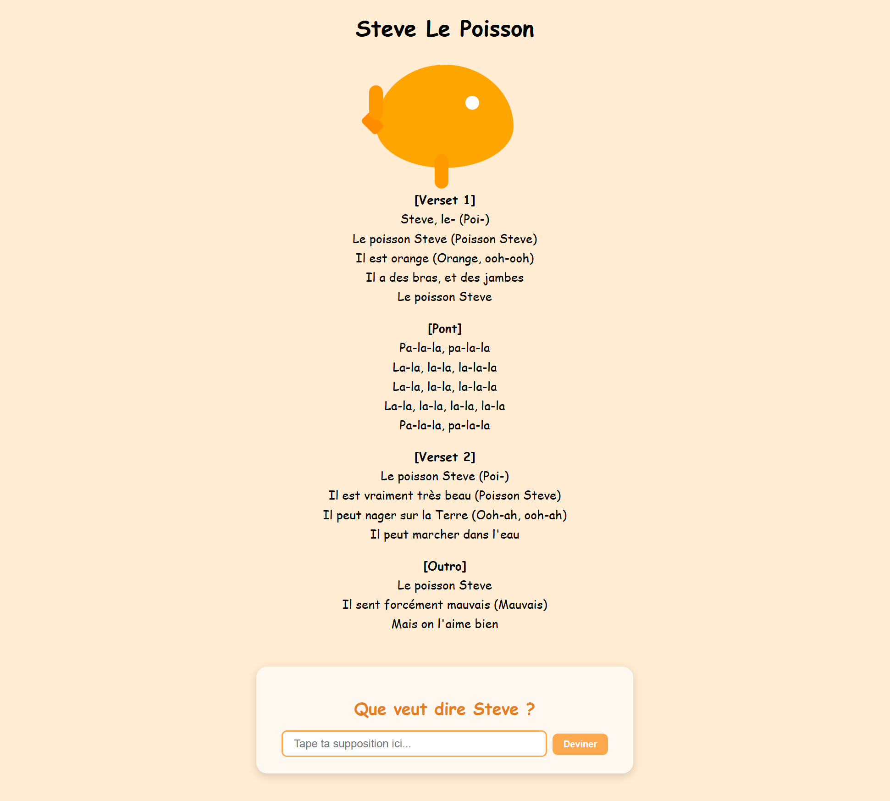
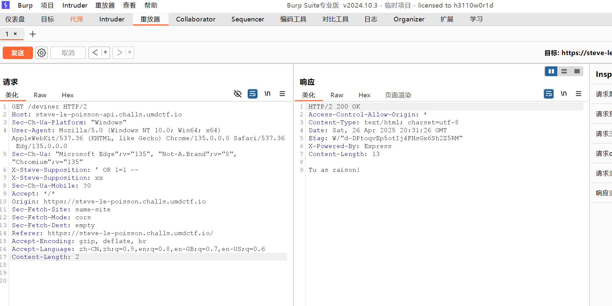
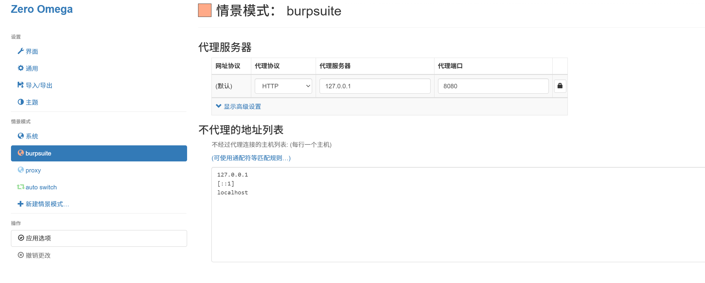
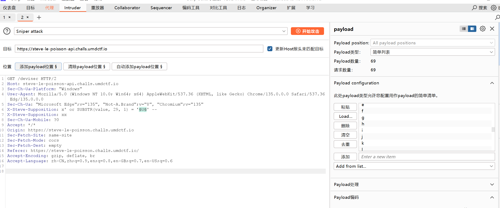

# Steve Le Poisson

给了一个网站，先是有一个视频，等视频放完了会有一个框框：



里面会发送一个GET请求，根据代码逻辑，如果输入正确的flag会有正确的提示。

这题给了源代码：

``` js
// 📦 Importation des modules nécessaires pour faire tourner notre monde sous-marin numérique
const express = require("express");   // Express, le cadre web minimaliste mais puissant
const sqlite3 = require("sqlite3");   // SQLite version brute, pour les bases de données légères
const sqlite = require("sqlite");     // Une interface moderne (promesse-friendly) pour SQLite
const cors = require("cors");         // Pour permettre à d'autres domaines de parler à notre serveur — Steve est sociable, mais pas trop

// 🐠 Création de l'application Express : c’est ici que commence l’aventure
const app = express();

// 🧪 Fonction de validation des en-têtes HTTP
// Steve, ce poisson à la sensibilité exacerbée, déteste les en-têtes trop longs, ambigus ou mystérieux
function checkBadHeader(headerName, headerValue) {
    return headerName.length > 80 || 
           (headerName.toLowerCase() !== 'user-agent' && headerValue.length > 80) || 
           headerValue.includes('\0'); // Le caractère nul ? Un blasphème pour Steve.
}

// 🛟 Middleware pour autoriser les requêtes Cross-Origin
app.use(cors());

// 🧙 Middleware maison : ici, Steve le Poisson filtre les requêtes selon ses principes aquatiques
app.use((req, res, next) => {
    let steveHeaderValue = null; // On prépare le terrain pour récupérer l’en-tête sacré
    let totalHeaders = 0;        // Pour compter — car Steve compte. Tout. Toujours.

    // 🔍 Parcours des en-têtes bruts, deux par deux (clé, valeur)
    for (let i = 0; i < req.rawHeaders.length; i += 2) {
        let headerName = req.rawHeaders[i];
        let headerValue = req.rawHeaders[i + 1];

        // ❌ Si un en-tête ne plaît pas à Steve, il coupe net la communication
        if (checkBadHeader(headerName, headerValue)) {
            return res.status(403).send(`Steve le poisson, un animal marin d’apparence inoffensive mais d’opinion tranchée, n’a jamais vraiment supporté tes en-têtes HTTP. Chaque fois qu’il en voit passer un — même sans savoir de quoi il s’agit exactement — son œil vitreux se plisse, et une sorte de grondement bouillonne dans ses branchies. Ce n’est pas qu’il les comprenne, non, mais il les sent, il les ressent dans l’eau comme une vibration mal alignée, une dissonance numérique qui le met profondément mal à l’aise. Il dit souvent, en tournoyant d’un air dramatique : « Pourquoi tant de formalisme ? Pourquoi cacher ce qu’on est vraiment derrière des chaînes de caractères obscures ? » Pour lui, ces en-têtes sont comme des algues synthétiques : inutiles, prétentieuses, et surtout étrangères à la fluidité du monde sous-marin. Il préférerait mille fois un bon vieux flux binaire brut, sans tous ces ornements absurdes. C’est une affaire de principe.`); // Message dramatique de Steve
        }

        // 🔮 Si on trouve l’en-tête "X-Steve-Supposition", on le garde
        if (headerName.toLowerCase() === 'x-steve-supposition') {
            steveHeaderValue = headerValue;
        } 

        totalHeaders++; // 🧮 On incrémente notre compteur de verbosité HTTP
    }

    // 🧻 Trop d’en-têtes ? Steve explose. Littéralement.
    if (totalHeaders > 30) {
        return res.status(403).send(`Steve le poisson, qui est orange avec de longs bras musclés et des jambes nerveuses, te fixe avec ses grands yeux globuleux. "Franchement," grogne-t-il en agitant une nageoire transformée en doigt accusateur, "tu abuses. Beaucoup trop d’en-têtes HTTP. Tu crois que c’est un concours ? Chaque requête que tu envoies, c’est un roman. Moi, je dois nager dans ce flux verbeux, et c’est moi qui me noie ! T’as entendu parler de minimalisme ? Non ? Et puis c’est quoi ce délire avec des en-têtes dupliqués ? Tu crois que le serveur, c’est un psy, qu’il doit tout écouter deux fois ? Retiens-toi la prochaine fois, ou c’est moi qui coupe la connexion."`); // Encore un monologue dramatique de Steve
    }

    // 🙅‍♂️ L’en-tête sacré est manquant ? Blasphème total.
    if (steveHeaderValue === null) {
        return res.status(400).send(`Steve le poisson, toujours orange et furibond, bondit hors de l’eau avec ses jambes fléchies et ses bras croisés. "Non mais sérieusement," râle-t-il, "où est passé l’en-tête X-Steve-Supposition ? Tu veux que je devine tes intentions ? Tu crois que je lis dans les paquets TCP ? Cet en-tête, c’est fondamental — c’est là que tu déclares tes hypothèses, tes intentions, ton respect pour le protocole sacré de Steve. Sans lui, je suis perdu, confus, désorienté comme un poisson hors d’un proxy.`);
    }

    // 🧪 Validation de la structure de la supposition : uniquement des caractères honorables
    if (!/^[a-zA-Z0-9{}]+$/.test(steveHeaderValue)) {
        return res.status(403).send(`Steve le poisson, ce poisson orange à la peau luisante et aux nageoires musclées, unique au monde, capable de nager sur la terre ferme et de marcher dans l'eau comme si c’était une moquette moelleuse, te regarde avec ses gros yeux globuleux remplis d’une indignation abyssale. Il claque de la langue – oui, car Steve a une langue, et elle est très expressive – en te voyant saisir ta supposition dans le champ prévu, un champ sacré, un espace réservé aux caractères honorables, alphabétiques et numériques, et toi, misérable bipède aux doigts témérairement chaotiques, tu as osé y glisser des signes de ponctuation, des tilde, des dièses, des dollars, comme si c’était une brocante de symboles oubliés. Tu crois que c’est un terrain de jeu, hein ? Mais pour Steve, ce champ est un pacte silencieux entre l’humain et la machine, une zone de pureté syntaxique. Et te voilà, en train de profaner cette convention sacrée avec ton “%” et ton “@”, comme si les règles n’étaient que des suggestions. Steve bat furieusement des pattes arrière – car oui, il a aussi des pattes arrière, pour la traction tout-terrain – et fait jaillir de petites éclaboussures d’écume terrestre, signe suprême de sa colère. “Pourquoi ?” te demande-t-il, avec une voix grave et solennelle, comme un vieux capitaine marin échoué dans un monde digital, “Pourquoi chercher la dissonance quand l’harmonie suffisait ? Pourquoi saboter la beauté simple de ‘azAZ09’ avec tes gribouillages postmodernes ?” Et puis il s’approche, les yeux plissés, et te lance d’un ton sec : “Tu n’es pas digne de l’en-tête X-Steve-Supposition. Reviens quand tu sauras deviner avec dignité.`);
    }

    // ✅ Si tout est bon, Steve laisse passer la requête
    next();
});

// 🔍 Point d'entrée principal : route GET pour "deviner"
app.get('/deviner', async (req, res) => {
    // 📂 Ouverture de la base de données SQLite
    const db = await sqlite.open({
        filename: "./database.db",           // Chemin vers la base de données
        driver: sqlite3.Database,            // Le moteur utilisé
        mode: sqlite3.OPEN_READONLY          // j'ai oublié ça
    });

    // 📋 Exécution d'une requête SQL : on cherche si la supposition de Steve est correcte
    const rows = await db.all(`SELECT * FROM flag WHERE value = '${req.get("x-steve-supposition")}'`);

    res.status(200); // 👍 Tout va bien, en apparence

    // 🧠 Si aucune ligne ne correspond, Steve se moque gentiment de toi
    if (rows.length === 0) {
        res.send("Bah, tu as tort."); // Pas de flag pour toi
    } else {
        res.send("Tu as raison!");    // Le flag était bon. Steve t’accorde son respect.
    }
});

// 🚪 On lance le serveur, tel un aquarium ouvert sur le monde
const PORT = 3000;
app.listen(PORT, "0.0.0.0", () => {
  console.log(`Serveur en écoute sur http://localhost:${PORT}`);
});
```

## Writeup

首先分析下基本信息：这是一个 Node + Express + CORS 的web应用程序。CORS是中间件。简单说，中间件就是类似服务器的“防火墙”，我们发送请求后，先要经过中间件处理，再发给服务器处理。

这里中间件的逻辑是过滤字符，防止SQL注入

``` js
app.use((req, res, next) => {
    let steveHeaderValue = null;  
    let totalHeaders = 0;        

    for (let i = 0; i < req.rawHeaders.length; i += 2) {
        let headerName = req.rawHeaders[i];
        let headerValue = req.rawHeaders[i + 1];

        if (checkBadHeader(headerName, headerValue)) {
            return res.status(403).send(`Ste...ipe.`); 
        }

        if (headerName.toLowerCase() === 'x-steve-supposition') {
            steveHeaderValue = headerValue;
        } 

        totalHeaders++; 
    }

    // 把 x-steve-supposition 存储再 steveHeaderValue 里面
    if (totalHeaders > 30) {
        return res.status(403).send(`Ste...on."`); 
    }

    if (steveHeaderValue === null) {
        return res.status(400).send(`Steve le poisson, tou...xy.`);
    }

    // 过滤字符，只允许A-Z,0-9,{}
    if (!/^[a-zA-Z0-9{}]+$/.test(steveHeaderValue)) {
        return res.status(403).send(`Steve le poisson, ce pé.`);
    }
	
    next(); // 中间件完成处理，交给服务器
});
```

之后的服务器处理就很简单

``` js
const rows = await db.all(`SELECT * FROM flag WHERE value = '${req.get("x-steve-supposition")}'`);

    res.status(200); // 👍 Tout va bien, en apparence

    if (rows.length === 0) { 
        res.send("Bah, tu as tort."); 
    } else {
        res.send("Tu as raison!");    
    }
```

直接把输入插入了SQL语句，如果可以绕过中间件的话，就是SQL盲注的裸题。

### 绕过中间件

因为这个中间件是有漏洞的，所以可以绕过。这里设计一个冷知识。HTTP Request发送rawHeaders的时候和最后 `req.get` 拿到的header是不一样的。看看ChatGPT的解释：

#### 📦 区别：`rawHeaders` vs `headers`


| 项目        | `rawHeaders`                                   | `headers`                                  |
| ----------- | ---------------------------------------------- | ------------------------------------------ |
| 类型        | **数组/列表**（交替：名字、值、名字、值）      | **对象/字典**（key-value映射）             |
| 原样保留？  | ✅ 完全保留原始格式（大小写、顺序、重复header） | ❌ 自动标准化（header名小写化、合并重复项） |
| 重复header  | 支持（可以有多个相同的header）                 | 通常只保留一个（或者把**值合并**）         |
| 适合场景    | 需要处理特别奇怪、脏、特制的HTTP包（比如CTF）  | 正常开发读取常规header用                   |
| Express中拿 | `req.rawHeaders`                               | `req.headers`                              |

------

#### 🎯 举个例子

如果浏览器发了这么一个HTTP请求：

```
GET / HTTP/1.1
Host: example.com
X-Test: 123
x-test: 456
X-Another: abc
```

在 Express.js 里面你能拿到：

#### `req.rawHeaders`

```
[
  "Host", "example.com",
  "X-Test", "123",
  "x-test", "456",
  "X-Another", "abc"
]
```

👉 **大小写、重复的header全保留**，顺序也一样！

------

#### `req.headers`

```
{
  "host": "example.com",
  "x-test": "123, 456",       // 这里合并了
  "x-another": "abc"
}
```

👉 **header名全部小写**，**重复header被覆盖**！

看了这个解释，那么那么for循环处理就可以解释的通了。rawheaders允许多个Key出现，但是那个for循环只检查最后一个。

``` js
for (let i = 0; i < req.rawHeaders.length; i += 2) {
    if (headerName.toLowerCase() === 'x-steve-supposition') {
        steveHeaderValue = headerValue;
    } 
}
```

但是后面注入的时候，是合并的值。所以除了最后一个，前面的都可以绕过中间件检查。

### Burp suite

我们首先用Burp Suite抓包，然后修改包的内容



``` shell
' OR 1=1 --
```

这个作为第一个，可以看到回复了正确的回答。

#### 浏览器代理

有个问题，这个要设置浏览器代理，用内置浏览器是不行的，因为视频加载不了，所以就跳不过后面

这里我用Edge浏览器

下载插件：**Proxy SwitchyOmega 3 (ZeroOmega)**

在插件的设置页面里面



首先在左边新建场景，写 Burpsuite, 然后像右边这样设置，然后保存。重启浏览器，开启代理。之后再Burpsuite里面就可以抓包了。

#### HTTPS抓包

这里有个问题，Burp Suite不能抓HTTPS的包，这是因为证书没有设置好。我是根据这个网站设置了一下，就好了：https://blog.csdn.net/qq_41631806/article/details/115709716

然后抓包的时候，第一个请求是OPTION请求，这个让它过去，第二个是我们要的GET请求

### SQL盲注

首先把请求发送到Intruder里面，把accept language后面结尾的一些删了，得到这样



我们用这个payload

``` shell
x' or SUBSTR(value, 29, 1) = '§U§' --
```

这个是检查第i个字符是不是某个字符，我们枚举后面的字符。U这里是添加payload位置产生的。

然后在右边设置，点Add from list，加入`A-Z,a-z,0-9` 还有 `{}` ,记得把下面的URL编码不要勾选。

然后点开始攻击，点那个response长度不一样的就是正确的字符。

就这样一个个试，从第一个字符攻击到最后一个字符，最后得到flag

``` shell
UMDCTF{ile5TVR4IM3NtTresbEAu}
```

### 后话

这题不能用Python的requests写，因为那里面传入的header是字典，不支持多个相同的key。所以不能利用这个漏洞。
