# 你管这玩意叫操作系统源码

搬运自飞天闪客公众号

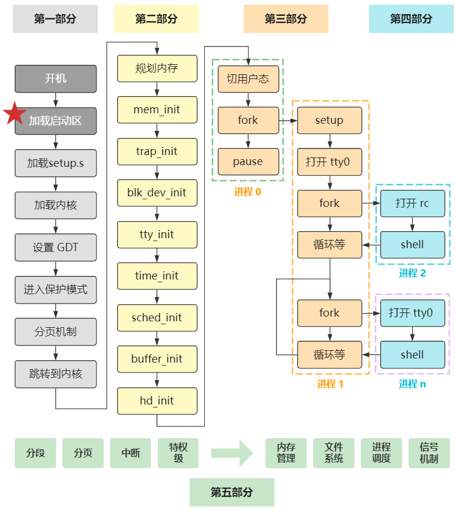

## 第一回 最开始的两行代码

从这一篇开始，您就将跟着我一起进入这操作系统的梦幻之旅！

别担心，每一章的内容会非常的少，而且你也不要抱着很大的负担去学习，只需要像读小说一样，跟着我一章一章读下去就好。

话不多说，直奔主题。当你按下开机键的那一刻，在主板上提前写死的固件程序 **BIOS** 会将硬盘中**启动区的 512 字节**的数据，原封不动复制到**内存中的 0x7c00** 这个位置，并跳转到那个位置进行执行。

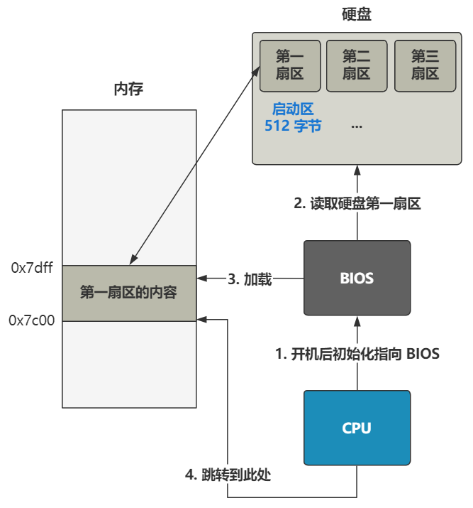

启动区的定义非常简单，只要硬盘中的 0 盘 0 道 1 扇区的 512 个字节的最后两个字节分别是 **0x55** 和 **0xaa**，那么 BIOS 就会认为它是个启动区。

所以对于我们理解操作系统而言，此时的 BIOS 仅仅就是个代码搬运工，把 512 字节的二进制数据从硬盘搬运到了内存中而已。**所以作为操作系统的开发人员，仅仅需要把操作系统最开始的那段代码，编译并存储在硬盘的 0 盘 0 道 1 扇区即可**。之后 BIOS 会帮我们把它放到内存里，并且跳过去执行。

而 Linux-0.11 的最开始的代码，就是这个用汇编语言写的 **bootsect.s**，位于 **boot** 文件夹下。

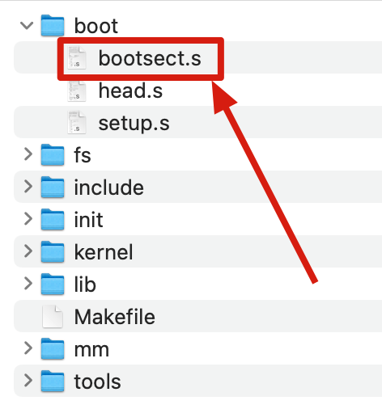

通过编译，这个 bootsect.s 会被编译成二进制文件，存放在启动区的第一扇区。

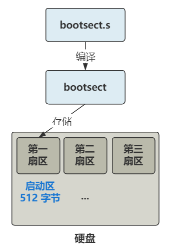

随后就会如刚刚所说，由 BIOS 搬运到内存的 0x7c00 这个位置，而 CPU 也会从这个位置开始，不断往后一条一条语句无脑地执行下去。

那我们的梦幻之旅，就从这个文件的第一行代码开始啦！

``` asm
mov ax,0x07c0
mov ds,ax
```

好吧，先连续看两行。

这段代码是用汇编语言写的，含义是把 0x07c0 这个值复制到 **ax 寄存器**里，再将 ax 寄存器里的值复制到 **ds 寄存器**里。那其实这一番折腾的结果就是，让 ds 这个寄存器里的值变成了 0x07c0。

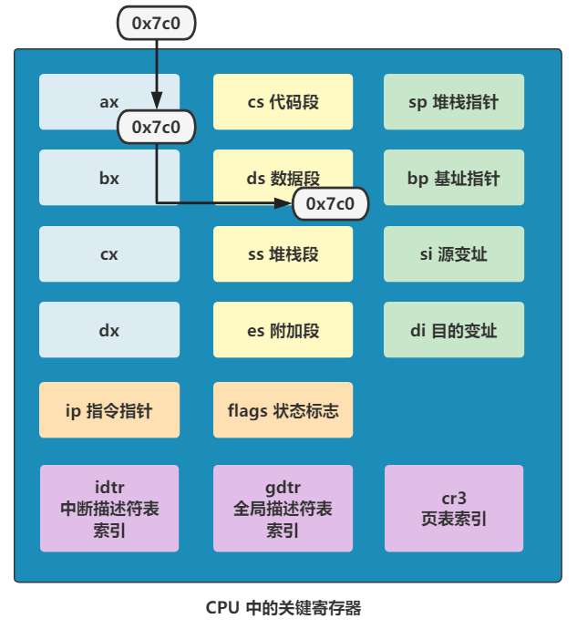

ds 是一个 16 位的段寄存器，具体表示数据段寄存器，在内存寻址时充当段基址的作用。啥意思呢？就是当我们之后用汇编语言写一个内存地址时，实际上仅仅是写了偏移地址，比如：

``` asm
mov ax, [0x0001]
```

实际上相当于

``` shell
mov ax, [ds:0x0001]
```

ds 是默认加上的，表示在 ds 这个段基址处，往后再偏移 0x0001 单位，将这个位置的内存数据，复制到 ax 寄存器中。

形象地比喻一下就是，你和朋友商量去哪玩比较好，你说天安门、南锣鼓巷、颐和园等等，实际上都是**偏移地址**，省略了北京市这个**基址**。

当然你完全可以说北京天安门、北京南锣鼓巷这样，每次都加上北京这个前缀。不过如果你事先和朋友说好，以下我说的地方都是北京市里的哈，之后你就不用每次都带着北京市这个词了，是不是很方便？

那 ds 这个数据段寄存器的作用就是如此，方便了描述一个内存地址时，可以省略一个基址，没什么神奇之处。

 ``` txt
 ds : 0x0001
 北京市 : 南锣鼓巷
 ```

再看，这个 ds 被赋值为了 0x07c0，由于 x86 为了让自己在 16 位这个实模式下能访问到 20 位的地址线这个历史因素（不了解这个的就先别纠结为啥了），所以段基址要先左移四位。**那 0x07c0 左移四位就是 0x7c00**，那这就刚好和这段代码被 BIOS 加载到的内存地址 0x7c00 一样了。

也就是说，之后再写的代码，里面访问的数据的内存地址，都先默认加上 0x7c00，再去内存中寻址。

为啥统一加上 0x7c00 这个数呢？这很好解释，BIOS 规定死了把操作系统代码加载到内存 0x7c00，那么里面的各种数据自然就全都被偏移了这么多，所以把数据段寄存器 ds 设置为这个值，方便了以后通过这种基址的方式访问内存里的数据。

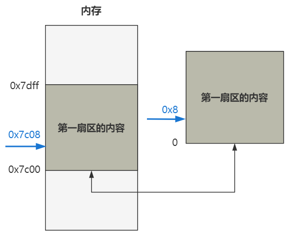

OK，赶紧消化掉前面的知识，那本篇就到此为止，只讲了两行代码，知识量很少，我没骗你吧。

希望你能做到，对 BIOS 将操作系统代码加载到内存 0x7c00，以及我们通过 mov 指令将默认的数据段寄存器 ds 寄存器的值改为 0x07c0 方便以后的基址寻址方式，这两件事在心里认可，并且没有疑惑，这才方便后面继续进行。

## 第二回 自己给自己挪个地儿

书接上回，上回书咱们说到，CPU 执行操作系统的最开始的两行代码。

``` asm
mov ax,0x07c0
mov ds,ax
```

将数据段寄存器 ds 的值变成了 **0x07c0**，方便了之后访问内存时利用这个**段基址**进行寻址。

接下来我们带着这两行代码，继续往下看几行。

``` asm
mov ax,0x07c0
mov ds,ax
mov ax,0x9000
mov es,ax
mov cx,#256
sub si,si
sub di,di
rep movw
```

此时 ds 寄存器的值已经是 0x07c0 了，然后又通过同样的方式将 **es** 寄存器的值变成 **0x9000**，接着又把 **cx** 寄存器的值变成 **256**（代码里确实是用十进制表示的，与其他地方有些不一致，不过无所谓）。

再往下看有两个 **sub** 指令，这个 sub 指令很简单，比如

``` asm
sub a,b
```

就表示

```
a = a - b
```

那么代码中的

```
sub si,si
```

就表示

```
si = si - si
```

所以如果 sub 后面的两个寄存器一模一样，就相当于把这个寄存器里的值**清零**，这是一个基本玩法。

那就非常简单了，经过这些指令后，以下几个寄存器分别被附上了指定的值，我们梳理一下。

```txt
ds = 0x07c0
es = 0x9000
cx = 256
si = 0
di = 0
```

还记得上一讲画的 CPU 寄存器的总图么？此时就是这样了

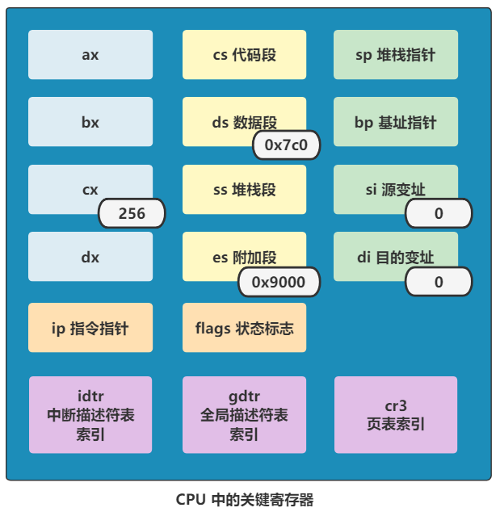

干嘛要给这些毫不相干的寄存器附上值呢？其实就是为下一条指令服务的，就是

```
rep movw
```

其中 **rep** 表示重复执行后面的指令。

而后面的指令 **movw** 表示复制一个**字**（word 16位），那其实就是**不断重复地复制一个字**。

那下面自然就有三连问：

**重复执行多少次呢？**是 cx 寄存器中的值，也就是 256 次。

**从哪复制到哪呢？**是从 ds:si 处复制到 es:di 处。

**一次复多少呢？**刚刚说过了，复制一个字，16 位，也就是两个字节。

上面是直译，那把这段话翻译成更人话的方式讲出来就是，**将内存地址 0x7c00 处开始往后的 512 字节的数据，原封不动复制到 0x90000 处**。

就是下图的第二步。

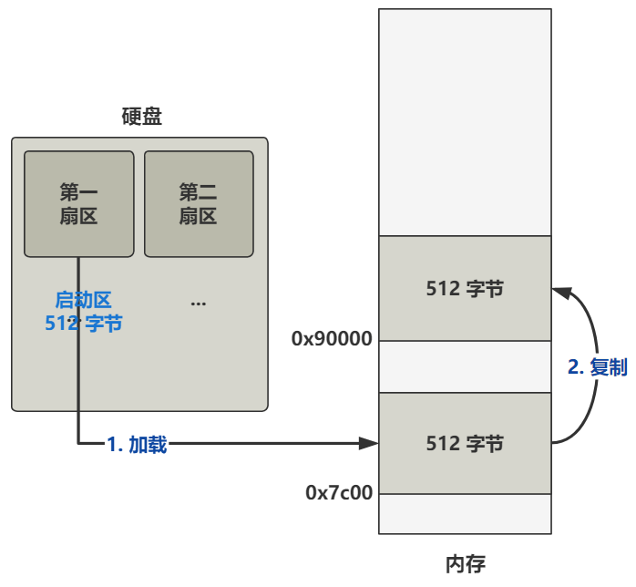

没错，就是这么折腾了一下。现在，操作系统最开头的代码，已经被挪到了 **0x90000** 这个位置了。

再往后是一个**跳转**指令。

```
jmpi go,0x9000
go: 
  mov ax,cs
  mov ds,ax
```

仔细想想或许你能猜到它想干嘛。

**jmpi** 是一个**段间跳转指令**，表示跳转到 **0x9000:go** 处执行。

还记得上一讲说的 **段基址 : 偏移地址** 这种格式的内存地址要如何计算吧？段基址仍然要先左移四位，因此结论就是跳转到 **0x90000 + go** 这个内存地址处执行。忘记的赶紧回去看看，这才过了一回哦，要稳扎稳打。

再说 go，go 就是一个**标签**，最终编译成机器码的时候会被翻译成一个值，这个值就是 go 这个标签在文件内的偏移地址。

这个偏移地址再加上 0x90000，就刚好是 go 标签后面那段代码 **mov ax,cs** 此时所在的内存地址了。

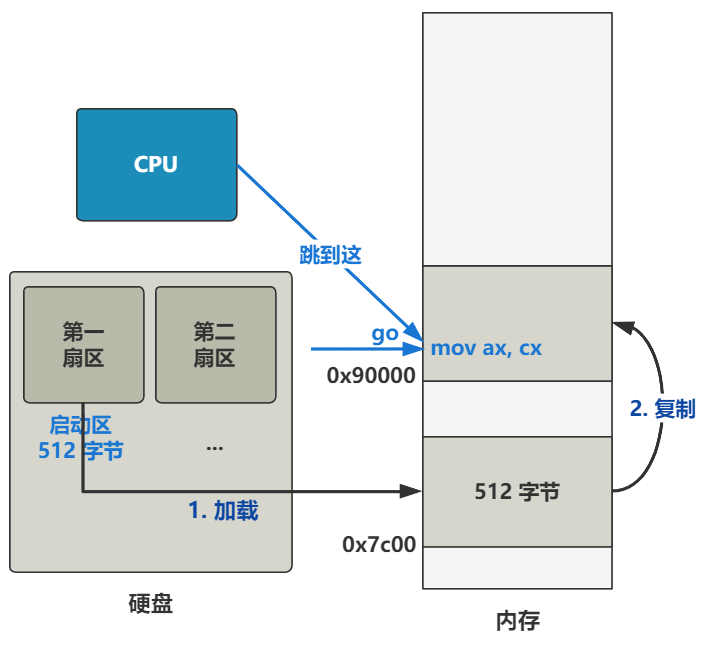

那假如 **mov ax,cx** 这行代码位于最终编译好后的二进制文件的 **0x08** 处，那 go 就等于 0x08，而最终 CPU 跳转到的地址就是 **0x90008** 处。

所以到此为止，前两回的内容，其实就是一段 **512** 字节的代码和数据，从硬盘的启动区先是被移动到了内存 **0x7c00** 处，然后又立刻被移动到 **0x90000** 处，并且跳转到此处往后再稍稍偏移 **go** 这个标签所代表的偏移地址处，也就是 **mov ax,cs** 这行指令的位置。

仍然是保持每回的简洁，本文就讲到这里，希望大家还跟得上，接下来的下一回，我们就把目光定位到 go 标签处往后的代码，看看他又要折腾些什么吧。

后面的世界越来越精彩，欲知后事如何，且听下回分解。

**------- 本回扩展与延伸 -------**

有关**寄存器**的详细信息，可以参考 Intel 手册：

Volume 1 Chapter 3.2 OVERVIEW OF THE BASIC EXECUTION ENVIRONMEN

如果想了解**汇编指令**的信息，可以参考 Intel 手册：

Volume 2 Chapter 3 ~ Chapter 5

比如本文出现的 sub 指令，你完全没必要去百度它的用法，直接看手册。

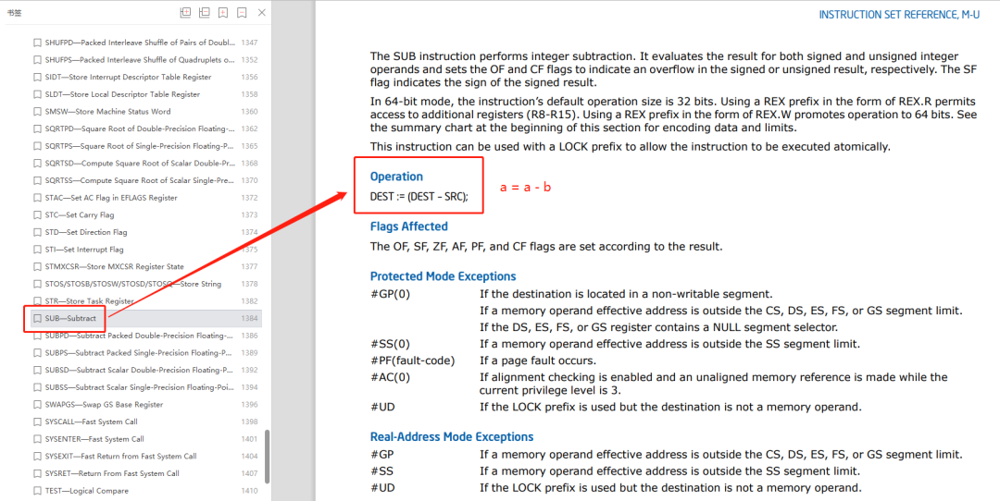

Intel 手册对于理解底层知识非常直接有效，但却没有很好的中文翻译版本，因此让许多人望而生畏，只能去看一些错误百出的中文二手资料和博客。因此我也发起了一个 **Intel 手册翻译计划**，就在阅读原文的 GitHub 里，感兴趣的同胞们可以参与进来，我们共同完成一份伟大的事。


希望你跟完整个系列，收获的不仅仅是 Linux 0.11 源码的了解，更是自己探索问题和寻找答案的一个科学思考方式。

所以每次**本回扩展与延伸**这里，希望你也能每天进步一点点，实践起来，再不济，也能多学几个英语单词不是？

>抱歉，go 处的代码是 mov ax，cs 有两处写成了 mov ax，cx 不过这个代码后面才讲，不影响本文理解。

## 第三回 做好最最基础的准备工作

书接上回，上回书咱们说到，操作系统的代码最开头的 512 字节的数据，从硬盘的启动区先是被移动到了内存 **0x7c00** 处，然后又立刻被移动到 **0x90000** 处，并且跳转到此处往后再稍稍偏移 **go** 这个标签所代表的偏移地址处。

 


 

那我们接下来，就继续把我们的目光放在 go 这个标签的位置，跟着 CPU 的步伐往后看。

```
go: mov ax,cs
    mov ds,ax
    mov es,ax
    mov ss,ax
    mov sp,#0xFF00
```

全都是 mov 操作，那好办了。

这段代码的直接意思很容易理解，就是把 **cs** 寄存器的值分别复制给 **ds**、**es** 和 **ss** 寄存器，然后又把 0xFF00 给了 **sp** 寄存器。

回顾下 CPU 寄存器图。

 

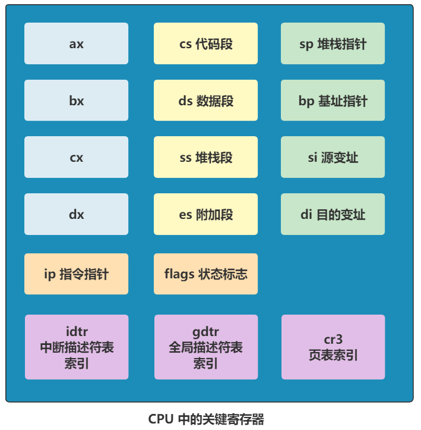

 

cs 寄存器表示**代码段寄存器**，CPU 当前正在执行的代码在内存中的位置，就是由 cs:ip 这组寄存器配合指向的，其中 cs 是基址，ip 是偏移地址。

由于之前执行过一个段间跳转指令，还记得不？

```
jmpi go,0x9000
```

所以现在 cs 寄存器里的值就是 **0x9000**，ip 寄存器里的值是 **go** 这个标签的偏移地址。那这三个 mov 指令就分别给 ds、es 和 ss 寄存器赋值为了 0x9000。

ds 为数据段寄存器，之前我们说过了，当时它被复制为 **0x07c0**，是因为之前的代码在 0x7c00 处，现在代码已经被挪到了 0x90000 处，所以现在自然又改赋值为 **0x9000** 了。

es 是扩展段寄存器，仅仅是个扩展，不是主角，先不用理它。

ss 为**栈段寄存器**，后面要配合栈基址寄存器 sp 来表示此时的栈顶地址。而此时 sp 寄存器被赋值为了 **0xFF00** 了，所以目前的栈顶地址就是 **ss:sp** 所指向的地址 **0x9FF00** 处。

 

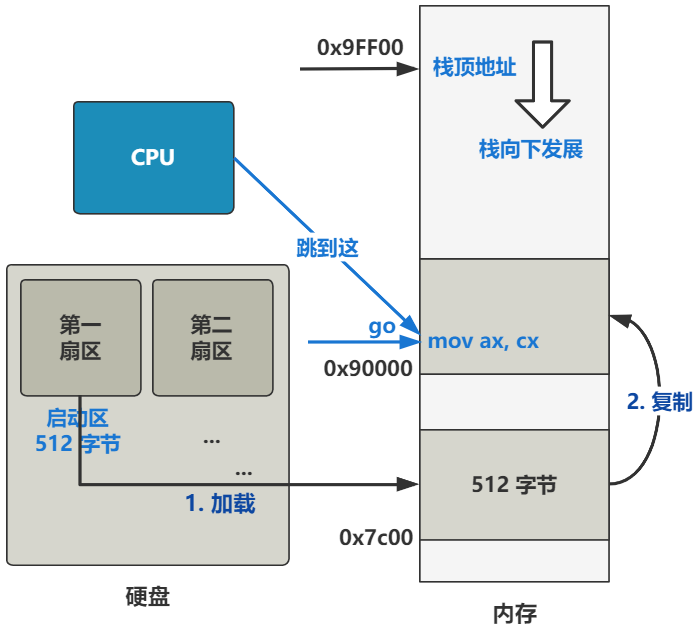

其实到这里，操作系统的一些最最最最基础的准备工作，就做好了。都做了些啥事呢？

**第一**，代码从硬盘移到内存，又从内存挪了个地方，放在了 **0x90000** 处。

**第二**，**数据段寄存器 ds** 和**代码段寄存器 cs** 此时都被设置为了 0x9000，也就为跳转代码和访问内存数据，奠定了同一个内存的基址地址，方便了跳转和内存访问，因为仅仅需要指定偏移地址即可了。

**第三**，栈顶地址被设置为了 0x9FF00，具体表现为**栈段寄存器 ss** 为 0x9000，**栈基址寄存器 sp** 为 0xFF00。栈是向下发展的，这个栈顶地址 0x9FF00 要远远大于此时代码所在的位置 0x90000，所以栈向下发展就很难撞见代码所在的位置，也就比较安全。这也是为什么给栈顶地址设置为这个值的原因，其实只需要离代码的位置远远的即可。

做好这些基础工作后，接下来就又该折腾了其他事了。

总结拔高一下，这一部分其实就是把**代码段寄存器 cs**，**数据段寄存器 ds**，**栈段寄存器 ss** 和**栈基址寄存器 sp** 分别设置好了值，方便后续使用。

再拔高一，其实操作系统在做的事情，就是给如何访问代码，如何访问数据，如何访问栈进行了一下**内存的初步规划**。其中访问代码和访问数据的规划方式就是设置了一个**基址**而已，访问栈就是把**栈顶指针**指向了一个远离代码位置的地方而已。


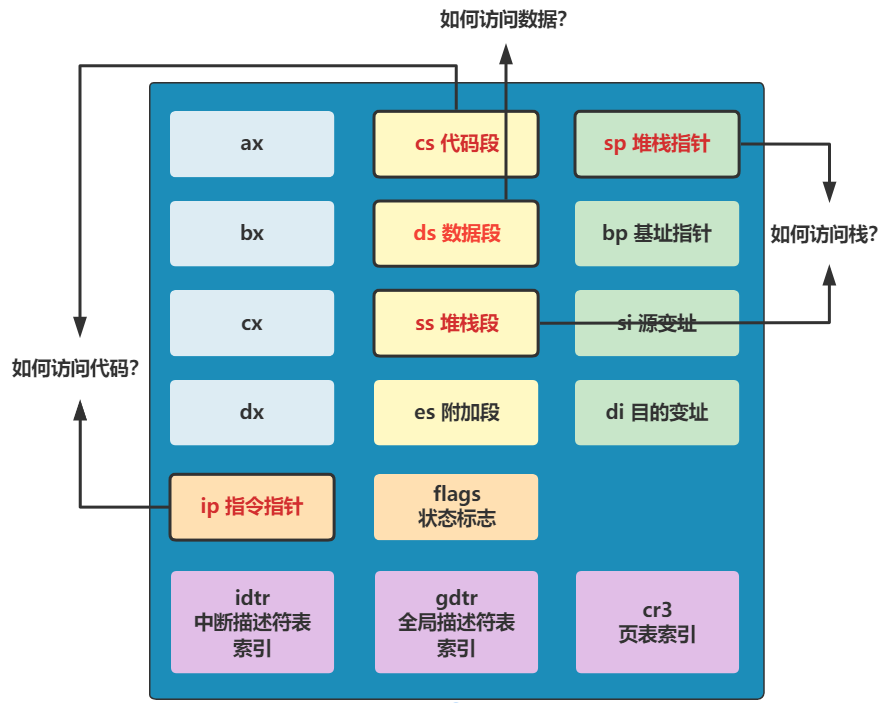

所以，千万别多想，就这么点事儿。那再给大家留个作业，把当前的内存布局画出来，告诉我现在 **cs、ip、ds、ss、sp** 这些寄存器的值，在内存布局中的位置。

好了，接下来我们应该干什么呢？我们回忆下，我们目前仅仅把硬盘中 512 字节加载到内存中了，但操作系统还有很多代码仍然在硬盘里，不能抛下他们不管呀。

所以你猜下一步要干嘛了？

后面的世界越来越精彩，欲知后事如何，且听下回分解。

**------- 本回扩展与延伸 -------**

有关段寄存器的详细信息，可以参考 Intel 手册：

Volume 1 Chapter 3.4.2 Segment Registers

其中有一张图清晰地描述了三种段寄存器的作用。


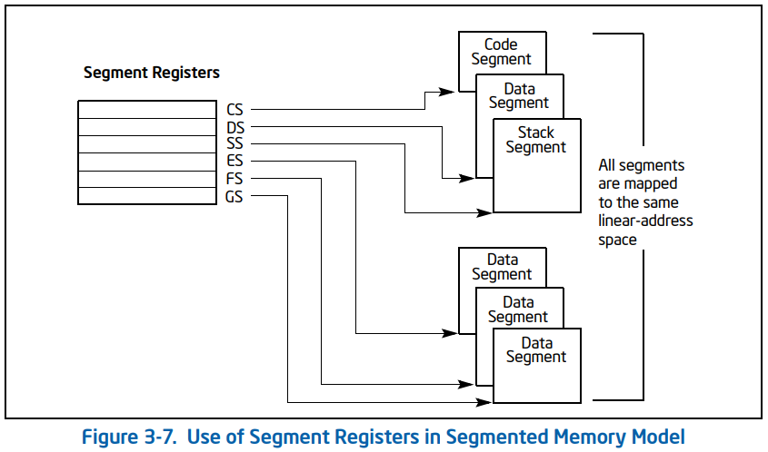

正如我们本回所涉及到的讲述一样，**CS 是代码段寄存器**，就是执行代码的时候带着这里存的基地址。**DS 是数据段寄存器**，就是访问数据的时候带着这里的基地址。**SS 是栈段寄存器**，就是访问栈时带着这里的基地址。


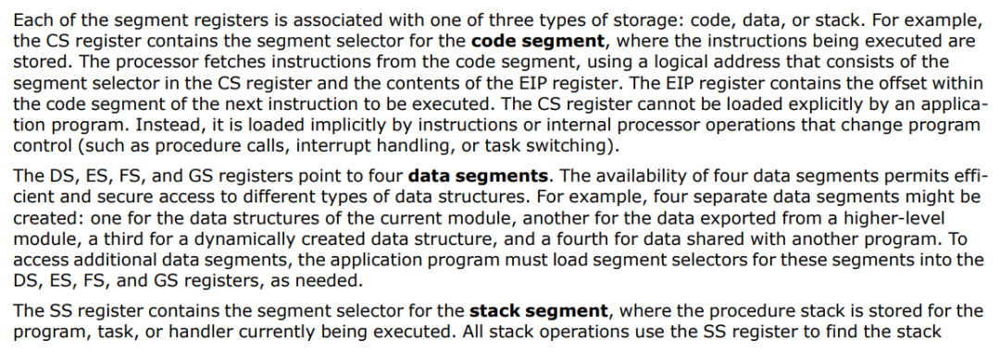


所以本回的代码，正如标题所说，就是做好最最基础的准备工作。但要从更伟大的战略意义上讲，它其实是按照 Intel 手册上要求的，老老实实把这三类段寄存器的值设置好，达到了**初步规划内存**的目的。

读到这里，我希望你此时已经稍稍有些，**操作系统原来就是这个破玩意**，的感觉。

同时也可以看出，Intel 手册对于理解底层知识非常直接有效，但却没有很好的中文翻译版本，因此让许多人望而生畏，只能去看一些错误百出的中文二手资料和博客。因此我也发起了一个 **Intel 手册翻译计划**，就在阅读原文的 GitHub 里，感兴趣的同胞们可以参与进来，我们共同完成一份伟大的事。

## 第四回 | 把自己在硬盘里的其他部分也放到内存来

书接上回，上回书咱们说到，操作系统的一些最最最最基础的准备工作，已经准备好了。

 

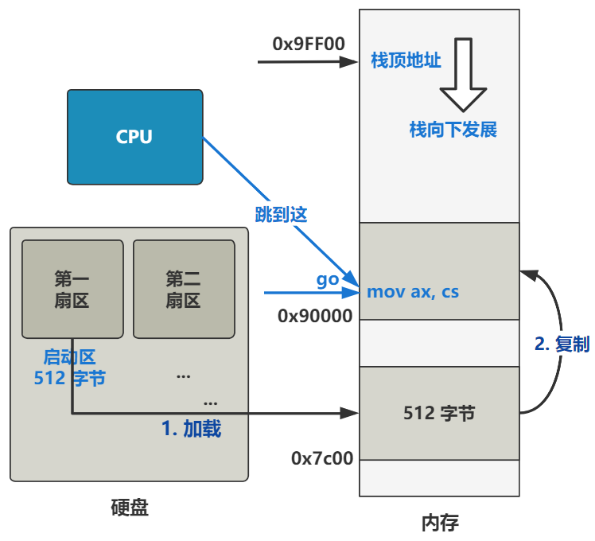

如这张图所示，此时操作系统短短几行代码，将**数据段寄存器 ds** 和**代码段寄存器 cs** 设置为了 **0x9000**，方便代码的跳转与数据的访问。并且，将**栈顶地址 ss:sp** 设置在了离代码的位置 0x90000 足够遥远的 **0x9FF00**，保证栈向下发展不会轻易撞见代码的位置。

简单说，就是设置了如何访问数据的**数据**段，如何访问代码的**代码**段，以及如何访问栈的**栈顶**指针，也即初步做了一次**内存规划**，从 CPU 的角度看，访问内存，就这么三块地方而已。


做好这些基础工作后，接下来就又该新的一翻折腾了，我们接着往下看。

```
load_setup:
    mov dx,#0x0000      ; drive 0, head 0
    mov cx,#0x0002      ; sector 2, track 0
    mov bx,#0x0200      ; address = 512, in 0x9000
    mov ax,#0x0200+4    ; service 2, nr of sectors
    int 0x13            ; read it
    jnc ok_load_setup       ; ok - continue
    mov dx,#0x0000
    mov ax,#0x0000      ; reset the diskette
    int 0x13
    jmp load_setup

ok_load_setup:
    ...
```

这里有两个 **int 指令**我们还没见过。

注意这个 int 是汇编指令，可不是高级语言的整型变量哟。int 0x13 表示**发起 0x13 号中断**，这条指令上面给 dx、cx、bx、ax 赋值都是作为这个中断程序的参数。

中断是啥如果你不理解，先不要管，如果你就是放不下，那可以看一眼我之前的文章：[认认真真的聊聊中断](http://mp.weixin.qq.com/s?__biz=Mzk0MjE3NDE0Ng==&mid=2247498208&idx=1&sn=b784f8b4e627ebd1bfb9810d194fdb80&chksm=c2c5834df5b20a5bdee331002bfc61c90eb468da325bf67abeef780c303a9f51c8543e1a5981&scene=21#wechat_redirect)，里面讲得非常细致。


总之这个中断发起后，CPU 会通过这个**中断号**，去寻找对应的**中断处理程序的入口地址**，并**跳转**过去执行，逻辑上就相当于**执行了一个函数**。而 0x13 号中断的处理程序是 BIOS 提前给我们写好的，是**读取磁盘**的相关功能的函数。

之后真正进入操作系统内核后，中断处理程序是需要我们自己去重新写的，这个在后面的章节中，你会不断看到各个模块注册自己相关的中断处理程序，所以不要急。此时为了方便就先用 BIOS 提前给我们写好的程序了。

可见即便是操作系统的源码，有时也需要去调用现成的函数方便自己，并不是造轮子的人就非得完全从头造。

本段代码的注释已经写的很明确了，直接说最终的作用吧，**就是将硬盘的第 2 个扇区开始，把数据加载到内存 0x90200 处，共加载 4 个扇区**，图示其实就是这样。

 

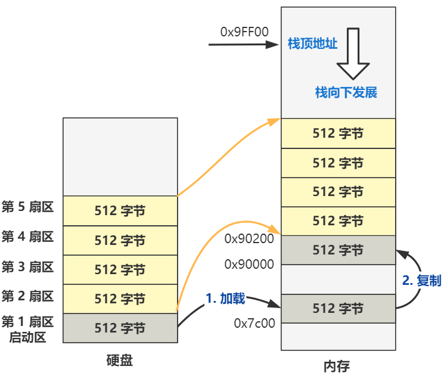

为了图片清晰表达意思，可能比例就不那么严谨了，大家不必纠结。

可以看到，如果复制成功，就跳转到 **ok_load_setup** 这个标签，如果失败，则会不断重复执行这段代码，也就是重试。那我们就别管重试逻辑了，直接看成功后跳转的 ok_load_setup 这个标签后的代码。

```
ok_load_setup:
    ...
    mov ax,#0x1000
    mov es,ax       ; segment of 0x10000
    call read_it
    ...
    jmpi 0,0x9020
```

这段代码省略了很多非主逻辑的代码，比如在屏幕上输出 Loading system ... 这个字符串以防止用户等烦了。

剩下的主要代码就都写在这里了，就这么几行，其作用是**把从硬盘第 6 个扇区开始往后的 240 个扇区，加载到内存 0x10000 处**，和之前的从硬盘捣腾到内存是一个道理。

 

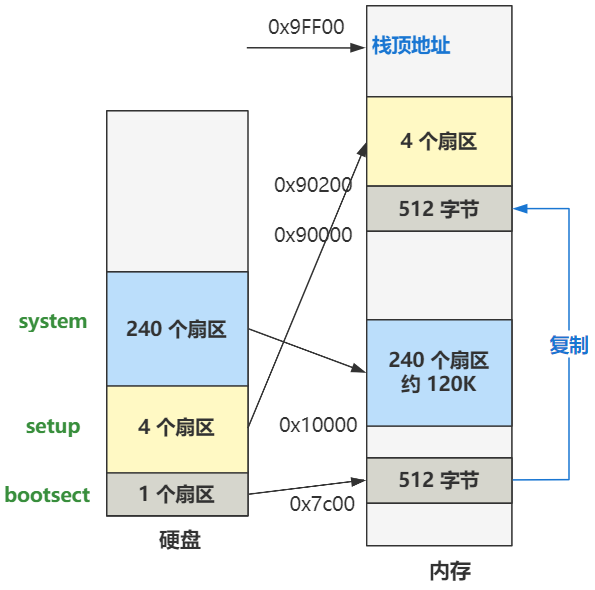

至此，整个操作系统的**全部代码**，就已经全部从硬盘中，被搬迁到内存来了。

然后又通过一个熟悉的段间跳转指令 jmpi 0,0x9020，跳转到 **0x90200** 处，就是硬盘第二个扇区开始处的内容。

那这里的内容是什么呢？先不急，我们借这个机会把整个操作系统的编译过程说下。整个编译过程，就是通过 **Makefile** 和 **build.c** 配合完成的，最终会：

***1.*** 把 bootsect.s 编译成 bootsect 放在硬盘的 1 扇区。

***2.*** 把 setup.s 编译成 setup 放在硬盘的 2~5 扇区。

***3.*** 把剩下的全部代码（head.s 作为开头）编译成 system 放在硬盘的随后 240 个扇区。

所以整个路径就是这样的。


所以，我们即将跳转到的内存中的 **0x90200** 处的代码，就是从硬盘第二个扇区开始处加载到内存的。第二个扇区的最开始处，那也就是 setup.s 文件的第一行代码咯。


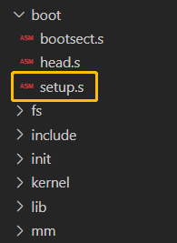

 

那这个代码是什么呢？我们后面再说，不过先打开 setup.s 这个文件看看吧。

```
start:
    mov ax,#0x9000  ; this is done in bootsect already, but...
    mov ds,ax
    mov ah,#0x03    ; read cursor pos
    xor bh,bh
    int 0x10        ; save it in known place, con_init fetches
    mov [0],dx      ; it from 0x90000.
    ...
```

好了，到目前为止，你是不是觉得，我去，这前面编译放在硬盘的位置，和后面代码写死的跳转地址，竟然如此地强耦合？那万一整错了咋办。

是啊，就是这样，你以为呢？**在操作系统刚刚开始建立的时候，那是完全自己安排前前后后的关系**，一个字节都不能偏，就是这么强耦合，需要小心翼翼，需要大脑时刻保持清醒，规划好自己写的代码被编译并存储在硬盘的哪个位置，而随后又会被加载到内存的哪个位置，不能错乱。

但这也是很有好处的，那就是在这个阶段，你完完全全知道每一步跳转，每一步数据访问都是怎么设计和规划的，不存在黑盒。

不像我们在写高级语言的时候，完全不知道是怎么底层帮我们做了多少工作。虽然这解脱了程序员关心底层细节的烦恼，但在遇到问题或者想知道原理的时候，就显得很讨厌了。所以珍惜这个阶段吧！

而且，你在上层之所以能那么随心所欲，很多底层细节完全不用考虑，很省心，正是因为像今天这样以及之后每一章的各种底层代码小心翼翼的做了很多铺垫。

好了，本文的内容就结束了。这也标志着我们走完了**第一个操作系统源码**文件 **bootsect.s**，开始向下一个文件 **setup.s** 进发了！

后面的世界越来越精彩，欲知后事如何，且听下回分解。

**------- 多说两句 -------**

先给大家留个课后作业，文中不是提到了 BIOS 提供了很多中断函数方便操作系统刚启动的时候调用么？这些中断都是什么？大家负责去找一份**一手资料**（注意是一手资料，不要网上整理的二手博客），并上传到我的 **GitHub** 上（文末阅读原文就是）。

不知不觉已经第四回了，刚刚才把 bootsect.s 这个汇编文件讲完，它所做的事情无非就是把硬盘中的数据复制到内存，然后挪来挪去的，并且根据放置在内存中的位置，设置了各种段基址寄存器的值。

在解答读者疑问时，我发现有**两种特别极端的人**。

**一种是把这几讲的内容想得极其复杂**，什么代码段和数据段一样会不会相互影响，这些地址是虚拟地址还是物理地址，为什么要不断从内存一个地方挪动到另一个地方，BIOS 是怎么映射到内存的，硬盘中 512 字节是数据还是代码，等等。

这样的人，我建议把你所知道的一切先忘掉，就把这几讲所说的东西理解清楚，因为它就是很简单，不涉及那么多乱七八糟的知识。你所产生的那些疑问，在这个阶段根本就不存在这些问题，现在内存就在这，你想怎么玩就怎么玩，无非就是访问数据，执行代码，自己能安排明白即可。

**还有一种人，就是把这几讲的内容想得特别简单**，这几讲确实就是复制硬盘数据和内存数据为主，但这就是操作系统呀！它就是不断通过这样简简单单的动作，把自己一点一点搞复杂的呢。

首先它靠 BIOS 做了第一步加载动作，然后就可以用加载的这 512 字节，去加载更多在硬盘中的代码和数据，那整个过程就自己把自己加载完整了，你不觉得这个过程也很伟大和奇妙么？会不会有解答了你之前一直困惑的什么东西呢？

多想想，多看看每回的扩展部分和延伸部分。

## 第五回 | 进入保护模式前的最后一次折腾内存

书接上回，上回书咱们说到，操作系统已经完成了各种从硬盘到内存的加载，以及内存到内存的复制。

 


至此，整个 **bootsect.s** 的使命就完成了，也是我们品读完的第一个操作系统源码文件。之后便跳转到了 **0x90200** 这个位置开始执行，这个位置处的代码就是位于 **setup.s** 的开头，我们接着来看。

```
start:
    mov ax,#0x9000  ; this is done in bootsect already, but...
    mov ds,ax
    mov ah,#0x03    ; read cursor pos
    xor bh,bh
    int 0x10        ; save it in known place, con_init fetches
    mov [0],dx      ; it from 0x90000.
```

又有个 **int** 指令。

前面的文章好好看过的话，一下就能猜出它要干嘛。还记不记得之前有个 **int 0x13** 表示触发 BIOS 提供的**读磁盘**中断程序？这个 **int 0x10** 也是一样的，它也是触发 BIOS 提供的**显示服务**中断处理程序，而 **ah** 寄存器被赋值为 **0x03** 表示显示服务里具体的**读取光标位置功能**。

具体 BIOS 提供了哪些中断服务，如何去调用和获取返回值，请大家自行寻找资料，这里只说结果。

这个 int 0x10 中断程序执行完毕并返回时，**dx** 寄存器里的值表示**光标的位置**，具体说来其高八位 dh 存储了**行号**，低八位 dl 存储了列号。

 

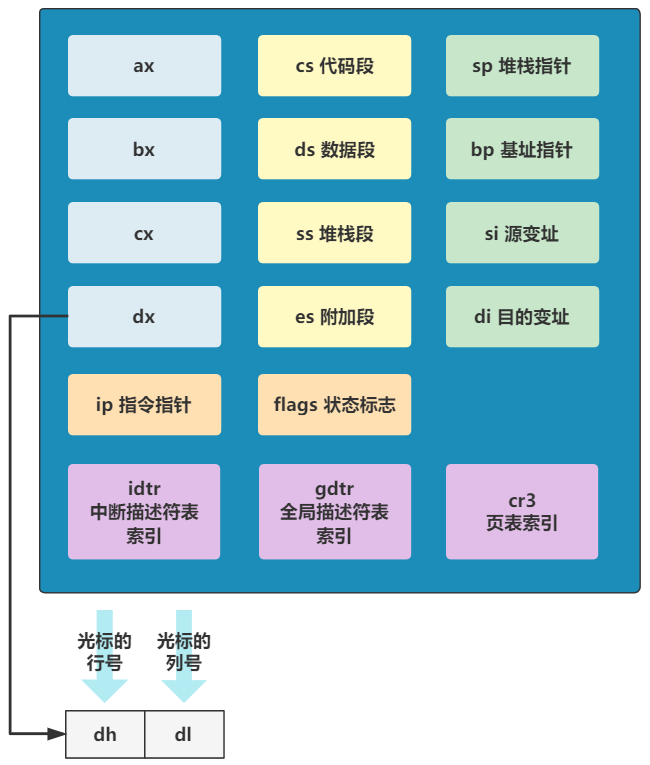

这里说明一下：计算机在加电自检后会自动初始化到文字模式，在这种模式下，一屏幕可以显示 25 行，每行 80 个字符，也就是 80 列。

那下一步 **mov [0],dx** 就是把这个光标位置存储在 [0] 这个内存地址处。注意，前面我们说过，这个内存地址仅仅是偏移地址，还需要加上 ds 这个寄存器里存储的段基址，最终的内存地址是在 **0x90000** 处，这里存放着光标的位置，以便之后在初始化控制台的时候用到。

所以从这里也可以看出，这和我们平时调用一个方法没什么区别，只不过这里的**寄存器**的用法相当于**入参和返回值**，这里的 **0x10 中断号**相当于**方法名**。

这里又应了之前说的一句话，操作系统内核的最开始也处处都是 BIOS 的调包侠，有现成的就用呗。

再接下来的几行代码，都是和刚刚一样的逻辑，调用一个 BIOS 中断获取点什么信息，然后存储在内存中某个位置，我们迅速浏览一下就好咯。

```
比如获取内存信息。
; Get memory size (extended mem, kB)
    mov ah,#0x88
    int 0x15
    mov [2],ax
获取显卡显示模式。
; Get video-card data:
    mov ah,#0x0f
    int 0x10
    mov [4],bx      ; bh = display page
    mov [6],ax      ; al = video mode, ah = window width
检查显示方式并取参数
; check for EGA/VGA and some config parameters
    mov ah,#0x12
    mov bl,#0x10
    int 0x10
    mov [8],ax
    mov [10],bx
    mov [12],cx
获取第一块硬盘的信息。
; Get hd0 data
    mov ax,#0x0000
    mov ds,ax
    lds si,[4*0x41]
    mov ax,#INITSEG
    mov es,ax
    mov di,#0x0080
    mov cx,#0x10
    rep
    movsb
获取第二块硬盘的信息。
; Get hd1 data
    mov ax,#0x0000
    mov ds,ax
    lds si,[4*0x46]
    mov ax,#INITSEG
    mov es,ax
    mov di,#0x0090
    mov cx,#0x10
    rep
    movsb
```

以上原理都是一样的。

我们就没必要细琢磨了，对操作系统的理解作用不大，只需要知道最终存储在内存中的信息是什么，在什么位置，就好了，之后会用到他们的。

| 内存地址 | 长度(字节) | 名称         |
| -------- | ---------- | ------------ |
| 0x90000  | 2          | 光标位置     |
| 0x90002  | 2          | 扩展内存数   |
| 0x90004  | 2          | 显示页面     |
| 0x90006  | 1          | 显示模式     |
| 0x90007  | 1          | 字符列数     |
| 0x90008  | 2          | 未知         |
| 0x9000A  | 1          | 显示内存     |
| 0x9000B  | 1          | 显示状态     |
| 0x9000C  | 2          | 显卡特性参数 |
| 0x9000E  | 1          | 屏幕行数     |
| 0x9000F  | 1          | 屏幕列数     |
| 0x90080  | 16         | 硬盘1参数表  |
| 0x90090  | 16         | 硬盘2参数表  |
| 0x901FC  | 2          | 根设备号     |

由于之后很快就会用 c 语言进行编程，虽然汇编和 c 语言也可以用变量的形式进行传递数据，但这需要编译器在链接时做一些额外的工作，所以这么多数据更方便的还是**双方共同约定一个内存地址**，我往这里存，你从这里取，就完事了。这恐怕是最最原始和直观的变量传递的方式了。

把这些信息存储好之后，操作系统又要做什么呢？我们继续往下看。

```
cli         ; no interrupts allowed ;
```

就一行 cli，表示**关闭中断**的意思。

因为后面我们要把原本是 BIOS 写好的中断向量表给覆盖掉，也就是给破坏掉了，写上我们自己的中断向量表，所以这个时候是不允许中断进来的。

继续看。

```
; first we move the system to it's rightful place
    mov ax,#0x0000
    cld         ; 'direction'=0, movs moves forward
do_move:
    mov es,ax       ; destination segment
    add ax,#0x1000
    cmp ax,#0x9000
    jz  end_move
    mov ds,ax       ; source segment
    sub di,di
    sub si,si
    mov cx,#0x8000
    rep movsw
    jmp do_move
; then we load the segment descriptors
end_move:
    ...
```

看到后面那个 **rep movsw** 熟不熟悉，一开始我们把操作系统代码从 **0x7c00** 移动到 **0x90000** 的时候就是用的这个指令，来图回忆一下。


同前面的原理一样，也是做了个内存复制操作，最终的结果是，把内存地址 **0x10000** 处开始往后一直到 **0x90000** 的内容，统统复制到内存的最开始的 **0** 位置，大概就是这么个效果。

 

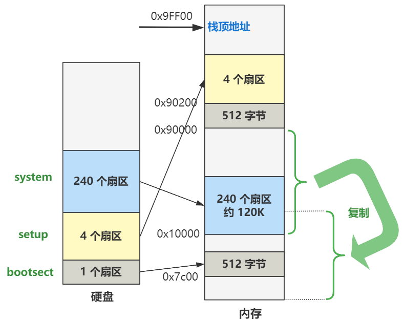

由于之前的各种加载和复制，导致内存看起来很乱，是时候进行一波取舍和整理了，我们重新梳理一下此时的内存布局。

栈顶地址仍然是 **0x9FF00** 没有改变。

**0x90000** 开始往上的位置，原来是 **bootsect** 和 **setup** 程序的代码，现 bootsect 的一部分代码在已经被操作系统为了记录内存、硬盘、显卡等一些**临时存放的**数据给覆盖了一部分。

内存最开始的 **0** 到 **0x80000** 这 512K 被 **system** 模块给占用了，之前讲过，这个 system 模块就是除了 bootsect 和 setup 之外的全部程序链接在一起的结果，可以理解为**操作系统的全部**。

那么现在的内存布局就是这个样子。

 

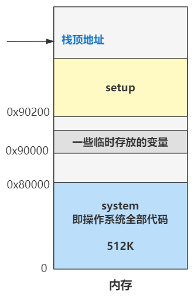

好了，记住上面的图就好了，这回是不是又重新清晰起来了？之前的什么 0x7c00，已经是过去式了，**赶紧忘掉它**，向前看！

接下来，就要进行有点技术含量的工作了，那就是**模式的转换**，需要从现在的 16 位的**实模式**转变为之后 32 位的**保护模式**，这是一项大工程！也是我认为的这趟操作系统源码旅程中，第一个颇为精彩的地方，大家做好准备！

后面的世界越来越精彩，欲知后事如何，且听下回分解。

**------- 本回扩展与延伸 -------**

尝试在文本模式下，用直接写显存的方式，把自己的名字输出在屏幕上。实验源码请自行到 GitHub 上寻找。

## 第六回 | 先解决段寄存器的历史包袱问题

书接上回，上回书咱们说到，操作系统又折腾了一下内存，之后的很长一段时间内存布局就不会变了，终于稳定下来了，目前它长这个样子。


0 地址开始处存放着操作系统的全部代码吗，也就是 system 模块，0x90000 位置处往后的几十个字节存放着一些设备的信息，方便以后使用。

| 内存地址 | 长度(字节) | 名称         |
| -------- | ---------- | ------------ |
| 0x90000  | 2          | 光标位置     |
| 0x90002  | 2          | 扩展内存数   |
| 0x90004  | 2          | 显示页面     |
| 0x90006  | 1          | 显示模式     |
| 0x90007  | 1          | 字符列数     |
| 0x90008  | 2          | 未知         |
| 0x9000A  | 1          | 显示内存     |
| 0x9000B  | 1          | 显示状态     |
| 0x9000C  | 2          | 显卡特性参数 |
| 0x9000E  | 1          | 屏幕行数     |
| 0x9000F  | 1          | 屏幕列数     |
| 0x90080  | 16         | 硬盘1参数表  |
| 0x90090  | 16         | 硬盘2参数表  |
| 0x901FC  | 2          | 根设备号     |

是不是十分清晰？不过别高兴得太早，清爽的内存布局，是方便后续操作系统的大显身手！

接下来就要进行真正的第一项大工程了，那就是**模式的转换**，需要从现在的 16 位的**实模式**转变为之后 32 位的**保护模式**。

当然，虽说是一项非常难啃的大工程，但从代码量看，却是少得可怜，所以不必太过担心。

每次讲这里都十分的麻烦，因为这是 **x86 的历史包袱**问题，现在的 CPU 几乎都是支持 32 位模式甚至 64 位模式了，很少有还仅仅停留在 16 位的实模式下的 CPU。所以我们要为了这个历史包袱，**写一段模式转换的代码**，如果 Intel CPU 被重新设计而不用考虑兼容性，那么今天的代码将会减少很多甚至不复存在。

所以不用担心，听懂就听懂，听不懂就拉倒，放宽心。

我不打算直接说实模式和保护模式的区别，我们还是跟着代码慢慢品味，来。

这里仍然是 setup.s 文件中的代码咯。

```
lidt  idt_48      ; load idt with 0,0
lgdt  gdt_48      ; load gdt with whatever appropriate

idt_48:
    .word   0     ; idt limit=0
    .word   0,0   ; idt base=0L
```

上来就是两行看不懂的指令，别急。

要理解这两条指令，就涉及到实模式和保护模式的第一个区别了。我们现在还处于实模式下，这个模式的 CPU 计算物理地址的方式还记得么？不记得的话看一下 [第一回 最开始的两行代码](http://mp.weixin.qq.com/s?__biz=Mzk0MjE3NDE0Ng==&mid=2247499226&idx=1&sn=1ff3d54a3608423b7781142ae3ac62ca&chksm=c2c58777f5b20e61664a51d31ab779bbe68c317c3459218c7cd4b9530887dbb33470628c3248&scene=21#wechat_redirect)

就是段基址左移四位，再加上偏移地址。比如：

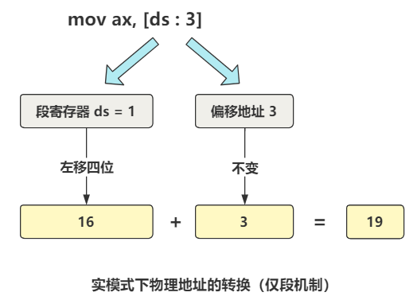

是不是觉得很别扭，那更别扭的地方就要来了。当 CPU 切换到**保护模式**后，同样的代码，内存地址的计算方式还不一样，你说气不气人？

变成啥样了呢？刚刚那个 ds 寄存器里存储的值，在实模式下叫做**段基址**，在保护模式下叫**段选择子**。段选择子里存储着**段描述符**的索引。

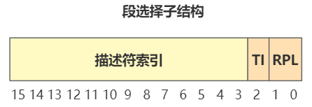

通过段描述符索引，可以从**全局描述符表 gdt** 中找到一个段描述符，段描述符里存储着段基址。


段基址取出来，再和偏移地址相加，就得到了物理地址，整个过程如下。

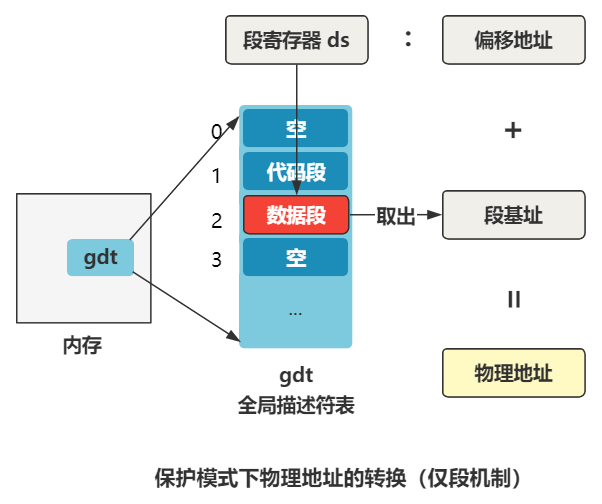

你就说烦不烦吧？同样一段代码，实模式下和保护模式下的结果还不同，但没办法，x86 的历史包袱我们不得不考虑，谁让我们没其他 CPU 可选呢。

总结一下就是，**段寄存器（比如 ds、ss、cs）里存储的是段选择子，段选择子去全局描述符表中寻找段描述符，从中取出段基址**。

好了，那问题自然就出来了，**全局描述符表（gdt）**长什么样？它在哪？怎么让 CPU 知道它在哪？

长什么样先别管，一定又是一个令人头疼的数据结构，先说说它在哪？在内存中呗，那么怎么告诉 CPU 全局描述符表（gdt）在内存中的什么位置呢？答案是由操作系统把这个位置信息存储在一个叫 **gdtr** 的寄存器中。


怎么存呢？就是刚刚那条指令。

```
lgdt    gdt_48
```

其中 **lgdt** 就表示把**后面的值（gdt_48）**放在 **gdtr** 寄存器中，gdt_48 标签，我们看看它长什么样。

```
gdt_48:
    .word   0x800       ; gdt limit=2048, 256 GDT entries
    .word   512+gdt,0x9 ; gdt base = 0X9xxxx
```

可以看到这个标签位置处表示一个 48 位的数据，其中高 32 位存储着的正是全局描述符表 gdt 的内存地址

**0x90200 + gdt**

**gdt** 是个标签，表示在本文件内的偏移量，而本文件是 **setup.s**，编译后是放在 **0x90200** 这个内存地址的，还记得吧？所以要加上 0x90200 这个值。

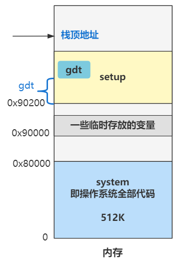

那 gdt 这个标签处，就是全局描述符表在内存中的真正数据了。

```
gdt:
    .word   0,0,0,0     ; dummy

    .word   0x07FF      ; 8Mb - limit=2047 (2048*4096=8Mb)
    .word   0x0000      ; base address=0
    .word   0x9A00      ; code read/exec
    .word   0x00C0      ; granularity=4096, 386

    .word   0x07FF      ; 8Mb - limit=2047 (2048*4096=8Mb)
    .word   0x0000      ; base address=0
    .word   0x9200      ; data read/write
    .word   0x00C0      ; granularity=4096, 386
```

具体细节不用关心，跟我看重点。

根据刚刚的段描述符格式。


可以看出目前全局描述符表有三个段描述符，第一个为**空**，第二个是**代码段描述符（type=code）**，第三个是**数据段描述符（type=data）**，第二个和第三个段描述符的段基址都是 0，也就是之后在逻辑地址转换物理地址的时候，通过段选择子查找到无论是代码段还是数据段，取出的段基址都是 0，那么物理地址将直接等于程序员给出的逻辑地址（准确说是逻辑地址中的偏移地址）。先记住这点就好。

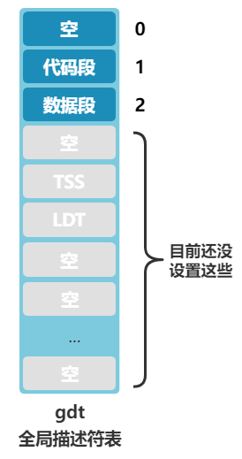

具体段描述符的细节还有很多，就不展开了，比如这里的高 22 位就表示它是代码段还是数据段。


接下来我们看看目前的内存布局，还是别管比例。


这里我把 **idtr** 寄存器也画出来了，这个是**中断描述符表**，其原理和全局描述符表一样。全局描述符表是让段选择子去里面寻找段描述符用的，而中断描述符表是用来在发生中断时，CPU 拿着中断号去中断描述符表中寻找中断处理程序的地址，找到后就跳到相应的中断程序中去执行，具体我们后面遇到了再说。

好了，今天我们就讲，操作系统设置了个**全局描述符表 gdt**，为后面切换到**保护模式**后，能去那里寻找到段描述符，然后拼凑成最终的物理地址，就这个作用。当然，还有很多段描述符，作用不仅仅是转换成最终的物理地址，不过这是后话了。

这仅仅是进入保护模式前准备工作的其中一个，后面的路还长着呢。欲知后事如何，且听下回分解。

**------- 本回扩展资料 -------**

保护模式下逻辑地址到线性地址（不开启分页时就是物理地址）的转化，看 Intel 手册：

Volume 3 Chapter 3.4 Logical And Linear Addresses


段描述符结构和详细说明，看 Intel 手册：

Volume 3 Chapter 3.4.5 Segment Descriptors


比如文中说的数据段与代码段的划分，其实还有更细分的权限控制。

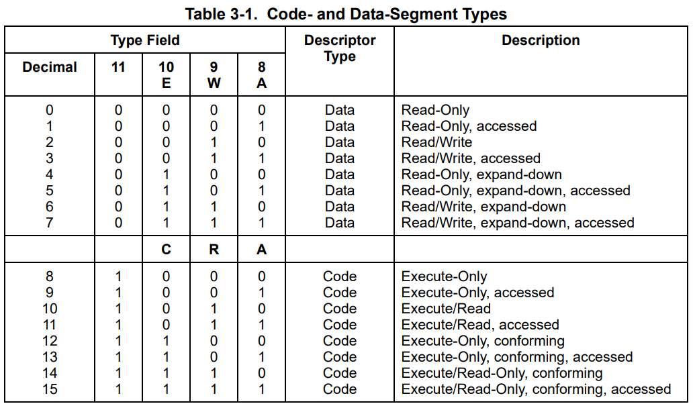

## 第七回 |六行代码就进入了保护模式

书接上回，上回书咱们说到，操作系统设置了个全局描述符表 gdt。

 


为后面切换到保护模式后，能去那里寻找到段描述符，然后拼凑成最终的物理地址。

 


而此时我们的内存布局变成了这个样子。

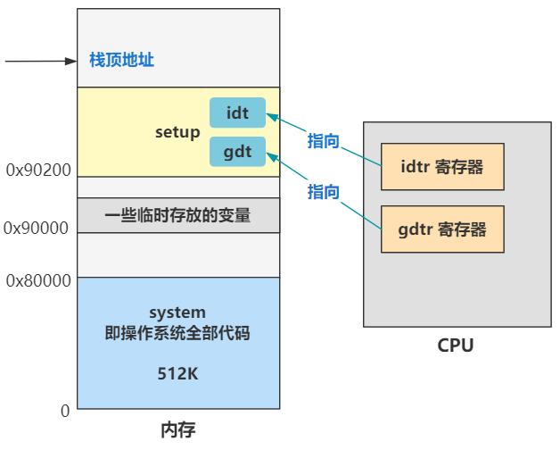

这仅仅是进入保护模式前准备工作的其中一个，我们接着往下看。代码仍然是 setup.s 中的。

```
mov al,#0xD1        ; command write
out #0x64,al
mov al,#0xDF        ; A20 on
out #0x60,al
```

这段代码的意思是，**打开 A20 地址线**。

说人话就是，打开 A20 地址线。哈哈，开玩笑，到底什么是 A20 地址线呢？

简单理解，这一步就是为了突破地址信号线 20 位的宽度，变成 32 位可用。这是由于 8086 CPU 只有 20 位的地址线，所以如果程序给出 21 位的内存地址数据，那多出的一位就被忽略了，比如如果经过计算得出一个内存地址为

1 0000 00000000 00000000

那实际上内存地址相当于 0，因为高位的那个 1 被忽略了，地方不够。

当 CPU 到了 32 位时代之后，由于要考虑**兼容性**，还必须保持一个只能用 20 位地址线的模式，所以如果你不手动开启的话，即使地址线已经有 32 位了，仍然会限制只能使用其中的 20 位。

简单吧？我们继续。

接下来的一段代码，你完全完全不用看，但为了防止你一直记挂在心上，我给你截出来说道说道，这样以后我说完全不用看的代码时，你就真的可以放宽心完全不看了。

就是这一大坨，还有 Linus 自己的注释。

```
; well, that went ok, I hope. Now we have to reprogram the interrupts :-(
; we put them right after the intel-reserved hardware interrupts, at
; int 0x20-0x2F. There they won't mess up anything. Sadly IBM really
; messed this up with the original PC, and they haven't been able to
; rectify it afterwards. Thus the bios puts interrupts at 0x08-0x0f,
; which is used for the internal hardware interrupts as well. We just
; have to reprogram the 8259's, and it isn't fun.

    mov al,#0x11        ; initialization sequence
    out #0x20,al        ; send it to 8259A-1
    .word   0x00eb,0x00eb       ; jmp $+2, jmp $+2
    out #0xA0,al        ; and to 8259A-2
    .word   0x00eb,0x00eb
    mov al,#0x20        ; start of hardware int's (0x20)
    out #0x21,al
    .word   0x00eb,0x00eb
    mov al,#0x28        ; start of hardware int's 2 (0x28)
    out #0xA1,al
    .word   0x00eb,0x00eb
    mov al,#0x04        ; 8259-1 is master
    out #0x21,al
    .word   0x00eb,0x00eb
    mov al,#0x02        ; 8259-2 is slave
    out #0xA1,al
    .word   0x00eb,0x00eb
    mov al,#0x01        ; 8086 mode for both
    out #0x21,al
    .word   0x00eb,0x00eb
    out #0xA1,al
    .word   0x00eb,0x00eb
    mov al,#0xFF        ; mask off all interrupts for now
    out #0x21,al
    .word   0x00eb,0x00eb
    out #0xA1,al
```

这里是对**可编程中断控制器 8259 芯片**进行的编程。

因为中断号是不能冲突的， Intel 把 0 到 0x19 号中断都作为**保留中断**，比如 0 号中断就规定为**除零异常**，软件自定义的中断都应该放在这之后，但是 IBM 在原 PC 机中搞砸了，跟保留中断号发生了冲突，以后也没有纠正过来，所以我们得重新对其进行编程，不得不做，却又一点意思也没有。这是 Linus 在上面注释上的原话。

所以我们也不必在意，只要知道重新编程之后，8259 这个芯片的引脚与中断号的对应关系，变成了如下的样子就好。

| PIC 请求号 | 中断号 |     用途     |
| :--------: | :----: | :----------: |
|    IRQ0    |  0x20  |   时钟中断   |
|    IRQ1    |  0x21  |   键盘中断   |
|    IRQ2    |  0x22  |  接连从芯片  |
|    IRQ3    |  0x23  |    串口2     |
|    IRQ4    |  0x24  |    串口1     |
|    IRQ5    |  0x25  |    并口2     |
|    IRQ6    |  0x26  |  软盘驱动器  |
|    IRQ7    |  0x27  |    并口1     |
|    IRQ8    |  0x28  |  实时钟中断  |
|    IRQ9    |  0x29  |     保留     |
|   IRQ10    |  0x2a  |     保留     |
|   IRQ11    |  0x2b  |     保留     |
|   IRQ12    |  0x2c  |   鼠标中断   |
|   IRQ13    |  0x2d  | 数学协处理器 |
|   IRQ14    |  0x2e  |   硬盘中断   |
|   IRQ15    |  0x2f  |     保留     |

好了，接下来的一步，就是真正切换模式的一步了，从代码上看就两行。

```
mov ax,#0x0001  ; protected mode (PE) bit
lmsw ax      ; This is it;
jmpi 0,8     ; jmp offset 0 of segment 8 (cs)
```

前两行，将 cr0 这个寄存器的位 0 置 1，模式就从实模式切换到保护模式了。

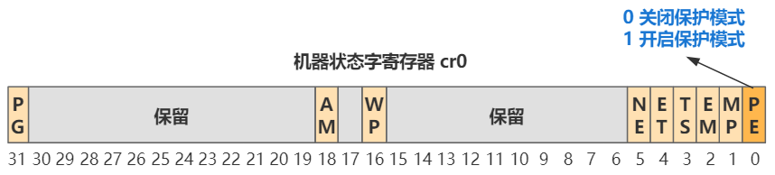

所以真正的模式切换十分简单，重要的是之前做的准备工作。

再往后，又是一个段间跳转指令 **jmpi**，后面的 8 表示 cs（代码段寄存器）的值，0 表示偏移地址。请注意，此时已经是保护模式了，之前也说过，保护模式下内存寻址方式变了，段寄存器里的值被当做段选择子。

回顾下段选择子的模样。

 


8 用二进制表示就是

00000,0000,0000,1000

对照上面段选择子的结构，可以知道**描述符索引值是 1**，也就是要去**全局描述符表（gdt）**中找第一项段描述符。

还记得上一讲中的全局描述符的具体内容么？

```
gdt:
    .word   0,0,0,0     ; dummy

    .word   0x07FF      ; 8Mb - limit=2047 (2048*4096=8Mb)
    .word   0x0000      ; base address=0
    .word   0x9A00      ; code read/exec
    .word   0x00C0      ; granularity=4096, 386

    .word   0x07FF      ; 8Mb - limit=2047 (2048*4096=8Mb)
    .word   0x0000      ; base address=0
    .word   0x9200      ; data read/write
    .word   0x00C0      ; granularity=4096, 386
```

我们说了，第 0 项是空值，第一项被表示为**代码段描述符**，是个可读可执行的段，第二项为**数据段描述符**，是个可读可写段，不过他们的段基址都是 0。

所以，这里取的就是这个代码段描述符，**段基址是 0**，偏移也是 0，那加一块就还是 0 咯，所以最终这个跳转指令，就是跳转到内存地址的 0 地址处，开始执行。

零地址处是什么呢？还是回顾之前的内存布局图。

 

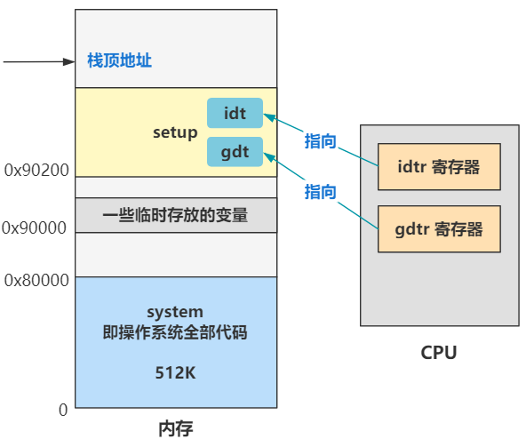

就是操作系统全部代码的 system 这个大模块，system 模块怎么生成的呢？由 Makefile 文件可知，是由 head.s 和 main.c 以及其余各模块的操作系统代码合并来的，可以理解为操作系统的全部核心代码编译后的结果。

```
tools/system: boot/head.o init/main.o \
    $(ARCHIVES) $(DRIVERS) $(MATH) $(LIBS)
    $(LD) $(LDFLAGS) boot/head.o init/main.o \
    $(ARCHIVES) \
    $(DRIVERS) \
    $(MATH) \
    $(LIBS) \
    -o tools/system > System.map
```

所以，接下来，我们就要重点阅读 **head.s** 了。

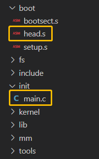

这也是 boot 文件夹下的最后一个由汇编写就的源代码文件，哎呀，不知不觉就把两个操作系统源码文件（**bootsect.s** 和 **setup.s**）讲完了，而且是汇编写的令人头疼的代码。

**head.s** 这个文件仅仅是为了顺利进入由后面的 c 语言写就的 main.c 做的准备，所以咬咬牙看完这个之后，我们就终于可以进入 c 语言的世界了！也终于可以看到我们熟悉的 main 函数了！

在那里，操作系统真正秀操作的地方，才刚刚开始！欲知后事如何，且听下回分解。

**------- 本回扩展资料 -------**

保护模式下逻辑地址到线性地址（不开启分页时就是物理地址）的转化，看 Intel 手册：

Volume 3 Chapter 3.4 Logical And Linear Addresses

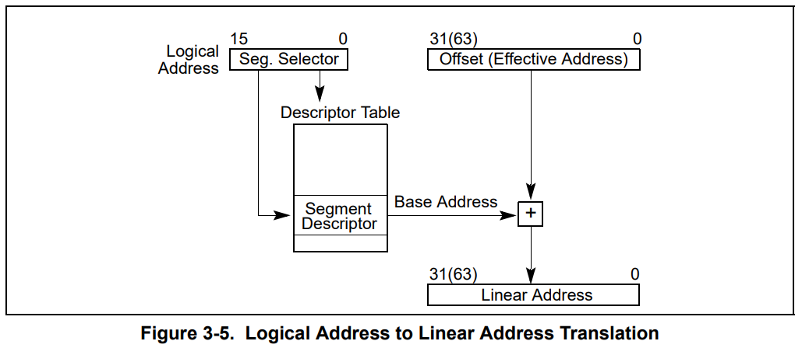

段描述符结构和详细说明，看 Intel 手册：

Volume 3 Chapter 3.4.5 Segment Descriptors

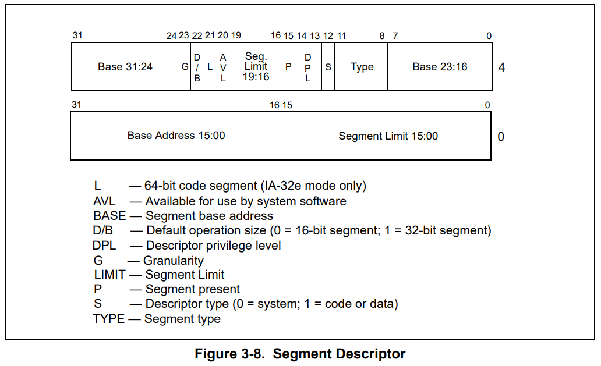

对操作系统如何编译的，比如好奇那个 system 是怎么来的，可以尝试理解一下 Linux 0.11 源码中的 Makefile，这个我就不展开讲了，我们把更多经历，放在操作系统是怎么一步一步构建起来的这个过程。

## 第八回 | 烦死了又要重新设置一遍 idt 和 gdt

书接上回，上回书咱们说到，CPU 进入了 32 位保护模式，我们快速回顾一下关键的代码。

首先配置了全局描述符表 gdt 和中断描述符表 idt。

```
lidt  idt_48
lgdt  gdt_48
```

然后打开了 A20 地址线。

```
mov al,#0xD1        ; command write
out #0x64,al
mov al,#0xDF        ; A20 on
out #0x60,al
```

然后更改 cr0 寄存器开启保护模式。

```
mov ax,#0x0001
lmsw ax
```

最后，一个干脆利落的跳转指令，跳到了内存地址 0 处开始执行代码。

```
jmpi 0,8
```

0 位置处存储着操作系统全部核心代码，是由 head.s 和 main.c 以及后面的无数源代码文件编译并链接在一起而成的 system 模块。

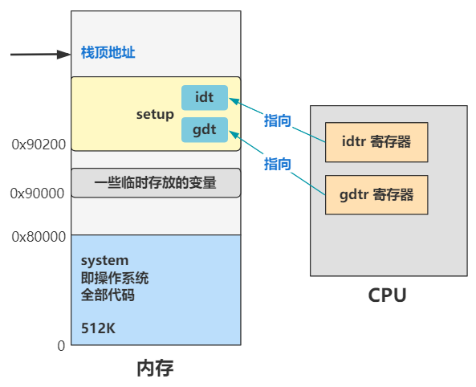

那接下来，我们就品品，正式进入 c 语言写的 main.c 之前的 **head.s** 究竟写了点啥？

head.s 文件很短，我们一点点品。

```
_pg_dir:
_startup_32:
    mov eax,0x10
    mov ds,ax
    mov es,ax
    mov fs,ax
    mov gs,ax
    lss esp,_stack_start
```

注意到开头有个标号 **_pg_dir**。先留个心眼，这个表示**页目录**，之后在设置分页机制时，页目录会存放在这里，也会覆盖这里的代码。

再往下连续五个 **mov** 操作，分别给 ds、es、fs、gs 这几个段寄存器赋值为 **0x10**，根据段描述符结构解析，表示这几个段寄存器的值为指向全局描述符表中的第二个段描述符，也就是数据段描述符。

最后 **lss** 指令相当于让 **ss:esp** 这个栈顶指针指向了 **_stack_start** 这个标号的位置。还记得图里的那个原来的栈顶指针在哪里吧？往上翻一下，**0x9FF00**，现在要变咯。

这个 stack_start 标号定义在了很久之后才会讲到的 **sched.c** 里，我们这里拿出来分析一波。

```
long user_stack[4096 >> 2];

struct
{
  long *a;
  short b;
}
stack_start = {&user_stack[4096 >> 2], 0x10};
```

这啥意思呢？

首先，stack_start 结构中的高位 8 字节是 **0x10**，将会赋值给 **ss** 栈段寄存器，低位 16 字节是 **user_stack** 这个数组的最后一个元素的地址值，将其赋值给 **esp** 寄存器。

赋值给 ss 的 0x10 仍然按照保护模式下的**段选择子**去解读，其指向的是全局描述符表中的第二个段描述符（数据段描述符），段基址是 0。

赋值给 esp 寄存器的就是 user_stack 数组的最后一个元素的内存地址值，那最终的**栈顶地址**，也指向了这里（user_stack + 0），后面的压栈操作，就是往这个新的栈顶地址处压咯。

继续往下看

```
call setup_idt ;设置中断描述符表
call setup_gdt ;设置全局描述符表
mov eax,10h
mov ds,ax
mov es,ax
mov fs,ax
mov gs,ax
lss esp,_stack_start
```

先设置了 **idt** 和 **gdt**，然后又重新执行了一遍刚刚执行过的代码。

为什么要重新设置这些段寄存器呢？因为上面修改了 gdt，所以要重新设置一遍以刷新才能生效。那我们接下来就把目光放到设置 idt 和 gdt 上。

中断描述符表 idt 我们之前没设置过，所以这里设置具体的值，理所应当。

```
setup_idt:
    lea edx,ignore_int
    mov eax,00080000h
    mov ax,dx
    mov dx,8E00h
    lea edi,_idt
    mov ecx,256
rp_sidt:
    mov [edi],eax
    mov [edi+4],edx
    add edi,8
    dec ecx
    jne rp_sidt
    lidt fword ptr idt_descr
    ret

idt_descr:
    dw 256*8-1
    dd _idt

_idt:
    DQ 256 dup(0)
```

不用细看，我给你说最终效果。

中断描述符表 idt 里面存储着一个个中断描述符，每一个中断号就对应着一个中断描述符，而中断描述符里面存储着主要是中断程序的地址，这样一个中断号过来后，CPU 就会自动寻找相应的中断程序，然后去执行它。

那这段程序的作用就是，**设置了 256 个中断描述符**，并且让每一个中断描述符中的中断程序例程都指向一个 **ignore_int** 的函数地址，这个是个**默认的中断处理程序**，之后会逐渐被各个具体的中断程序所覆盖。比如之后键盘模块会将自己的键盘中断处理程序，覆盖过去。

那现在，产生任何中断都会指向这个默认的函数 ignore_int，也就是说现在这个阶段**你按键盘还不好使**。

设置中断描述符表 setup_idt 说完了，那接下来 **setup_gdt** 就同理了。我们就直接看设置好后的新的全局描述符表长什么样吧？

```
_gdt:
    DQ 0000000000000000h    ;/* NULL descriptor */
    DQ 00c09a0000000fffh    ;/* 16Mb */
    DQ 00c0920000000fffh    ;/* 16Mb */
    DQ 0000000000000000h    ;/* TEMPORARY - don't use */
    DQ 252 dup(0)
```

其实和我们原先设置好的 gdt 一模一样。

也是有**代码段描述符**和**数据段描述符**，然后第四项系统段描述符并没有用到，不用管。最后还留了 252 项的空间，这些空间后面会用来放置**任务状态段描述符 TSS** 和**局部描述符 LDT**，这个后面再说。

 

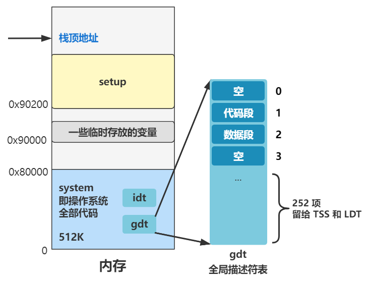

为什么原来已经设置过一遍了，这里又要重新设置一遍，你可千万别想有什么复杂的原因，就是因为原来设置的 gdt 是在 setup 程序中，之后这个地方要被缓冲区覆盖掉，所以这里重新设置在 head 程序中，这块内存区域之后就不会被其他程序用到并且覆盖了，就这么个事。

说的口干舌燥，还是来张图吧。

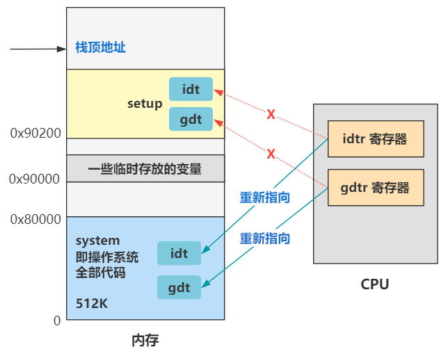

如果你本文的内容完全不能理解，那就记住最后这张图就好了，本文代码就是完成了这个图中所示的一个指向转换而已，并且给所有中断设置了一个默认的中断处理程序 ignore_int，然后全局描述符表仍然只有代码段描述符和数据段描述符。

好了，本文就是两个描述符表位置的变化以及重新设置，再后面一行代码就是又一个令人兴奋的功能了！

```
jmp after_page_tables
...
after_page_tables:
    push 0
    push 0
    push 0
    push L6
    push _main
    jmp setup_paging
L6:
    jmp L6
```

那就是开启分页机制，并且跳转到 main 函数！

这可太令人兴奋了！开启分页后，配合着之前讲的分段，就构成了内存管理的最最底层的机制。而跳转到 main 函数，标志着我们正式进入 c 语言写的操作系统核心代码！

欲知后事如何，且听下回分解。

**------- 本回扩展资料 -------**

保护模式下逻辑地址到线性地址（不开启分页时就是物理地址）的转化，看 Intel 手册：

Volume 3 Chapter 3.4 Logical And Linear Addresses


段描述符结构和详细说明，看 Intel 手册：

Volume 3 Chapter 3.4.5 Segment Descriptors


对操作系统如何编译的，比如好奇那个 system 是怎么来的，可以尝试理解一下 Linux 0.11 源码中的 Makefile，这个我就不展开讲了，我们把更多经历，放在操作系统是怎么一步一步构建起来的这个过程。

## 第九回 | Intel 内存管理两板斧：分段与分页

书接上回，上回书咱们说到，head.s 代码在重新设置了 gdt 与 idt 后。


来到了这样一段代码。

```
jmp after_page_tables
...
after_page_tables:
    push 0
    push 0
    push 0
    push L6
    push _main
    jmp setup_paging
L6:
    jmp L6
```

那就是开启分页机制，并且跳转到 main 函数。

如何跳转到之后用 c 语言写的 main.c 里的 main 函数，是个有趣的事，也包含在这段代码里。不过我们先瞧瞧这**分页机制**是如何开启的，也就是 **setup_paging** 这个标签处的代码。

```
setup_paging:
    mov ecx,1024*5
    xor eax,eax
    xor edi,edi
    pushf
    cld
    rep stosd
    mov eax,_pg_dir
    mov [eax],pg0+7
    mov [eax+4],pg1+7
    mov [eax+8],pg2+7
    mov [eax+12],pg3+7
    mov edi,pg3+4092
    mov eax,00fff007h
    std
L3: stosd
    sub eax,00001000h
    jge L3
    popf
    xor eax,eax
    mov cr3,eax
    mov eax,cr0
    or  eax,80000000h
    mov cr0,eax
    ret
```

别怕，我们一点点来分析。

首先要了解的就是，啥是分页机制？

还记不记得之前我们在代码中给出一个内存地址，在保护模式下要先经过分段机制的转换，才能最终变成物理地址，就是这样。 


这是在没有开启分页机制的时候，只需要经过这一步转换即可得到最终的物理地址了，但是在开启了分页机制后，又会**多一步转换**。

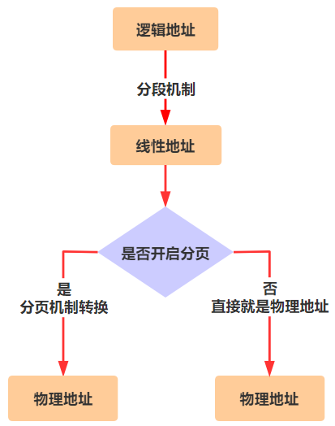

也就是说，在没有开启分页机制时，由程序员给出的**逻辑地址**，需要先通过分段机制转换成物理地址。但在开启分页机制后，逻辑地址仍然要先通过分段机制进行转换，只不过转换后不再是最终的物理地址，而是**线性地址**，然后再通过一次分页机制转换，得到最终的物理地址。

分段机制我们已经清楚如何对地址进行变换了，那分页机制又是如何变换的呢？我们直接以一个例子来学习过程。

比如我们的线性地址（已经经过了分段机制的转换）是

15M

二进制表示就是

0000000011_0100000000_000000000000

我们看一下它的转换过程


也就是说，CPU 在看到我们给出的内存地址后，首先把线性地址被拆分成

高 10 位：中间 10 位：后 12 位

高 10 位负责在**页目录表**中找到一个**页目录项**，这个页目录项的值加上中间 10 位拼接后的地址去**页表**中去寻找一个**页表项**，这个页表项的值，再加上后 12 位偏移地址，就是最终的物理地址。

而这一切的操作，都由计算机的一个硬件叫 **MMU**，中文名字叫**内存管理单元**，有时也叫 PMMU，分页内存管理单元。由这个部件来负责将虚拟地址转换为物理地址。 

所以整个过程我们不用操心，作为操作系统这个软件层，只需要提供好页目录表和页表即可，这种页表方案叫做**二级页表**，第一级叫**页目录表 PDE**，第二级叫**页表 PTE**。他们的结构如下。


之后再开启分页机制的开关。其实就是更改 **cr0** 寄存器中的一位即可（31 位），还记得我们开启保护模式么，也是改这个寄存器中的一位的值。

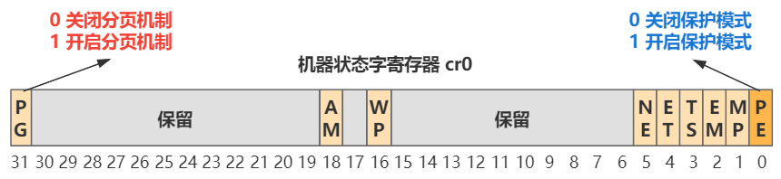

然后，MMU 就可以帮我们进行分页的转换了。此后指令中的内存地址（就是程序员提供的逻辑地址），就统统要先经过分段机制的转换，再通过分页机制的转换，才能最终变成物理地址。

所以这段代码，就是帮我们把页表和页目录表在内存中写好，之后开启 cr0 寄存器的分页开关，仅此而已，我们再把代码贴上来。

```
setup_paging:
    mov ecx,1024*5
    xor eax,eax
    xor edi,edi
    pushf
    cld
    rep stosd
    mov eax,_pg_dir
    mov [eax],pg0+7
    mov [eax+4],pg1+7
    mov [eax+8],pg2+7
    mov [eax+12],pg3+7
    mov edi,pg3+4092
    mov eax,00fff007h
    std
L3: stosd
    sub eax,00001000h
    jge L3
    popf
    xor eax,eax
    mov cr3,eax
    mov eax,cr0
    or  eax,80000000h
    mov cr0,eax
    ret
```

我们先说这段代码最终产生的效果吧。

当时 linux-0.11 认为，总共可以使用的内存不会超过 **16M**，也即最大地址空间为 **0xFFFFFF**。

而按照当前的页目录表和页表这种机制，1 个页目录表最多包含 1024 个页目录项（也就是 1024 个页表），1 个页表最多包含 1024 个页表项（也就是 1024 个页），1 页为 4KB（因为有 12 位偏移地址），因此，16M 的地址空间可以用 1 个页目录表 + 4 个页表搞定。

4（页表数）* 1024（页表项数） * 4KB（一页大小）= 16MB

所以，上面这段代码就是，**将页目录表放在内存地址的最开头**，还记得上一讲开头让你留意的 _pg_dir 这个标签吧？

```
_pg_dir:
_startup_32:
    mov eax,0x10
    mov ds,ax
    ...
```

**之后紧挨着这个页目录表，放置 4 个页表**，代码里也有这四个页表的标签项。

```
.org 0x1000 pg0:
.org 0x2000 pg1:
.org 0x3000 pg2:
.org 0x4000 pg3:
.org 0x5000
```

最终将页目录表和页表填写好数值，来覆盖整个 16MB 的内存。随后，开启分页机制。此时内存中的页表相关的布局如下。

 

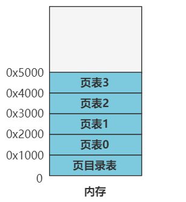

这些页目录表和页表放到了整个内存布局中最开头的位置，就是覆盖了开头的 system 代码了，不过被覆盖的 system 代码已经执行过了，所以无所谓。

同时，如 idt 和 gdt 一样，我们也需要通过一个寄存器告诉 CPU 我们把这些页表放在了哪里，就是这段代码。

```
xor eax,eax
mov cr3,eax
```

你看，我们相当于告诉 cr3 寄存器，**0 地址处就是页目录表，再通过页目录表可以找到所有的页表**，也就相当于 CPU 知道了分页机制的全貌了。

至此后，整个内存布局如下。

 


那么具体页表设置好后，映射的内存是怎样的情况呢？那就要看页表的具体数据了，就是这一坨代码。

```
setup_paging:
    ...
    mov eax,_pg_dir
    mov [eax],pg0+7
    mov [eax+4],pg1+7
    mov [eax+8],pg2+7
    mov [eax+12],pg3+7
    mov edi,pg3+4092
    mov eax,00fff007h
    std
L3: stosd
    sub eax, 1000h
    jpe L3
    ...
```

很简单，对照刚刚的页目录表与页表结构看。

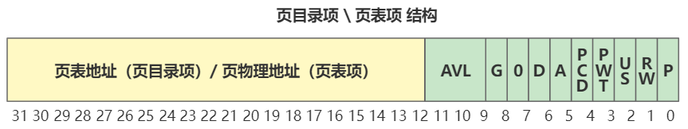

前五行表示，页目录表的前 4 个页目录项，分别指向 4 个页表。比如页目录项中的第一项 **[eax]** 被赋值为 **pg0+7**，也就是 **0x00001007**，根据页目录项的格式，表示页表地址为 **0x1000**，页属性为 **0x07** 表示改页存在、用户可读写。

后面几行表示，填充 4 个页表的每一项，一共 **4\*1024=4096** 项，依次映射到内存的前 16MB 空间。

画出图就是这个样子，其实刚刚的图就是。


看，最终的效果就是，经过这套分页机制，**线性地址将恰好和最终转换的物理地址一样**。

现在只有四个页目录项，也就是将前 16M 的线性地址空间，与 16M 的物理地址空间一一对应起来了。

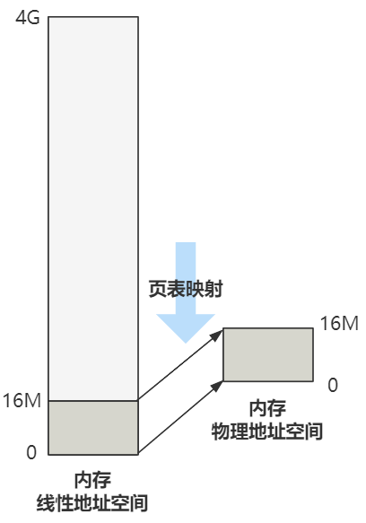

好了，我知道你目前可能有点晕头转向，关于地址，我们已经出现了好多词了，包括**逻辑地址**、**线性地址**、**物理地址**，以及本文中没出现的，你可能在很多地方看到过的**虚拟地址**。

而这些地址后面加上空间两个字，似乎又成为了一个新词，比如**线性地址空间**、**物理地址空间**、**虚拟地址空间**等。

那就是时候展开一波讨论，将这块的内容梳理一番了，且听我说。

Intel 体系结构的**内存管理**可以分成两大部分，也就是标题中的两板斧，**分段**和**分页**。

**分段机制**在之前几回已经讨论过多次了，其目的是为了为每个程序或任务提供单独的代码段（cs）、数据段（ds）、栈段（ss），使其不会相互干扰。

**分页机制**是本回讲的内容，开机后分页机制默认是关闭状态，需要我们手动开启，并且设置好页目录表（PDE）和页表（PTE）。其目的在于可以按需使用物理内存，同时也可以在多任务时起到隔离的作用，这个在后面将多任务时将会有所体会。

在 Intel 的保护模式下，分段机制是没有开启和关闭一说的，它必须存在，而分页机制是可以选择开启或关闭的。所以如果有人和你说，它实现了一个没有分段机制的操作系统，那一定是个外行。

再说说那些地址：

**逻辑地址**：我们程序员写代码时给出的地址叫逻辑地址，其中包含段选择子和偏移地址两部分。

**线性地址**：通过分段机制，将逻辑地址转换后的地址，叫做线性地址。而这个线性地址是有个范围的，这个范围就叫做线性地址空间，32 位模式下，线性地址空间就是 4G。

**物理地址**：就是真正在内存中的地址，它也是有范围的，叫做物理地址空间。那这个范围的大小，就取决于你的内存有多大了。

**虚拟地址**：如果没有开启分页机制，那么线性地址就和物理地址是一一对应的，可以理解为相等。如果开启了分页机制，那么线性地址将被视为虚拟地址，这个虚拟地址将会通过分页机制的转换，最终转换成物理地址。


但实际上，我本人是不喜欢虚拟地址这个叫法的，因为它在 Intel 标准手册上出现的次数很少，我觉得知道逻辑地址、线性地址、物理地址这三个概念就够了，逻辑地址是程序员给出的，经过分段机制转换后变成线性地址，然后再经过分页机制转换后变成物理地址，就这么简单。 

好了，我们终于把这些杂七杂八的，idt、gdt、页表都设置好了，并且也开启了保护模式，之后我们就要做好进入 main.c 的准备了，那里是个新世界！

不过进入 main.c 之前还差最后一哆嗦，就是 head.s 最后的代码，也就是本文开头的那段代码。

```
jmp after_page_tables
...
after_page_tables:
    push 0
    push 0
    push 0
    push L6
    push _main
    jmp setup_paging
L6:
    jmp L6
```

看到没，这里有个 push _main，把 main 函数的地址压栈了，那最终跳转到这个 main.c 里的 main 函数，一定和这个压栈有关。
压栈为什么和跳转到这里还能联系上呢？留作本文思考题，下一篇将揭秘这个过程，你会发现仍然简单得要死。

欲知后事如何，且听下回分解。

**------- 本回扩展资料 -------**

关于逻辑地址-线性地址-物理地址的转换，可以参考 Intel 手册：

Intel 3A Chapter 3 Protected-Mode Memory Management

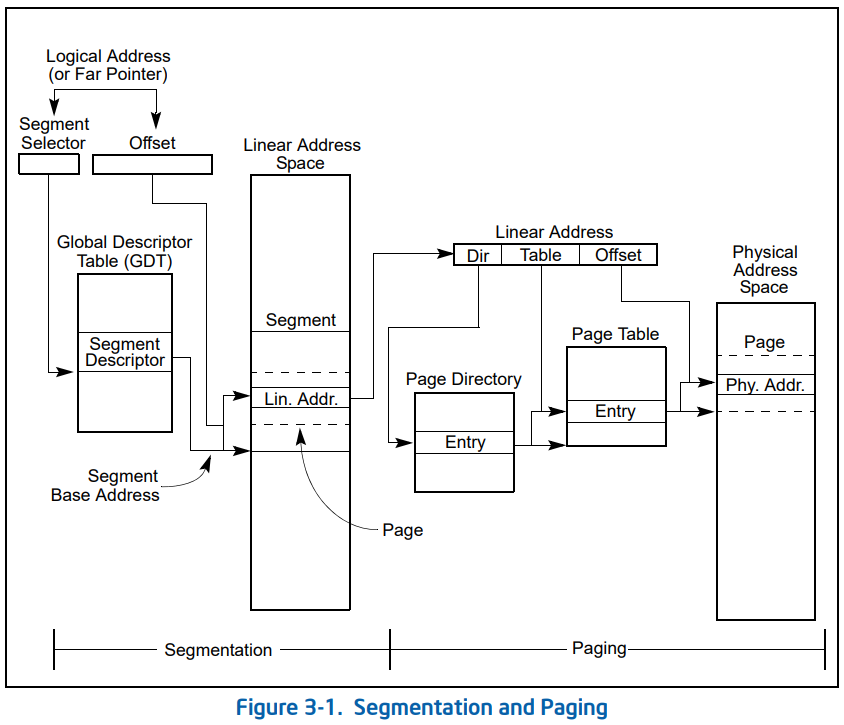

而有关这些地址的定义和说明，在本小节中也做了详细的说明，看这里的介绍是最权威也是最透彻的。相信我，它很简单。

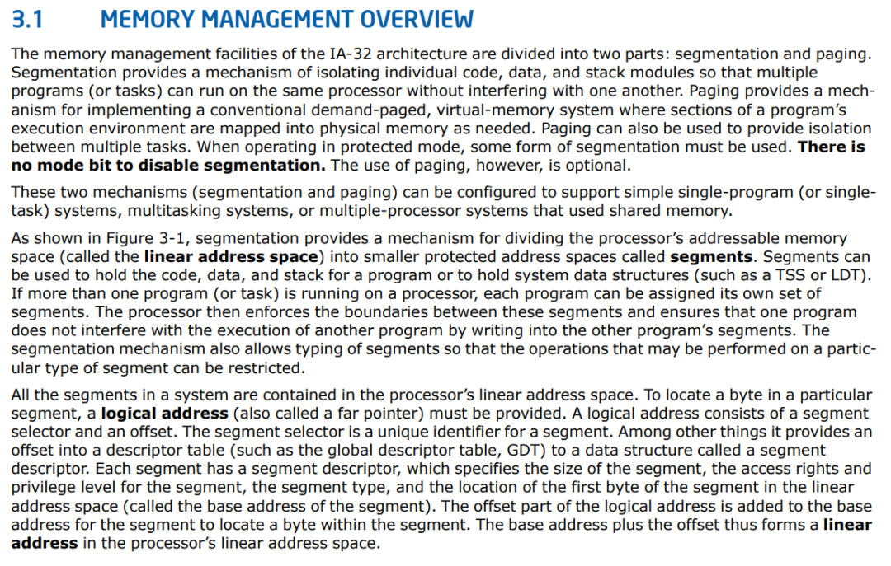

页目录表和页表的具体结构，可以看 

Intel 3A Chapter 4.3 32-bit paging

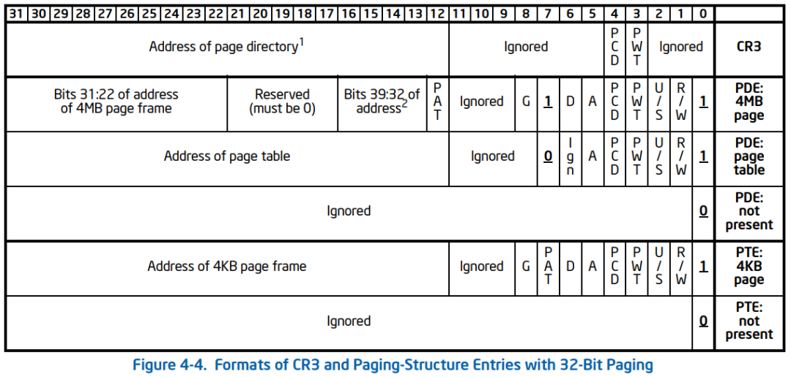

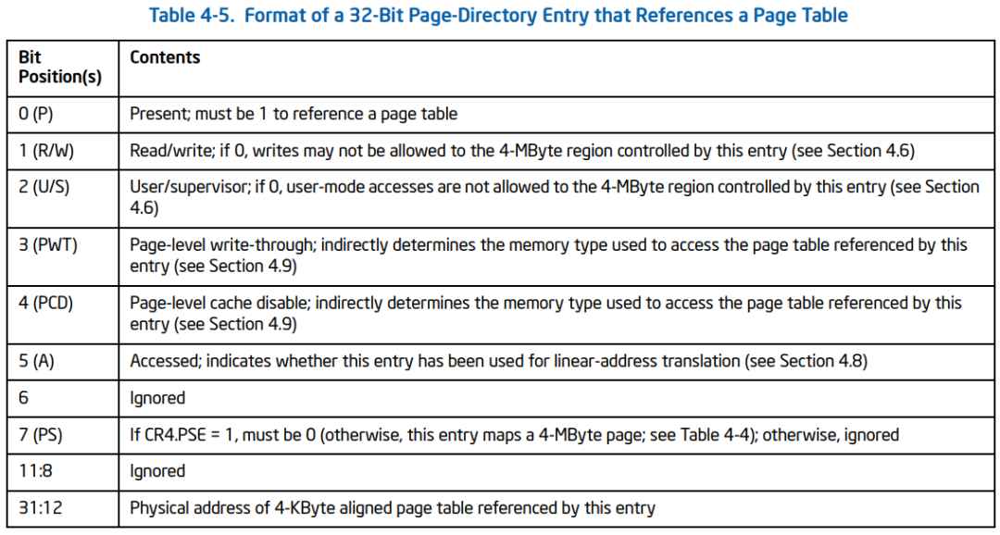

## 第十回 | 进入 main 函数前的最后一跃！

书接上回，上回书咱们说到，我们终于把这些杂七杂八的，idt、gdt、页表都设置好了，并且也开启了保护模式，相当于所有苦力活都做好铺垫了，之后我们就要准备进入 main.c！那里是个新世界！

注意不是进入，而是准备进入哦，就差一哆嗦了。

由于上一讲的知识量非常大，所以这一讲将会非常简单，作为进入 main 函数前的衔接，大家放宽心。

这仍然要回到上一讲我们跳转到设置分页代码的那个地方（head.s 里），这里有个骚操作帮我们跳转到 main.c。

```
after_page_tables:
    push 0
    push 0
    push 0
    push L6
    push _main
    jmp setup_paging
...
setup_paging:
    ...
    ret
```

直接解释起来非常简单。

push 指令就是**压栈**，五个 push 指令过去后，栈会变成这个样子。

 

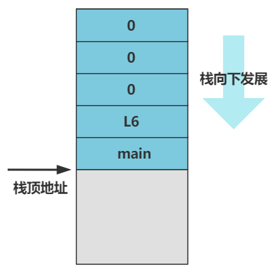

然后注意，setup_paging 最后一个指令是 **ret**，也就是我们上一回讲的设置分页的代码的最后一个指令，形象地说它叫**返回指令**，但 CPU 可没有那么聪明，它并不知道该返回到哪里执行，只是很机械地**把栈顶的元素值当做返回地址**，跳转去那里执行。

再具体说是，把 esp 寄存器（栈顶地址）所指向的内存处的值，赋值给 eip 寄存器，而 cs:eip 就是 CPU 要执行的下一条指令的地址。而此时栈顶刚好是 main.c 里写的 main 函数的内存地址，是我们刚刚特意压入栈的，所以 CPU 就理所应当跳过来了。

当然 Intel CPU 是设计了 call 和 ret 这一配对儿的指令，意为调用函数和返回，具体可以看后面本回扩展资料里的内容。

至于其他压入栈的 L6 是用作当 main 函数返回时的跳转地址，但由于在操作系统层面的设计上，main 是绝对不会返回的，所以也就没用了。而其他的三个压栈的 0，本意是作为 main 函数的参数，但实际上似乎也没有用到，所以也不必关心。

总之，经过这一个小小的骚操作，程序终于跳转到 main.c 这个由 c 语言写就的主函数 main 里了！我们先一睹为快一下。

```cpp
void main(void) {
    ROOT_DEV = ORIG_ROOT_DEV;
    drive_info = DRIVE_INFO;
    memory_end = (1<<20) + (EXT_MEM_K<<10);
    memory_end &= 0xfffff000;
    if (memory_end > 16*1024*1024)
        memory_end = 16*1024*1024;
    if (memory_end > 12*1024*1024) 
        buffer_memory_end = 4*1024*1024;
    else if (memory_end > 6*1024*1024)
        buffer_memory_end = 2*1024*1024;
    else
        buffer_memory_end = 1*1024*1024;
    main_memory_start = buffer_memory_end;
    mem_init(main_memory_start,memory_end);
    trap_init();
    blk_dev_init();
    chr_dev_init();
    tty_init();
    time_init();
    sched_init();
    buffer_init(buffer_memory_end);
    hd_init();
    floppy_init();
    sti();
    move_to_user_mode();
    if (!fork()) {
        init();
    }
    for(;;) pause();
}
```

没错，这就是这个 main 函数的全部了。

而整个操作系统也会最终停留在最后一行死循环中，永不返回，直到关机。 

好了，至此，整个第一部分就圆满结束了，为了跳进 main 函数的准备工作，我称之为进入内核前的苦力活，就完成了！我们看看我们做了什么。

 

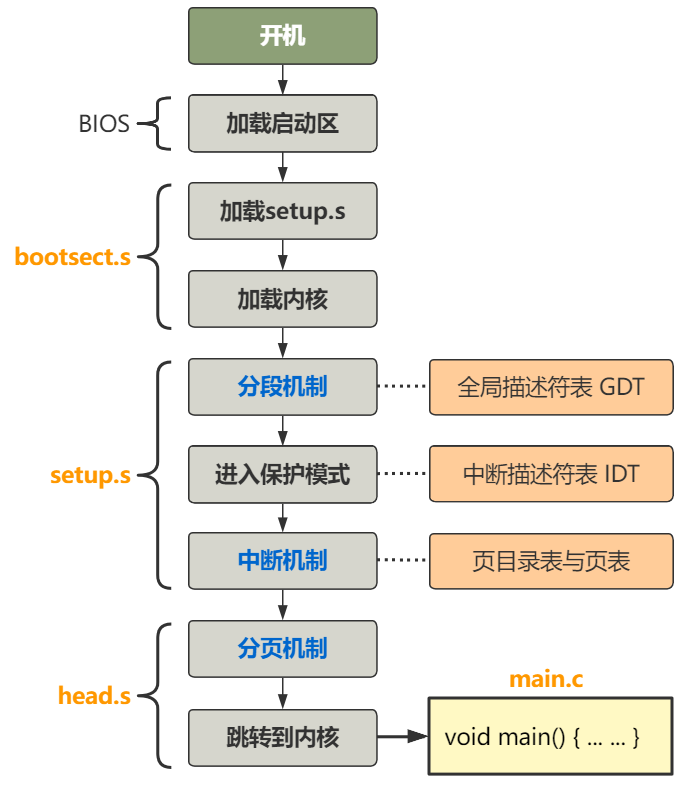

我把这些称为**进入内核前的苦力活**，经过这样的流程，内存被搞成了这个样子。


之后，main 方法就开始执行了，靠着我们辛辛苦苦建立起来的内存布局，向崭新的未来前进！

欲知后事如何，且听下回分解。

**------- 本回扩展资料 -------**

关于 ret 指令，其实 Intel CPU 是配合 call 设计的，有关 call 和 ret 指令，即调用和返回指令，可以参考 Intel 手册：

Intel 1 Chapter 6.4 CALLING PROCEDURES USING CALL AND RET

可以看到还分为不改变段基址的 near call 和 near ret

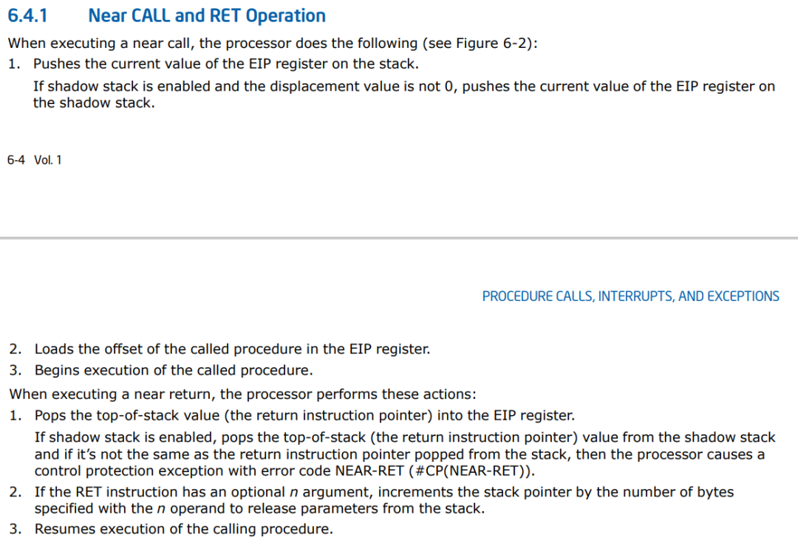

以及改变段基址的 far call 和 far ret

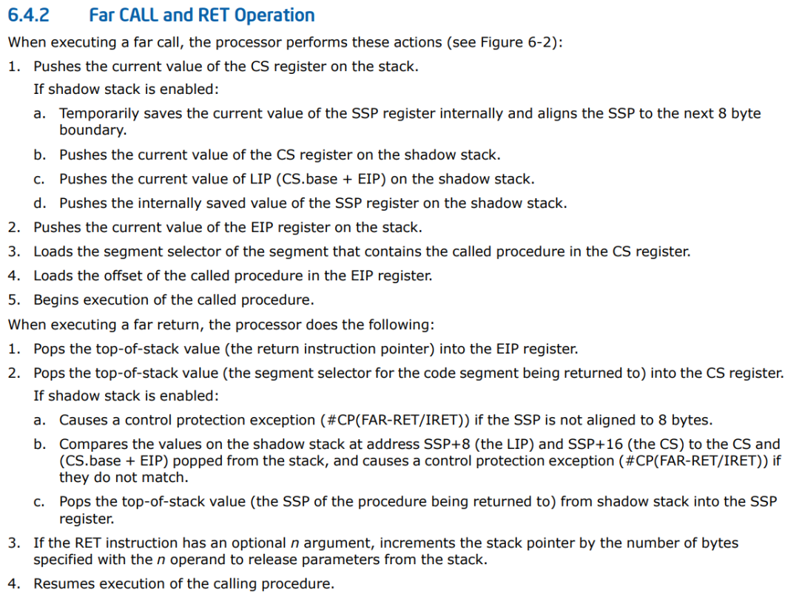

压栈和出栈的具体过程，上面文字写的清清楚楚，下面 Intel 手册还非常友好地放了张图。

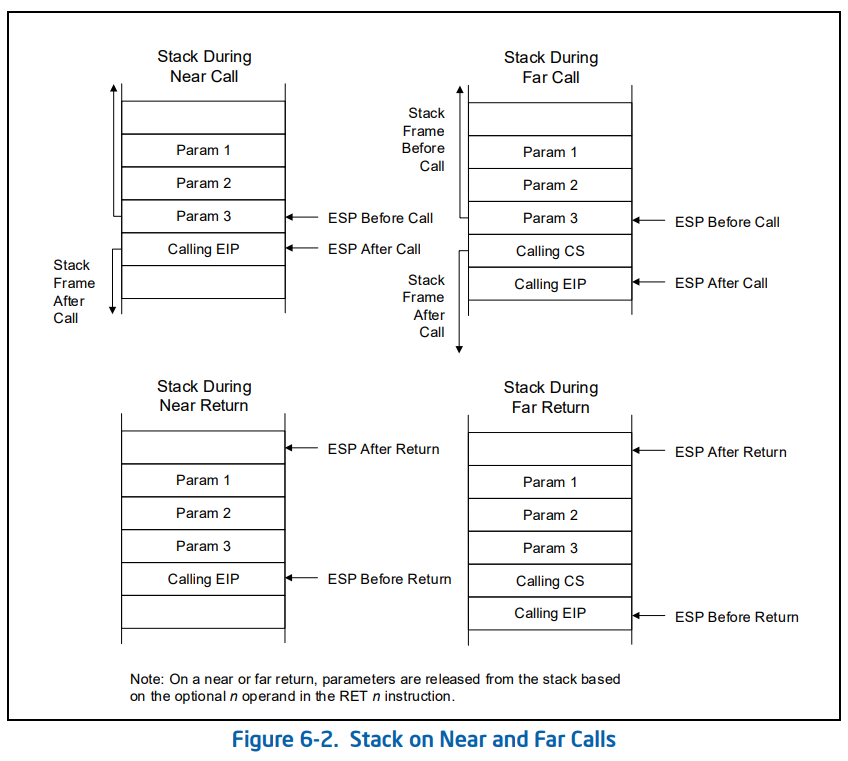

可以看到，我们本文就是左边的那一套，把 main 函数地址值当做 Calling EIP 压入栈，仿佛是执行了 call 指令调用了一个函数一样，但实际上这是我们通过骚操作代码伪造的假象，骗了 CPU。

然后 ret 的时候就把栈顶的那个 Calling EIP 也就是 main 函数地址弹出栈，存入 EIP 寄存器，这样 CPU 就相当于“返回”到了 main 函数开始执行。

## 第一部分完结 进入内核前的苦力活

那今天就来整体梳理一下第一部分的内容，看过的同学跟着我回顾一下，没看过的同学，借着这波机会上车，也是不错的选择。

话不多说，我们开始。

当你按下开机键的那一刻，在主板上提前写死的固件程序 BIOS 会将硬盘中启动区的 512 字节的数据，原封不动复制到内存中的 0x7c00 这个位置，并跳转到那个位置进行执行，


有了这个步骤之后，我们就可以把代码写在硬盘第一扇区，让 BIOS 帮我们加载到内存并由 CPU 去执行，我们不用操心这个过程。

而这一个扇区的代码，就是操作系统源码中最最最开始的部分，它可以执行一些指令，也可以把硬盘的其他部分加载到内存，其实本质上也是执行一些指令。这样，整个计算机今后如何运作，就完全交到我们自己的手中，想怎么玩就怎么玩了。

这是 [第一回 | 最开始的两行代码](http://mp.weixin.qq.com/s?__biz=Mzk0MjE3NDE0Ng==&mid=2247499226&idx=1&sn=1ff3d54a3608423b7781142ae3ac62ca&chksm=c2c58777f5b20e61664a51d31ab779bbe68c317c3459218c7cd4b9530887dbb33470628c3248&scene=21#wechat_redirect) 讲的内容。

接下来，直到 [第四回 | 把自己在硬盘里的其他部分也放到内存来](http://mp.weixin.qq.com/s?__biz=Mzk0MjE3NDE0Ng==&mid=2247499359&idx=1&sn=233812a464996b9566cdf3258132bc22&chksm=c2c584f2f5b20de40a7990c754cdbf3073b4652f318d479ac0c8ff686ca7aa74eef1ba7c6c2f&scene=21#wechat_redirect)，我们才讲到整个操作系统的编译和加载过程的全貌，就是下面这张图。

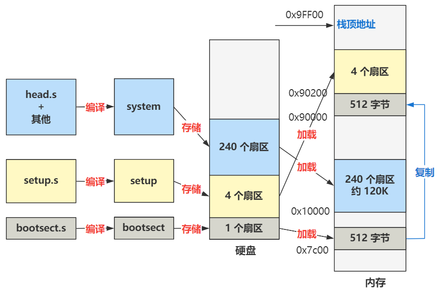

而我们整个的第一部分，其实就在讲 boot 文件夹下的三个汇编文件的内容，bootsect.s，setup.s 以及后面要和其他全部操作系统代码做链接的 head.s。

前五回的内容一直在调整内存的布局，把这块内存复制到那块，又把那块内存复制到这块，所以在 [第五回 | 进入保护模式前的最后一次折腾内存](http://mp.weixin.qq.com/s?__biz=Mzk0MjE3NDE0Ng==&mid=2247499558&idx=1&sn=d5d057fae2fb835d38f82804c2649463&chksm=c2c5858bf5b20c9de2db5c31dd34fbe766f6c46cda17f54f4518a75fc1838f2ada6fe5717aad&scene=21#wechat_redirect) 的结尾，我让你记住这样一张图，在很长一段时间这个内存布局的大体框架就不会再变了，前五回的内容你也可以抛在脑后了。


从第六回开始往后，就是逐渐进入保护模式，并设置分段、分页、中断等机制的地方。最终的内存布局变成了这个样子。


你看，idtr 寄存器指向了 idt，这个就是中断的设置；gdtr 寄存器指向了 gdt，这个就是全局描述符表的设置，可以简单理解为分段机制的设置；cr3 寄存器指向了页目录表的位置，这个就是分页机制的设置。

中断的设置，就引出了 CPU 与操作系统处理中断的流程。

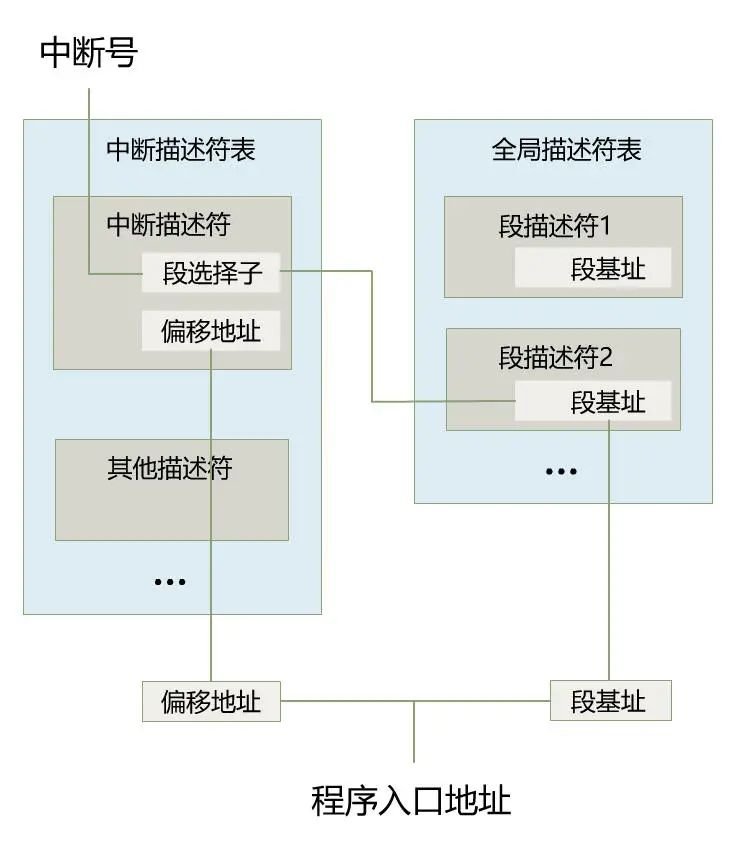

分段和分页的设置，引出了逻辑地址到物理地址的转换。


具体来说，逻辑地址到线性地址的转换，依赖 Intel 的分段机制。


而线性地址到物理地址的转换，依赖 Intel 的分页机制。

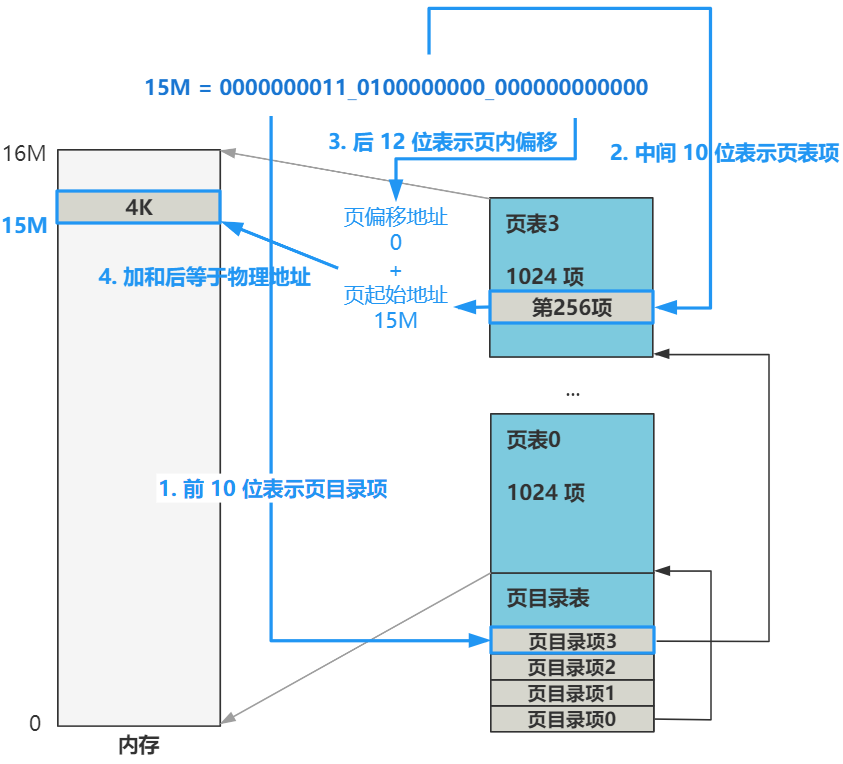


**分段**和**分页**，就是 Intel 管理内存的两大利器，也是内存管理最最最最底层的支撑。

而 Intel 本身对于访问内存就分成三类：

**
**

**代码**

**数据**

**栈**

而 Intel 也提供了三个段寄存器来分别对应着三类内存：

**代码段寄存器（cs）**

**数据段寄存器（ds）**

**栈段寄存器（ss）**

具体来说：

**cs:eip** 表示了我们要执行哪里的代码。

**ds:xxx** 表示了我们要访问哪里的数据。

**ss:esp** 表示了我们的栈顶地址在哪里。

而第一部分的代码，也做了如下工作：

将 **ds** 设置为了 0x10，表示指向了索引值为 2 的全局描述符，即数据段描述符。

将 **cs** 通过一次长跳转指令设置为了 8，表示指向了索引值为 1 的全局描述符，即代码段描述符。

将 **ss:esp** 这个栈顶地址设置为 user_stack 数组的末端。

你看，分段和分页，以及这几个寄存器的设置，其实本质上就是安排我们今后访问内存的方式，做了一个初步规划，**包括去哪找代码、去哪找数据、去哪找栈，以及如何通过分段和分页机制将逻辑地址转换为最终的物理地址**。

而所有上面说的这一切，和 Intel CPU 这个硬件打交道比较多，设置了一些最最最最基础的环境和内存布局，为之后进入 main 函数做了充分的准备，因为 c 语言虽然很底层了，但也有其不擅长的事情，就交给第一部分的汇编语言来做，所以我称第一部分为**进入内核前的苦力活**。

接下来，也就是从第二部分开始，我将会讲述 main.c 里的 main 函数，短短几行，包含了操作系统的全部核心思想。

```cpp
void main(void) {
    ROOT_DEV = ORIG_ROOT_DEV;
    drive_info = DRIVE_INFO;
    memory_end = (1<<20) + (EXT_MEM_K<<10);
    memory_end &= 0xfffff000;
    if (memory_end > 16*1024*1024)
        memory_end = 16*1024*1024;
    if (memory_end > 12*1024*1024) 
        buffer_memory_end = 4*1024*1024;
    else if (memory_end > 6*1024*1024)
        buffer_memory_end = 2*1024*1024;
    else
        buffer_memory_end = 1*1024*1024;
    main_memory_start = buffer_memory_end;
    mem_init(main_memory_start,memory_end);
    trap_init();
    blk_dev_init();
    chr_dev_init();
    tty_init();
    time_init();
    sched_init();
    buffer_init(buffer_memory_end);
    hd_init();
    floppy_init();
    sti();
    move_to_user_mode();
    if (!fork()) {
        init();
    }
    for(;;) pause();
}
```

敬请期待吧！

另外，前十回几乎每一回都有资料扩展部分，基本是围绕着 Intel 手册，把一些文中提到的知识点在一手资料中给出标准答案，大家可以多看看，培养下自己看一手资料的习惯。

由此也可以看出，前十回的苦力活，大部分是在和 Intel CPU 这个硬件打交道，因此阅读 Intel 技术手册从而了解 CPU 体系结构和机制，是理解这一切最直接和有效的办法。

以下列出我所有让大家扩展阅读的资料

有关寄存器的详细信息，可以参考 Intel 手册：

Volume 1 Chapter 3.2 OVERVIEW OF THE BASIC EXECUTION ENVIRONMEN

如果想了解计算机启动时详细的初始化过程，还是得参考 Intel 手册：

Volume 3A Chapter 9 PROCESSOR MANAGEMENT AND INITIALIZATION

如果想了解汇编指令的信息，可以参考 Intel 手册：

Volume 2 Chapter 3 ~ Chapter 5

保护模式下逻辑地址到线性地址（不开启分页时就是物理地址）的转化，看 Intel 手册：

Volume 3 Chapter 3.4 Logical And Linear Addresses

关于逻辑地址-线性地址-物理地址的转换，可以参考 Intel 手册：

Intel 3A Chapter 3 Protected-Mode Memory Management

段描述符结构和详细说明，看 Intel 手册：

Volume 3 Chapter 3.4.5 Segment Descriptors

页目录表和页表的具体结构，可以看 

Intel 3A Chapter 4.3 32-bit paging

关于 ret 指令，其实 Intel CPU 是配合 call 设计的，有关 call 和 ret 指令，即调用和返回指令，可以参考 Intel 手册：

Intel 1 Chapter 6.4 CALLING PROCEDURES USING CALL AND RET

资料就摆在你眼前了，你再不去看，我就没办法咯，加油！

## 第11回 | 整个操作系统就 20 几行代码

第二部分正式开始啦！

在第一部分，用了总共十回的篇章，把进入 main 方法前的苦力工作都完成了，我们的程序终于跳到第一个由 c 语言写的，也是操作系统的全部代码骨架的地方，就是 main.c 文件里的 main 方法。

```
void main(void) {
    ROOT_DEV = ORIG_ROOT_DEV;
    drive_info = DRIVE_INFO;
    memory_end = (1<<20) + (EXT_MEM_K<<10);
    memory_end &= 0xfffff000;
    if (memory_end > 16*1024*1024)
        memory_end = 16*1024*1024;
    if (memory_end > 12*1024*1024) 
        buffer_memory_end = 4*1024*1024;
    else if (memory_end > 6*1024*1024)
        buffer_memory_end = 2*1024*1024;
    else
        buffer_memory_end = 1*1024*1024;
    main_memory_start = buffer_memory_end;

    mem_init(main_memory_start,memory_end);
    trap_init();
    blk_dev_init();
    chr_dev_init();
    tty_init();
    time_init();
    sched_init();
    buffer_init(buffer_memory_end);
    hd_init();
    floppy_init();

    sti();
    move_to_user_mode();
    if (!fork()) {
        init();
    }

    for(;;) pause();
}
```

数一数看，总共也就 20 几行代码。

但这的确是操作系统启动流程的全部秘密了，我用空格将这个代码分成了几个部分。

第一部分是一些参数的取值和计算。

```
void main(void) {
    ROOT_DEV = ORIG_ROOT_DEV;
    drive_info = DRIVE_INFO;
    memory_end = (1<<20) + (EXT_MEM_K<<10);
    memory_end &= 0xfffff000;
    if (memory_end > 16*1024*1024)
        memory_end = 16*1024*1024;
    if (memory_end > 12*1024*1024) 
        buffer_memory_end = 4*1024*1024;
    else if (memory_end > 6*1024*1024)
        buffer_memory_end = 2*1024*1024;
    else
        buffer_memory_end = 1*1024*1024;
    main_memory_start = buffer_memory_end;
    ...
}
```

包括**根设备 ROOT_DEV**，之前在汇编语言中获取的各个设备的**参数信息 drive_info**，以及通过计算得到的**内存边界**

main_memory_start

main_memory_end

buffer_memory_start

buffer_memory_end

从哪获得之前的设备参数信息呢？如果你前面看了，那一定还记得这个表，都是由 setup.s 这个汇编程序调用 BIOS 中断获取的各个设备的信息，并保存在约定好的内存地址 0x90000 处，现在这不就来取了么，我就不赘述了。

| 内存地址 | 长度(字节) | 名称         |
| -------- | ---------- | ------------ |
| 0x90000  | 2          | 光标位置     |
| 0x90002  | 2          | 扩展内存数   |
| 0x90004  | 2          | 显示页面     |
| 0x90006  | 1          | 显示模式     |
| 0x90007  | 1          | 字符列数     |
| 0x90008  | 2          | 未知         |
| 0x9000A  | 1          | 显示内存     |
| 0x9000B  | 1          | 显示状态     |
| 0x9000C  | 2          | 显卡特性参数 |
| 0x9000E  | 1          | 屏幕行数     |
| 0x9000F  | 1          | 屏幕列数     |
| 0x90080  | 16         | 硬盘1参数表  |
| 0x90090  | 16         | 硬盘2参数表  |
| 0x901FC  | 2          | 根设备号     |

第二部分是各种初始化 **init** 操作。

```
void main(void) {
    ...
    mem_init(main_memory_start,memory_end);
    trap_init();
    blk_dev_init();
    chr_dev_init();
    tty_init();
    time_init();
    sched_init();
    buffer_init(buffer_memory_end);
    hd_init();
    floppy_init();
    ...
}
```

包括**内存初始化 mem_init**，**中断初始化 trap_init**、**进程调度初始化 sched_init** 等等。我们知道学操作系统知识的时候，其实就分成这么几块来学的，看来在操作系统源码上看，也确实是这么划分的，那我们之后照着源码慢慢品，就好了。

第三部分是**切换到用户态模式**，并在一个新的进程中做一个最终的初始化 init。

```
void main(void) {
    ...
    sti();
    move_to_user_mode();
    if (!fork()) {
        init();
    }
    ...
}
```

这个 init 函数里会创建出一个进程，设置终端的标准 IO，并且再创建出一个执行 shell 程序的进程用来接受用户的命令，到这里其实就出现了我们熟悉的画面（下面是 bochs 启动 Linux 0.11 后的画面）。

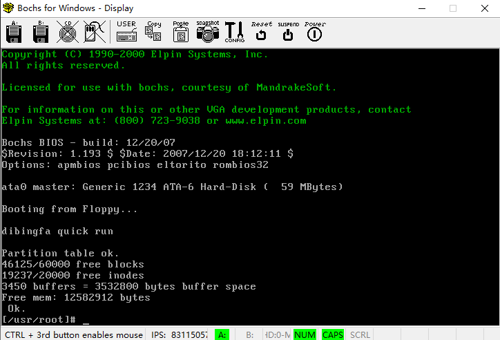

第四部分是个**死循环**，如果没有任何任务可以运行，操作系统会一直陷入这个死循环无法自拔。

```
void main(void) {
    ...
    for(;;) pause();
}
```

OK，不要细品每一句话，我们本回就是要你有个整体印象，之后会细细讲这里的每一个部分。

这里再放上目前的内存布局图。


这个图大家一定要牢记在心，操作系统说白了就是在内存中放置各种的数据结构，来实现“管理”的功能。 

所以之后我们的学习过程，主心骨其实就是看看，操作系统在经过一番折腾后，又在内存中建立了什么数据结构，而这些数据结构后面又是如何用到的。

比如进程管理，就是在内存中建立好多复杂的数据结构用来记录进程的信息，再配合上进程调度的小算法，完成了进程这个强大的功能。

为了让大家目前心里有个底，我们把前面的工作再再再再在这里做一个回顾，用一张图表示就是：

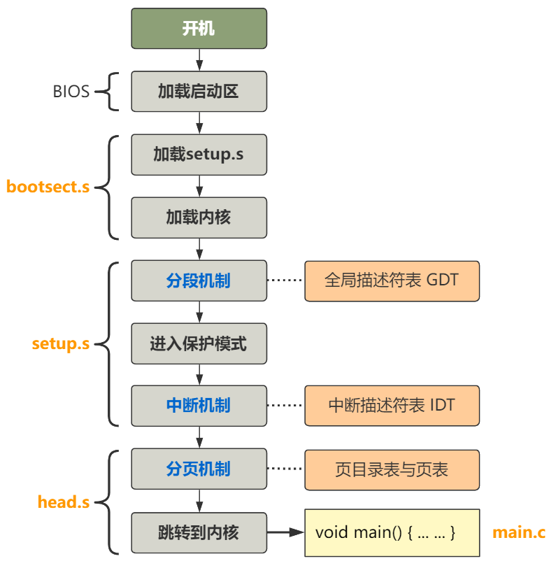

看到了吧，我们已经把 boot 文件夹下的三个汇编文件的全部代码都一行一行品读过了，其主要功能就是三张表的设置：全局描述符表、中断描述符表、页表。同时还设置了各种段寄存器，栈顶指针。并且，还为后续的程序提供了设备信息，保存在 0x90000 处往后的几个位置上。

最后，一个华丽的跳转，将程序跳转到了 main.c 文件里的 main 函数中。

所以，本讲就是让大家深呼吸，把之前的准备工作再消化消化。如果第一部分全部认真看过的同学，必定觉得这一回是废话。

如果你不这样觉得，那就得再回去重新梳理一边咯，如果有不会的，赶紧查资料搞懂它，因为之后要打一系列的硬仗了！根基不稳，地动山摇！

预知后事如何，且听下回分解。

## 第12回 | 管理内存前先划分出三个边界值

书接上回，上回书咱们回顾了一下 main.c 函数之前我们做的全部工作，给进入 main 函数做了一个充分的准备。


那今天我们就话不多说，从 main 函数的第一行代码开始读。

还是把 main 的全部代码都先写出来，很少。

```c
void main(void) {

    ROOT_DEV = ORIG_ROOT_DEV;
    drive_info = DRIVE_INFO;
    memory_end = (1<<20) + (EXT_MEM_K<<10);
    memory_end &= 0xfffff000;
    if (memory_end > 16*1024*1024)
        memory_end = 16*1024*1024;
    if (memory_end > 12*1024*1024) 
        buffer_memory_end = 4*1024*1024;
    else if (memory_end > 6*1024*1024)
        buffer_memory_end = 2*1024*1024;
    else
        buffer_memory_end = 1*1024*1024;
    main_memory_start = buffer_memory_end;

    mem_init(main_memory_start,memory_end);
    trap_init();
    blk_dev_init();
    chr_dev_init();
    tty_init();
    time_init();
    sched_init();
    buffer_init(buffer_memory_end);
    hd_init();
    floppy_init();

    sti();
    move_to_user_mode();
    if (!fork()) {      /* we count on this going ok */
        init();
    }

    for(;;) pause();
}
```

我们今天就看这第一小段。 

首先，ROOT_DEV 为系统的根文件设备号，drive_info 为之前 setup.s 程序获取并存储在内存 0x90000 处的设备信息，我们先不管这俩，等之后用到了再说。

我们看后面这一坨很影响整体画风的一段代码。

```
void main(void) {
    ...
    memory_end = (1<<20) + (EXT_MEM_K<<10);
    memory_end &= 0xfffff000;
    if (memory_end > 16*1024*1024)
        memory_end = 16*1024*1024;
    if (memory_end > 12*1024*1024) 
        buffer_memory_end = 4*1024*1024;
    else if (memory_end > 6*1024*1024)
        buffer_memory_end = 2*1024*1024;
    else
        buffer_memory_end = 1*1024*1024;
    main_memory_start = buffer_memory_end;
    ...
}
```

这一坨代码和后面规规整整的 xxx_init 平级的位置，要是我们这么写代码，肯定被老板批评，被同事鄙视了。但 Linus 写的，就是经典，学就完事了。 

这一坨代码虽然很乱，但仔细看就知道它只是为了计算出三个变量罢了。

**main_memory_start**

**memory_end**

**buffer_memory_end**

而观察最后一行代码发现，其实两个变量是相等的，所以其实仅仅计算出了两个变量。

**main_memory_start**

**memory_end**

然后再具体分析这个逻辑，其实就是一堆 if else 判断而已，判断的标准都是 memory_end 也就是内存最大值的大小，而这个内存最大值由第一行代码可以看出，是等于 1M + 扩展内存大小。

那 ok 了，**其实就只是针对不同的内存大小，设置不同的边界值罢了**，为了理解它，我们完全没必要考虑这么周全，就假设总内存一共就 **8M** 大小吧。

那么如果内存为 8M 大小，**memory_end** 就是

8 * 1024 * 1024

也就只会走倒数第二个分支，那么 **buffer_memory_end** 就为

2 * 1024 * 1024

那么 **main_memory_start** 也为

2 * 1024 * 1024

那这些值有什么用呢？一张图就给你说明白了。 


你看，其实就是定了三个箭头所指向的地址的三个边界变量，具体主内存区是如何管理和分配的，要看下面代码的功劳。

```
void main(void) {
    ...
    mem_init(main_memory_start, memory_end);
    ...
}
```

而缓冲区是如何管理和分配的，就要看

```
void main(void) {
    ...
    buffer_init(buffer_memory_end);
    ...
}
```

是如何折腾的了。 

那我们今天就不背着这两个负担了，仅仅需要知道这三个参数的计算，以及后面是为谁效力的，就好啦，是不是很轻松？后面我们再讲，如何利用这三个参数，来做到内存的管理。

预知后事如何，且听下会分解。

## 操作系统就用一张大表管理内存？

今天我们不聊具体内存管理的算法，我们就来看看，操作系统用什么样的一张表，达到了管理内存的效果。

我们以 Linux 0.11 源码为例，发现进入内核的 main 函数后不久，有这样一坨代码。

```c
void main(void) {
    ...
    memory_end = (1<<20) + (EXT_MEM_K<<10);
    memory_end &= 0xfffff000;
    if (memory_end > 16*1024*1024)
        memory_end = 16*1024*1024;
    if (memory_end > 12*1024*1024) 
        buffer_memory_end = 4*1024*1024;
    else if (memory_end > 6*1024*1024)
        buffer_memory_end = 2*1024*1024;
    else
        buffer_memory_end = 1*1024*1024;
    main_memory_start = buffer_memory_end;

    mem_init(main_memory_start,memory_end);
    ...
}
```

除了最后一行外，前面的那一大坨的作用很简单。

**
**

**其实就只是针对不同的内存大小，设置不同的边界值罢了**，为了理解它，我们完全没必要考虑这么周全，就假设总内存一共就 **8M** 大小吧。

那么如果内存为 8M 大小，**memory_end** 就是

8 * 1024 * 1024

也就只会走倒数第二个分支，那么 **buffer_memory_end** 就为

2 * 1024 * 1024

那么 **main_memory_start** 也为

2 * 1024 * 1024

你仔细看看代码逻辑，看是不是这样？

当然，你不愿意细想也没关系，上述代码执行后，就是如下效果而已。


你看，其实就是定了三个箭头所指向的地址的三个边界变量。具体主内存区是如何管理和分配的，要看 mem_init 里做了什么。

```c
void main(void) {
    ...
    mem_init(main_memory_start, memory_end);
    ...
}
```

而缓冲区是如何管理和分配的，就要看再后面的 buffer_init 里干了什么。

```c
void main(void) {
    ...
    buffer_init(buffer_memory_end);
    ...
}
```

不过我们今天只看，主内存是如何管理的，很简单，放轻松。

进入 mem_init 函数。

```c
#define LOW_MEM 0x100000
#define PAGING_MEMORY (15*1024*1024)
#define PAGING_PAGES (PAGING_MEMORY>>12)
#define MAP_NR(addr) (((addr)-LOW_MEM)>>12)
#define USED 100

static long HIGH_MEMORY = 0;
static unsigned char mem_map[PAGING_PAGES] = { 0, };

// start_mem = 2 * 1024 * 1024
// end_mem = 8 * 1024 * 1024
void mem_init(long start_mem, long end_mem)
{
    int i;
    HIGH_MEMORY = end_mem;
    for (i=0 ; i<PAGING_PAGES ; i++)
        mem_map[i] = USED;
    i = MAP_NR(start_mem);
    end_mem -= start_mem;
    end_mem >>= 12;
    while (end_mem-->0)
        mem_map[i++]=0;
}
```

发现也没几行，而且并没有更深的方法调用，看来是个好欺负的方法。

仔细一看这个方法，其实折腾来折腾去，就是给一个 **mem_map** 数组的各个位置上赋了值，而且显示全部赋值为 USED 也就是 100，然后对其中一部分又赋值为了 0。

赋值为 100 的部分就是 USED，也就表示内存被占用，如果再具体说是占用了 100 次，这个之后再说。剩下赋值为 0 的部分就表示未被使用，也即使用次数为零。

是不是很简单？**就是准备了一个表，记录了哪些内存被占用了，哪些内存没被占用**。这就是所谓的“管理”，并没有那么神乎其神。

那接下来自然有两个问题，每个元素表示占用和未占用，这个表示的范围是多大？初始化时哪些地方是占用的，哪些地方又是未占用的？

还是一张图就看明白了，我们仍然假设内存总共只有 8M。

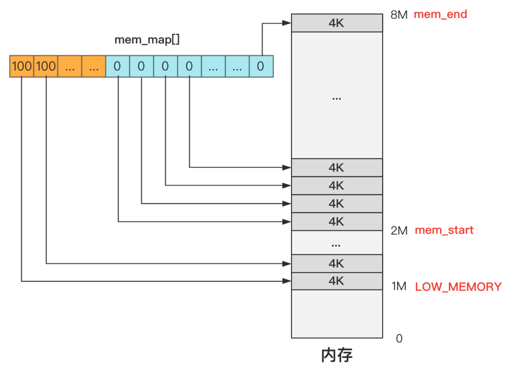

可以看出，初始化完成后，其实就是 mem_map 这个数组的每个元素都代表一个 4K 内存是否空闲（准确说是使用次数）

4K 内存通常叫做 1 页内存，而这种管理方式叫**分页管理**，就是把内存分成一页一页（4K）的单位去管理。

1M 以下的内存这个数组干脆没有记录，这里的内存是无需管理的，或者换个说法是无权管理的，也就是没有权利申请和释放，因为这个区域是内核代码所在的地方，不能被“污染”。

1M 到 2M 这个区间是**缓冲区**，2M 是缓冲区的末端，缓冲区的开始在哪里之后再说，这些地方不是主内存区域，因此直接标记为 USED，产生的效果就是无法再被分配了。

2M 以上的空间是**主内存区域**，而主内存目前没有任何程序申请，所以初始化时统统都是零，未来等着应用程序去申请和释放这里的内存资源。

那应用程序如何申请内存呢？我们本讲不展开，不过我们简单展望一下，看看申请内存的过程中，是如何使用 mem_map 这个结构的。

在 **memory.c** 文件中有个函数 **get_free_page()**，用于在主内存区中申请一页空闲内存页，并返回物理内存页的起始地址。

比如我们在 fork 子进程的时候，会调用 **copy_process** 函数来复制进程的结构信息，其中有一个步骤就是要**申请一页内存**，用于存放进程结构信息 task_struct。

```c
int copy_process(...) {
    struct task_struct *p;
    ...
    p = (struct task_struct *) get_free_page();
    ...
}
```

我们看 get_free_page 的具体实现，是内联汇编代码，看不懂不要紧，注意它里面就有 **mem_map** 结构的使用。

```c
unsigned long get_free_page(void) {
    register unsigned long __res asm("ax");
    __asm__(
        "std ; repne ; scasb\n\t"
        "jne 1f\n\t"
        "movb $1,1(%%edi)\n\t"
        "sall $12,%%ecx\n\t"
        "addl %2,%%ecx\n\t"
        "movl %%ecx,%%edx\n\t"
        "movl $1024,%%ecx\n\t"
        "leal 4092(%%edx),%%edi\n\t"
        "rep ; stosl\n\t"
        "movl %%edx,%%eax\n"
        "1:"
        :"=a" (__res)
        :"0" (0),"i" (LOW_MEM),"c" (PAGING_PAGES),
        "D" (mem_map + PAGING_PAGES-1)
        :"di","cx","dx");
    return __res;
}
```

就是选择 mem_map 中首个空闲页面，并标记为已使用。

好了，本讲就这么多，只是填写了一张大表而已，简单吧？之后的内存申请与释放等骚操作，统统是跟着张大表 **mem_map** 打交道而已，你一定要记住它哦。

## 你的键盘是什么时候生效的？

当你的计算机刚刚启动时，你按下键盘是不生效的，但是过了一段时间后，再按下键盘就有效果了。


那我们今天就来刨根问底一下，**到底过了多久之后，按下键盘才有效果呢？**

当然首先你得知道，按下键盘后会触发中断，CPU 收到你的键盘中断后，根据中断号，寻找由操作系统写好的键盘中断处理程序。

中断的原理和过程不了解的，可以看我的文章，[认认真真的聊聊中断](http://mp.weixin.qq.com/s?__biz=Mzk0MjE3NDE0Ng==&mid=2247498208&idx=1&sn=b784f8b4e627ebd1bfb9810d194fdb80&chksm=c2c5834df5b20a5bdee331002bfc61c90eb468da325bf67abeef780c303a9f51c8543e1a5981&scene=21#wechat_redirect)

这个中断处理程序会把你的键盘码放入一个队列中，由相应的用户程序或内核程序读取，并显示在控制台，或者其他用途，这就代表你的键盘生效了。

不过放宽心，我们不展开讲这个中断处理程序以及用户程序读取键盘码后的处理细节，我们把关注点放在，究竟是**“什么时候”**，按下键盘才会有这个效果。

我们以 **Linux 0.11** 源码为例，发现进入内核的 main 函数后不久，有这样一行代码。

```
void main(void) {
    ...
    trap_init();
    ...
}
```

看到这个方法的全部代码后，你可能会会心一笑，也可能一脸懵逼。

```c
void trap_init(void) {
    int i;
    set_trap_gate(0,&divide_error);
    set_trap_gate(1,&debug);
    set_trap_gate(2,&nmi);
    set_system_gate(3,&int3);   /* int3-5 can be called from all */
    set_system_gate(4,&overflow);
    set_system_gate(5,&bounds);
    set_trap_gate(6,&invalid_op);
    set_trap_gate(7,&device_not_available);
    set_trap_gate(8,&double_fault);
    set_trap_gate(9,&coprocessor_segment_overrun);
    set_trap_gate(10,&invalid_TSS);
    set_trap_gate(11,&segment_not_present);
    set_trap_gate(12,&stack_segment);
    set_trap_gate(13,&general_protection);
    set_trap_gate(14,&page_fault);
    set_trap_gate(15,&reserved);
    set_trap_gate(16,&coprocessor_error);
    for (i=17;i<48;i++)
        set_trap_gate(i,&reserved);
    set_trap_gate(45,&irq13);
    set_trap_gate(39,&parallel_interrupt);
}
```

这啥玩意？这么多 **set_xxx_gate**。

有密集恐惧症的话，绝对看不下去这个代码，所以我就给他简化一下。

把相同功能的去掉。

```c
void trap_init(void) {
    int i;
    // set 了一堆 trap_gate
    set_trap_gate(0, &divide_error);
    ... 
    // 又 set 了一堆 system_gate
    set_system_gate(45, &bounds);
    ...
    // 又又批量 set 了一堆 trap_gate
    for (i=17;i<48;i++)
        set_trap_gate(i, &reserved);
    ...
}
```

这就简单多了，我们一块一块看。

首先我们看 **set_trap_gate** 和 **set_system_gate** 这俩货，发现了这么几个宏定义。

```c
#define _set_gate(gate_addr,type,dpl,addr) \
__asm__ ("movw %%dx,%%ax\n\t" \
    "movw %0,%%dx\n\t" \
    "movl %%eax,%1\n\t" \
    "movl %%edx,%2" \
    : \
    : "i" ((short) (0x8000+(dpl<<13)+(type<<8))), \
    "o" (*((char *) (gate_addr))), \
    "o" (*(4+(char *) (gate_addr))), \
    "d" ((char *) (addr)),"a" (0x00080000))

#define set_trap_gate(n,addr) \
    _set_gate(&idt[n],15,0,addr)

#define set_system_gate(n,addr) \
    _set_gate(&idt[n],15,3,addr)
```

别怕，我也看不懂。

不过这俩都是最终指向了相同的另一个宏定义 **_set_gate**，说明是有共性的。

啥共性呢？我直接说吧，那段你完全看不懂的代码，是将汇编语言嵌入到 c 语言了，这种内联汇编的格式非常恶心，所以我也不想搞懂它，最终的效果就是**在中断描述符表中插入了一个中断描述符**。

中断描述符表还记得吧，英文叫 idt。 


这段代码就是往这个 idt 表里一项一项地写东西，其对应的中断号就是第一个参数，中断处理程序就是第二个参数。

产生的效果就是，之后如果来一个中断后，CPU 根据其中断号，就可以到这个中断描述符表 idt 中找到对应的中断处理程序了。

比如这个。

```c
set_trap_gate(0,&divide_error);
```

就是设置 **0 号中断**，对应的中断处理程序是 **divide_error**。

等 CPU 执行了一条除零指令的时候，会从硬件层面发起一个 0 号异常中断，然后执行由我们操作系统定义的 divide_error 也就是除法异常处理程序，执行完之后再返回。

再比如这个。

```c
set_system_gate(5,&overflow);
```

就是设置 5 号中断，对应的中断处理程序是 overflow，是边界出错中断。

TIPS：这个 trap 与 system 的区别仅仅在于，设置的中断描述符的特权级不同，前者是 0（内核态），后者是 3（用户态），这块展开将会是非常严谨的、绕口的、复杂的特权级相关的知识，不明白的话先不用管，就理解为都是设置一个中断号和中断处理程序的对应关系就好了。

再往后看，批量操作这里。

```c
void trap_init(void) {
    ...
    for (i=17;i<48;i++)
        set_trap_gate(i,&reserved);
    ...
}
```

17 到 48 号中断都批量设置为了 **reserved** 函数，这是暂时的，后面各个硬件初始化时要重新设置好这些中断，把暂时的这个给覆盖掉，此时你留个印象。

所以整段代码执行下来，内存中那个 idt 的位置会变成如下的样子。

 

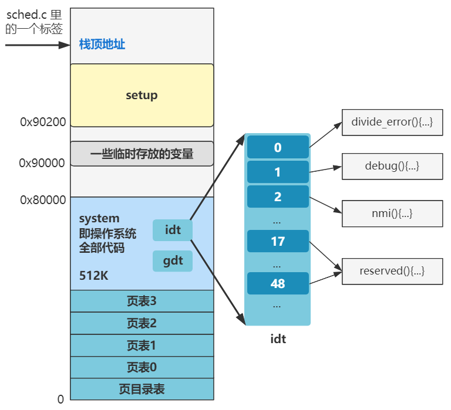

好了，我们看到了设置中断号与中断处理程序对应的地方，那这行代码过去后，键盘好使了么？

**NO**

键盘产生的中断的中断号是 **0x21**，此时这个中断号还仅仅对应着一个临时的中断处理程序 &reserved，我们接着往后看。

在这行代码往后几行，还有这么一行代码。

```c
void main(void) {
    ...
    trap_init();
    ...
    tty_init();
    ...
}

void tty_init(void) {
    rs_init();
    con_init();
}

void con_init(void) {
    ...
    set_trap_gate(0x21,&keyboard_interrupt);
    ...
}
```

我省略了大量的代码，只保留了我们关心的。

注意到 trap_init 后有个 **tty_init**，最后根据调用链，会调用到一行添加 0x21 号中断处理程序的代码，就是刚刚熟悉的 **set_trap_gate**。

而后面的 **keyboard_interrupt** 根据名字也可以猜出，就是键盘的中断处理程序嘛！

好了，那我们终于找到大案了，就是从这一行代码开始，我们的键盘生效了！

没错，不过还有点小问题，不过不重要，就是我们现在的中断处于**禁用状态**，不论是键盘中断还是其他中断，通通都不好使。

而 main 方法继续往下读，还有一行这个东西。

```c
void main(void) {
    ...
    trap_init();
    ...
    tty_init();
    ...
    sti();
    ...
}
```

sti 最终会对应一个同名的汇编指令 sti，表示**允许中断**。所以这行代码之后，键盘才真正开始生效！


动画酷不酷？好啦，今天的文章就到这里了，中断的原理和细节，就看我之前的文章，[认认真真的聊聊中断](http://mp.weixin.qq.com/s?__biz=Mzk0MjE3NDE0Ng==&mid=2247498208&idx=1&sn=b784f8b4e627ebd1bfb9810d194fdb80&chksm=c2c5834df5b20a5bdee331002bfc61c90eb468da325bf67abeef780c303a9f51c8543e1a5981&scene=21#wechat_redirect)。

键盘处理的具体流程，可以跟着我今天的代码深入进去看看哟，Linux 0.11 里还是很简单的。

## 读取硬盘前的准备工作有哪些？

读取硬盘数据到内存中，是操作系统的一个基础功能。

读取硬盘需要有块设备驱动程序，而以文件的方式来读取则还有要再上面包一层文件系统。

把读出来的数据放到内存，就涉及到内存中缓冲区的管理。

上面说的每一件事，都是一个十分庞大的体系，我们今天的文章一个都不展开讲，哈哈。

我们就讲讲，读取块设备与内存缓冲区之间的桥梁，**块设备请求项**的初始化工作。

我们以 Linux 0.11 源码为例，发现进入内核的 main 函数后不久，有这样一行代码。

```c
void main(void) {
    ...
    blk_dev_init();
    ...
}
```

看到这个方法的全部代码后，你可能会会心一笑，也可能一脸懵逼。

```c
void blk_dev_init(void) {
    int i;
    for (i=0; i<32; i++) {
        request[i].dev = -1;
        request[i].next = NULL;
    }
}
```

这也太简单了吧？

就是给 request 这个数组的前 32 个元素的两个变量 **dev** 和 **next** 附上值，看这俩值 **-1** 和 **NULL** 也可以大概猜出，这是没有任何作用时的初始化值。

我们看下 request 结构体。

```c
/*
 * Ok, this is an expanded form so that we can use the same
 * request for paging requests when that is implemented. In
 * paging, 'bh' is NULL, and 'waiting' is used to wait for
 * read/write completion.
 */
struct request {
    int dev;        /* -1 if no request */
    int cmd;        /* READ or WRITE */
    int errors;
    unsigned long sector;
    unsigned long nr_sectors;
    char * buffer;
    struct task_struct * waiting;
    struct buffer_head * bh;
    struct request * next;
};
```

注释也附上了。

哎哟，这就有点头大了，刚刚的函数虽然很短，但看到这个结构体我们知道了，重点在这呢。

这也侧面说明了，学习操作系统，其实把遇到的重要数据结构牢记心中，就已经成功一半了。比如主内存管理结构 mem_map，知道它的数据结构是什么样子，其功能也基本就懂了。

收，继续说这个 request 结构，这个结构就代表了一次读盘请求，其中：

**dev** 表示设备号，-1 就表示空闲。

**cmd** 表示命令，其实就是 READ 还是 WRITE，也就表示本次操作是读还是写。

**errors** 表示操作时产生的错误次数。

**sector** 表示起始扇区。

**nr_sectors** 表示扇区数。

**buffer** 表示数据缓冲区，也就是读盘之后的数据放在内存中的什么位置。

**waiting** 是个 task_struct 结构，这可以表示一个进程，也就表示是哪个进程发起了这个请求。

**bh** 是缓冲区头指针，这个后面讲完缓冲区就懂了，因为这个 request 是需要与缓冲区挂钩的。

**next** 指向了下一个请求项。

这里有的变量看不懂没关系。

不过我们倒是可以基于现有的重点参数猜测一下，比如读请求时，**cmd** 就是 READ，**sector** 和 **nr_sectors** 这俩就定位了所要读取的块设备（可以简单先理解为硬盘）的哪几个扇区，**buffer** 就定位了这些数据读完之后放在内存的什么位置。

这就够啦，想想看，这四个参数是不是就能完整描述了一个读取硬盘的需求了？而且完全没有歧义，就像下面这样。


 

而其他的参数，肯定是为了更好地配合操作系统进行读写块设备操作嘛，为了把多个读写块设备请求很好地组织起来。这个组织不但要有这个数据结构中 hb 和 next 等变量的配合，还要有后面的电梯调度算法的配合，仅此而已，先点到为止。 

总之，我们这里就先明白，这个 request 结构可以完整描述一个读盘操作。然后那个 request 数组就是把它们都放在一起，并且它们又通过 next 指针串成链表。


好，本文讲述的两行代码，其实就完成了上图所示的工作而已。

但讲到这就结束的话，很多同学可能会不太甘心，那我就简单展望一下，后面读盘的全流程中，是怎么用到刚刚初始化的这个 request[32] 结构的。

读操作的系统调用函数是 **sys_read**，源代码很长，我给简化一下，仅仅保留读取普通文件的分支，就是如下的样子。

```c
int sys_read(unsigned int fd,char * buf,int count) {
    struct file * file = current->filp[fd];
    struct m_inode * inode = file->f_inode;
    // 校验 buf 区域的内存限制
    verify_area(buf,count);
    // 仅关注目录文件或普通文件
    return file_read(inode,file,buf,count);
}
```

看，入参 **fd** 是文件描述符，通过它可以找到一个文件的 inode，进而找到这个文件在硬盘中的位置。

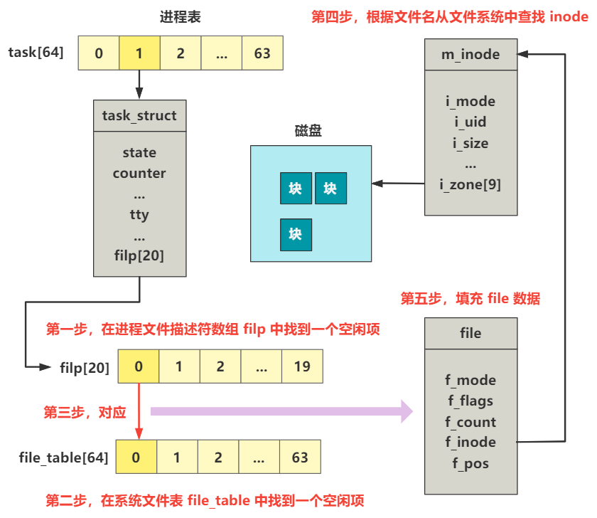

另两个入参 **buf** 就是要复制到的内存中的位置，**count** 就是要复制多少个字节，很好理解。

钻到 file_read 函数里继续看。

```c
int file_read(struct m_inode * inode, struct file * filp, char * buf, int count) {
    int left,chars,nr;
    struct buffer_head * bh;
    left = count;
    while (left) {
        if (nr = bmap(inode,(filp->f_pos)/BLOCK_SIZE)) {
            if (!(bh=bread(inode->i_dev,nr)))
                break;
        } else
            bh = NULL;
        nr = filp->f_pos % BLOCK_SIZE;
        chars = MIN( BLOCK_SIZE-nr , left );
        filp->f_pos += chars;
        left -= chars;
        if (bh) {
            char * p = nr + bh->b_data;
            while (chars-->0)
                put_fs_byte(*(p++),buf++);
            brelse(bh);
        } else {
            while (chars-->0)
                put_fs_byte(0,buf++);
        }
    }
    inode->i_atime = CURRENT_TIME;
    return (count-left)?(count-left):-ERROR;
}
```

整体看，就是一个 while 循环，每次读入一个块的数据，直到入参所要求的大小全部读完为止。

直接看 bread 那一行。

```c
int file_read(struct m_inode * inode, struct file * filp, char * buf, int count) {
    ...
    while (left) {
        ...
        if (!(bh=bread(inode->i_dev,nr)))
    }
}
```

这个函数就是去读某一个设备的某一个数据块号的内容，展开进去看。

```c
struct buffer_head * bread(int dev,int block) {
    struct buffer_head * bh = getblk(dev,block);
    if (bh->b_uptodate)
        return bh;
    ll_rw_block(READ,bh);
    wait_on_buffer(bh);
    if (bh->b_uptodate)
        return bh;
    brelse(bh);
    return NULL;
}
```

其中 getblk 先申请了一个内存中的缓冲块，然后 ll_rw_block 负责把数据读入这个缓冲块，进去继续看。

```c
void ll_rw_block(int rw, struct buffer_head * bh) {
    ...
    make_request(major,rw,bh);
}

static void make_request(int major,int rw, struct buffer_head * bh) {
    ...
if (rw == READ)
        req = request+NR_REQUEST;
    else
        req = request+((NR_REQUEST*2)/3);
/* find an empty request */
    while (--req >= request)
        if (req->dev<0)
            break;
    ...
/* fill up the request-info, and add it to the queue */
    req->dev = bh->b_dev;
    req->cmd = rw;
    req->errors=0;
    req->sector = bh->b_blocknr<<1;
    req->nr_sectors = 2;
    req->buffer = bh->b_data;
    req->waiting = NULL;
    req->bh = bh;
    req->next = NULL;
    add_request(major+blk_dev,req);
}
```

看，这里就用到了刚刚说的结构咯。

具体说来，就是该函数会往刚刚的设备的请求项链表 request[32] 中添加一个请求项，只要 request[32] 中有未处理的请求项存在，都会陆续地被处理，直到设备的请求项链表是空为止。

具体怎么读盘，就是与硬盘 IO 端口进行交互的过程了，可以继续往里跟，直到看到一个 hd_out 函数为止，本讲不展开了。

具体读盘操作，后面会有详细的章节展开讲解，本讲你只需要知道，我们在 main 函数的 init 系列函数中，通过 blk_dev_init 为后面的块设备访问，提前建立了一个数据结构，作为访问块设备和内存缓冲区之间的桥梁，就可以了。

## 第16回 | 按下键盘后为什么屏幕上就会有输出

书接上回，上回书咱们说到，继内存管理结构 mem_map 和中断描述符表 **idt** 建立好之后，我们又在内存中倒腾出一个新的数据结构 request。


并且把它们都放在了一个数组中。

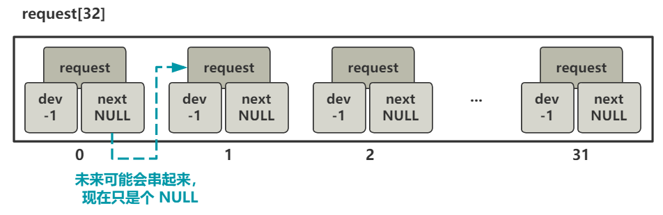

这是**块设备驱动程序**与**内存缓冲区**的桥梁，通过它可以完整地表示一个块设备读写操作要做的事。

我们继续往下看，tty_init。

```c
void main(void) {
    ...
    mem_init(main_memory_start,memory_end);
    trap_init();
    blk_dev_init();
    chr_dev_init();
    tty_init();
    time_init();
    sched_init();
    buffer_init(buffer_memory_end);
    hd_init();
    floppy_init();
    
    sti();
    move_to_user_mode();
    if (!fork()) {init();}
    for(;;) pause();
}
```

这个方法执行完成之后，我们将会具备键盘输入到显示器输出字符这个最常用的功能。

打开这个函数后我有点慌。

```c
void tty_init(void)
{
    rs_init();
    con_init();
}
```

看来这个方法已经多到需要拆成两个子方法了。

打开第一个方法，还好。

```c
void rs_init(void)
{
    set_intr_gate(0x24,rs1_interrupt);
    set_intr_gate(0x23,rs2_interrupt);
    init(tty_table[1].read_q.data);
    init(tty_table[2].read_q.data);
    outb(inb_p(0x21)&0xE7,0x21);
}
```

这个方法是串口中断的开启，以及设置对应的中断处理程序，串口在我们现在的 PC 机上已经很少用到了，所以这个直接忽略，要讲我也不懂。 

看第二个方法，这是重点。代码非常长，有点吓人，我先把大体框架写出。

```c
void con_init(void) {
    ...
    if (ORIG_VIDEO_MODE == 7) {
        ...
        if ((ORIG_VIDEO_EGA_BX & 0xff) != 0x10) {...}
        else {...}
    } else {
        ...
        if ((ORIG_VIDEO_EGA_BX & 0xff) != 0x10) {...}
        else {...}
    }
    ...
}
```

可以看出，非常多的 if else。

这是为了应对不同的显示模式，来分配不同的变量值，那如果我们仅仅找出一个显示模式，这些分支就可以只看一个了。

啥是显示模式呢？那我们得简单说说显示，**一个字符是如何显示在屏幕上的呢**？换句话说，如果你可以随意操作内存和 CPU 等设备，你如何操作才能使得你的显示器上，显示一个字符‘a’呢？

我们先看一张图。

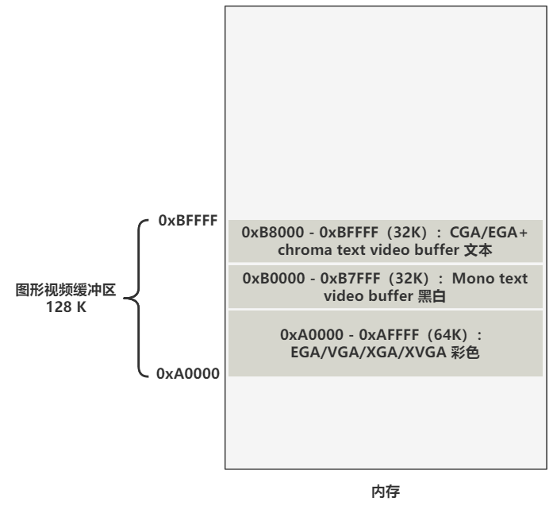

内存中有这样一部分区域，是和显存映射的。啥意思，就是你往上图的这些内存区域中写数据，相当于写在了显存中。而往显存中写数据，就相当于在屏幕上输出文本了。

没错，就是这么简单。

如果我们写这一行汇编语句。

```
mov [0xB8000],'h'
```

后面那个 h 相当于汇编编辑器帮我们转换成 ASCII 码的二进制数值，当然我们也可以直接写。

```
mov [0xB8000],0x68
```

其实就是往内存中 **0xB8000** 这个位置写了一个值，只要一写，屏幕上就会是这样。 


简单吧，具体说来，这片内存是每两个字节表示一个显示在屏幕上的字符，**第一个是字符的编码，第二个是字符的颜色**，那我们先不管颜色，如果多写几个字符就像这样。

```
mov [0xB8000],'h'
mov [0xB8002],'e'
mov [0xB8004],'l'
mov [0xB8006],'l'
mov [0xB8008],'o'
```

此时屏幕上就会是这样。


 是不是贼简单？那我们回过头看刚刚的代码，我们就假设显示模式是我们现在的这种文本模式，那条件分支就可以去掉好多。 

代码可以简化成这个样子。

```c
#define ORIG_X          (*(unsigned char *)0x90000)
#define ORIG_Y          (*(unsigned char *)0x90001)
void con_init(void) {
    register unsigned char a;
    // 第一部分 获取显示模式相关信息
    video_num_columns = (((*(unsigned short *)0x90006) & 0xff00) >> 8);
    video_size_row = video_num_columns * 2;
    video_num_lines = 25;
    video_page = (*(unsigned short *)0x90004);
    video_erase_char = 0x0720;
    // 第二部分 显存映射的内存区域 
    video_mem_start = 0xb8000;
    video_port_reg  = 0x3d4;
    video_port_val  = 0x3d5;
    video_mem_end = 0xba000;
    // 第三部分 滚动屏幕操作时的信息
    origin  = video_mem_start;
    scr_end = video_mem_start + video_num_lines * video_size_row;
    top = 0;
    bottom  = video_num_lines;
    // 第四部分 定位光标并开启键盘中断
    gotoxy(ORIG_X, ORIG_Y);
    set_trap_gate(0x21,&keyboard_interrupt);
    outb_p(inb_p(0x21)&0xfd,0x21);
    a=inb_p(0x61);
    outb_p(a|0x80,0x61);
    outb(a,0x61);
}
```

别看这么多，一点都不难。

首先还记不记得之前汇编语言的时候做的工作，存了好多以后要用的数据在内存中。就在 [第五回 | 进入保护模式前的最后一次折腾内存](http://mp.weixin.qq.com/s?__biz=Mzk0MjE3NDE0Ng==&mid=2247499558&idx=1&sn=d5d057fae2fb835d38f82804c2649463&chksm=c2c5858bf5b20c9de2db5c31dd34fbe766f6c46cda17f54f4518a75fc1838f2ada6fe5717aad&scene=21#wechat_redirect)

| 内存地址 | 长度(字节) | 名称         |
| -------- | ---------- | ------------ |
| 0x90000  | 2          | 光标位置     |
| 0x90002  | 2          | 扩展内存数   |
| 0x90004  | 2          | 显示页面     |
| 0x90006  | 1          | 显示模式     |
| 0x90007  | 1          | 字符列数     |
| 0x90008  | 2          | 未知         |
| 0x9000A  | 1          | 显示内存     |
| 0x9000B  | 1          | 显示状态     |
| 0x9000C  | 2          | 显卡特性参数 |
| 0x9000E  | 1          | 屏幕行数     |
| 0x9000F  | 1          | 屏幕列数     |
| 0x90080  | 16         | 硬盘1参数表  |
| 0x90090  | 16         | 硬盘2参数表  |
| 0x901FC  | 2          | 根设备号     |

所以，**第一部分**获取 0x90006 地址处的数据，就是获取显示模式等相关信息。

**第二部分**就是显存映射的内存地址范围，我们现在假设是 CGA 类型的文本模式，所以映射的内存是从 0xB8000 到 0xBA000。

**第三部分**是设置一些滚动屏幕时需要的参数，定义顶行和底行是哪里，这里顶行就是第一行，底行就是最后一行，很合理。

**第四部分**是把光标定位到之前保存的光标位置处（取内存地址 0x90000 处的数据），然后设置并开启键盘中断。

开启键盘中断后，键盘上敲击一个按键后就会触发中断，中断程序就会读键盘码转换成 ASCII 码，然后写到光标处的内存地址，也就相当于往显存写，于是这个键盘敲击的字符就显示在了屏幕上。

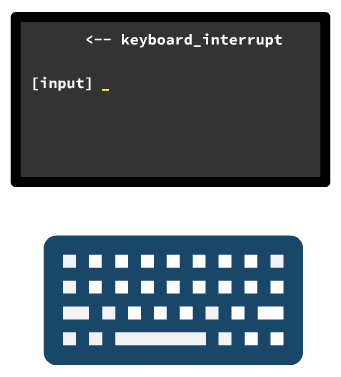

这一切具体是怎么做到的呢？我们先看看我们干了什么。

**1.** 我们现在根据已有信息已经可以实现往屏幕上的任意位置写字符了，而且还能指定颜色。

**2.** 并且，我们也能接受键盘中断，根据键盘码中断处理程序就可以得知哪个键按下了。

有了这俩功能，那我们想干嘛还不是为所欲为？

好，接下来我们看看代码是怎么处理的，很简单。一切的起点，就是第四步的 **gotoxy** 函数，定位当前光标。

```c
#define ORIG_X          (*(unsigned char *)0x90000)
#define ORIG_Y          (*(unsigned char *)0x90001)
void con_init(void) {
    ...
    // 第四部分 定位光标并开启键盘中断
    gotoxy(ORIG_X, ORIG_Y);
    ...
}
```

这里面干嘛了呢？

```c
static inline void gotoxy(unsigned int new_x,unsigned int new_y) {
   ...
   x = new_x;
   y = new_y;
   pos = origin + y*video_size_row + (x<<1);
}
```

就是给 **x y pos** 这三个参数附上了值。

其中 **x** 表示光标在哪一列，**y** 表示光标在哪一行，**pos** 表示根据列号和行号计算出来的内存指针，也就是往这个 pos 指向的地址处写数据，就相当于往控制台的 x 列 y 行处写入字符了，简单吧？

然后，当你按下键盘后，触发键盘中断，之后的程序调用链是这样的。

```c
_keyboard_interrupt:
    ...
    call _do_tty_interrupt
    ...
    
void do_tty_interrupt(int tty) {
   copy_to_cooked(tty_table+tty);
}

void copy_to_cooked(struct tty_struct * tty) {
    ...
    tty->write(tty);
    ...
}

// 控制台时 tty 的 write 为 con_write 函数
void con_write(struct tty_struct * tty) {
    ...
    __asm__("movb _attr,%%ah\n\t"
      "movw %%ax,%1\n\t"
      ::"a" (c),"m" (*(short *)pos)
      :"ax");
     pos += 2;
     x++;
    ...
}
```

前面的过程不用管，我们看最后一个函数 con_write 中的关键代码。

__asm__ 内联汇编，就是把键盘输入的字符 **c** 写入 **pos** 指针指向的内存，相当于往屏幕输出了。

之后两行 pos+=2 和 x++，就是调整所谓的**光标**。

你看，写入一个字符，最底层，**其实就是往内存的某处写个数据，然后顺便调整一下光标**。

由此我们也可以看出，光标的本质，其实就是这里的 x y pos 这仨变量而已。

我们还可以做**换行效果**，当发现光标位置处于某一行的结尾时（这个应该很好算吧，我们都知道屏幕上一共有几行几列了），就把光标计算出一个新值，让其处于下一行的开头。 


就一个小计算公式即可搞定，仍然在 con_write 源码处有体现，就是判断列号 x 是否大于了总列数。

```c
void con_write(struct tty_struct * tty) {
    ...
    if (x>=video_num_columns) {
        x -= video_num_columns;
        pos -= video_size_row;
        lf();
  }
  ...
}

static void lf(void) {
   if (y+1<bottom) {
      y++;
      pos += video_size_row;
      return;
   }
 ...
}
```

相似的，我们还可以实现**滚屏**的效果，无非就是当检测到光标已经出现在最后一行最后一列了，那就把每一行的字符，都复制到它上一行，其实就是算好哪些内存地址上的值，拷贝到哪些内存地址，就好了。

这里大家自己看源码寻找。

所以，有了这个初始化工作，我们就可以利用这些信息，弄几个小算法，实现各种我们常见控制台的操作。

或者换句话说，我们见惯不怪的控制台，**回车**、**换行**、**删除**、**滚屏**、**清屏**等操作，其实底层都要实现相应的代码的。

所以 console.c 中的其他方法就是做这个事的，我们就不展开每一个功能的方法体了，简单看看有哪些方法。

```c
// 定位光标的
static inline void gotoxy(unsigned int new_x, unsigned int new_y){}
// 滚屏，即内容向上滚动一行
static void scrup(void){}
// 光标同列位置下移一行
static void lf(int currcons){}
// 光标回到第一列
static void cr(void){}
...
// 删除一行
static void delete_line(void){}
```

内容繁多，但没什么难度，只要理解了基本原理即可了。

OK，整个 **console.c** 就讲完了，要知道这个文件可是整个内核中代码量最大的文件，可是功能特别单一，也都很简单，主要是处理键盘各种不同的按键，需要写好多 switch case 等语句，十分麻烦，我们这里就完全没必要去展开了，就是个苦力活。

到这里，我们就正式讲完了 **tty_init** 的作用。

在此之后，内核代码就可以用它来方便地在控制台输出字符啦！这在之后内核想要在启动过程中告诉用户一些信息，以及后面内核完全建立起来之后，由用户用 shell 进行操作时手动输入命令，都是可以用到这里的代码的！

让我们继续向前进发，看下一个被初始化的倒霉鬼是什么东东。 

欲知后事如何，且听下回分解。

## 第17回 | 原来操作系统获取时间的方式也这么 low

书接上回，上回书咱们说到，通过初始化控制台的 tty_init 操作，内核代码可以很方便地在控制台输出字符啦！

作为用户也可以通过敲击键盘，或调用诸如 printf 这样的库函数，在屏幕上输出信息，同时支持换行和滚屏等友好设计，这些都是 tty_init 初始化，以及其对外封装的小功能函数，来实现的。

 


我们继续往下看下一个初始化的倒霉鬼，**time_init**。

```c
void main(void) {
    ...
    mem_init(main_memory_start,memory_end);
    trap_init();
    blk_dev_init();
    chr_dev_init();
    tty_init();
    time_init();
    sched_init();
    buffer_init(buffer_memory_end);
    hd_init();
    floppy_init();
    
    sti();
    move_to_user_mode();
    if (!fork()) {init();}
    for(;;) pause();
}
```

曾经我很好奇，**操作系统是怎么获取到当前时间的呢**？

当然，现在都联网了，可以从网络上实时同步。那当没有网络时，为什么操作系统在启动之后，可以显示出当前时间呢？难道操作系统在电脑关机后，依然不停地在某处运行着，勤勤恳恳数着秒表么？

当然不是，那我们今天就打开这个 **time_init** 函数一探究竟。

打开这个函数后我又是很开心，因为很短，且没有更深入的方法调用。

```c
#define CMOS_READ(addr) ({ \
    outb_p(0x80|addr,0x70); \
    inb_p(0x71); \
})

#define BCD_TO_BIN(val) ((val)=((val)&15) + ((val)>>4)*10)

static void time_init(void) {
    struct tm time;
    do {
        time.tm_sec = CMOS_READ(0);
        time.tm_min = CMOS_READ(2);
        time.tm_hour = CMOS_READ(4);
        time.tm_mday = CMOS_READ(7);
        time.tm_mon = CMOS_READ(8);
        time.tm_year = CMOS_READ(9);
    } while (time.tm_sec != CMOS_READ(0));
    BCD_TO_BIN(time.tm_sec);
    BCD_TO_BIN(time.tm_min);
    BCD_TO_BIN(time.tm_hour);
    BCD_TO_BIN(time.tm_mday);
    BCD_TO_BIN(time.tm_mon);
    BCD_TO_BIN(time.tm_year);
    time.tm_mon--;
    startup_time = kernel_mktime(&time);
}
```

梦想的代码呀！

那主要就是对 **CMOS_READ** 和 **BCD_TO_BIN** 都是啥意思展开讲一下就明白了了。

首先是 **CMOS_READ**

```c
#define CMOS_READ(addr) ({ \
    outb_p(0x80|addr,0x70); \
    inb_p(0x71); \
})
```

就是对一个端口先 **out** 写一下，再 **in** 读一下。

这是 CPU 与外设交互的一个基本玩法，CPU 与外设打交道基本是通过端口，往某些端口写值来表示要这个外设干嘛，然后从另一些端口读值来接受外设的反馈。

至于这个外设内部是怎么实现的，对使用它的操作系统而言，是个黑盒，无需关心。那对于我们程序员来说，就更不用关心了。

对 CMOS 这个外设的交互讲起来可能没感觉，我们看看与硬盘的交互。

最常见的就是读硬盘了，我们看硬盘的端口表。

| 端口  | 读                               | 写                               |
| ----- | -------------------------------- | -------------------------------- |
| 0x1F0 | 数据寄存器                       | 数据寄存器                       |
| 0x1F1 | 错误寄存器                       | 特征寄存器                       |
| 0x1F2 | 扇区计数寄存器                   | 扇区计数寄存器                   |
| 0x1F3 | 扇区号寄存器或 LBA 块地址 0~7    | 扇区号或 LBA 块地址 0~7          |
| 0x1F4 | 磁道数低 8 位或 LBA 块地址 8~15  | 磁道数低 8 位或 LBA 块地址 8~15  |
| 0x1F5 | 磁道数高 8 位或 LBA 块地址 16~23 | 磁道数高 8 位或 LBA 块地址 16~23 |
| 0x1F6 | 驱动器/磁头或 LBA 块地址 24~27   | 驱动器/磁头或 LBA 块地址 24~27   |
| 0x1F7 | 命令寄存器或状态寄存器           | 命令寄存器                       |

那读硬盘就是，往除了第一个以外的后面几个端口写数据，告诉要读硬盘的哪个扇区，读多少。然后再从 0x1F0 端口一个字节一个字节的读数据。这就完成了一次硬盘读操作。

如果觉得不够具体，那来个具体的版本。

1. 在 0x1F2 写入要读取的扇区数
2. 在 0x1F3 ~ 0x1F6 这四个端口写入计算好的起始 LBA 地址
3. 在 0x1F7 处写入读命令的指令号
4. 不断检测 0x1F7 （此时已成为状态寄存器的含义）的忙位
5. 如果第四步骤为不忙，则开始不断从 0x1F0 处读取数据到内存指定位置，直到读完

看，是不是对 CPU 最底层是如何与外设打交道有点感觉了？是不是也不难？就是按照人家的操作手册，然后无脑按照要求读写端口就行了。

当然，读取硬盘的这个无脑循环，可以 **CPU** 直接读取并做写入内存的操作，这样就会占用 CPU 的计算资源。

也可以交给 **DMA** 设备去读，解放 CPU，但和硬盘的交互，通通都是按照硬件手册上的端口说明，来操作的，实际上也是做了一层封装。

好了，我们已经学会了和一个外设打交道的基本玩法了。

那我们代码中要打交道的是哪个外设呢？就是 **CMOS**。

它是主板上的一个可读写的 RAM 芯片，你在开机时长按某个键就可以进入设置它的页面。

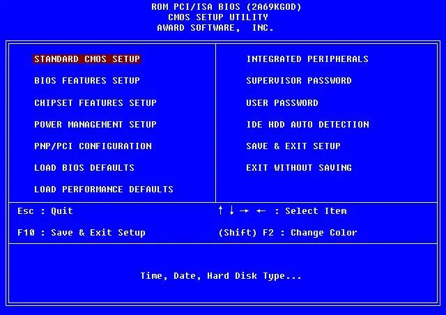

那我们的代码，其实就是与它打交道，获取它的一些数据而已。

我们回过头看代码。

```c
static void time_init(void) {
    struct tm time;
    do {
        time.tm_sec = CMOS_READ(0);
        time.tm_min = CMOS_READ(2);
        time.tm_hour = CMOS_READ(4);
        time.tm_mday = CMOS_READ(7);
        time.tm_mon = CMOS_READ(8);
        time.tm_year = CMOS_READ(9);
    } while (time.tm_sec != CMOS_READ(0));
    BCD_TO_BIN(time.tm_sec);
    BCD_TO_BIN(time.tm_min);
    BCD_TO_BIN(time.tm_hour);
    BCD_TO_BIN(time.tm_mday);
    BCD_TO_BIN(time.tm_mon);
    BCD_TO_BIN(time.tm_year);
    time.tm_mon--;
    startup_time = kernel_mktime(&time);
}
```

前面几个赋值语句 **CMOS_READ** 就是通过读写 CMOS 上的指定端口，依次获取**年月日时分秒**等信息。具体咋操作代码上也写了，也是按照 CMOS 手册要求的读写指定端口就行了，我们就不展开了。 

所以你看，其实操作系统程序，也是要依靠与一个外部设备打交道，来获取这些信息的，并不是它自己有什么魔力。操作系统最大的魅力，就在于它借力完成了一项伟大的事，借 CPU 的力，借硬盘的力，借内存的力，以及现在借 CMOS 的力。

至于 CMOS 又是如何知道时间的，这个就不在我们讨论范围了。 

接下来 **BCD_TO_BIN** 就是 BCD 转换成 BIN，因为从 CMOS 上获取的这些年月日都是 BCD 码值，需要转换成存储在我们变量上的二进制数值，所以需要一个小算法来转换一下，没什么意思。

最后一步 **kernel_mktime** 也很简单，就是根据刚刚的那些时分秒数据，计算从 **1970 年 1 月 1 日 0 时**起到开机当时经过的秒数，作为开机时间，存储在 **startup_time** 这个变量里。

想研究可以仔细看看这段代码，不过我觉得这种细节不必看。

```c
startup_time = kernel_mktime(&time);

// kernel/mktime.c
long kernel_mktime(struct tm * tm)
{
    long res;
    int year;
    year = tm->tm_year - 70;
    res = YEAR*year + DAY*((year+1)/4);
    res += month[tm->tm_mon];
    if (tm->tm_mon>1 && ((year+2)%4))
        res -= DAY;
    res += DAY*(tm->tm_mday-1);
    res += HOUR*tm->tm_hour;
    res += MINUTE*tm->tm_min;
    res += tm->tm_sec;
    return res;
}
```

就这。

所以今天其实就是，计算出了一个 **startup_time** 变量而已，至于这个变量今后会被谁用，怎么用，那就是后话了。

相信你逐渐也体会到了，此时操作系统好多地方都是用外设要求的方式去询问，比如硬盘信息、显示模式，以及今天的开机时间的获取等。

所以至少到目前来说，你还不应该感觉操作系统有多么的“高端”，很多时候都是繁琐地，读人家的硬件手册，获取到想要的的信息，拿来给自己用，或者对其进行各种设置。

但你一定要耐得住寂寞，真正体现操作系统的强大设计之处，还得接着往下读。

欲知后事如何，且听下回分解。

## 第18回 | 大名鼎鼎的进程调度就是从这里开始的

书接上回，上回书咱们说到，**time_init** 方法通过与 CMOS 端口进行读写交互，获取到了年月日时分秒等数据，并通过这些计算出了开机时间 **startup_time** 变量，是从 1970 年 1 月 1 日 0 时起到开机当时经过的秒数。

我们继续往下看，大名鼎鼎的进程调度初始化，**shed_init**。

```c
void main(void) {
    ...
    mem_init(main_memory_start,memory_end);
    trap_init();
    blk_dev_init();
    chr_dev_init();
    tty_init();
    time_init();
    sched_init();
    buffer_init(buffer_memory_end);
    hd_init();
    floppy_init();
    
    sti();
    move_to_user_mode();
    if (!fork()) {init();}
    for(;;) pause();
}
```

这方法可了不起，因为它就是多进程的基石！

终于来到了兴奋的时刻，是不是很激动？不过先别激动，这里只是进程调度的初始化，也就是为进程调度所需要用到的数据结构做个准备，真正的进程调度还需要调度算法、时钟中断等机制的配合。

当然，对于理解操作系统，流程和数据结构最为重要了，而这一段作为整个流程的起点，以及建立数据结构的地方，就显得格外重要了。

我们进入这个方法，一点点往后看。

```c
void sched_init(void) {
    set_tss_desc(gdt+4, &(init_task.task.tss));
    set_ldt_desc(gdt+5, &(init_task.task.ldt));
    ...
}
```

两行代码初始化了下 **TSS** 和 **LDT**。

先别急问这俩结构是啥。还记得之前讲的全局描述符表 gdt 么？它在内存的这个位置，并且被设置成了这个样子。

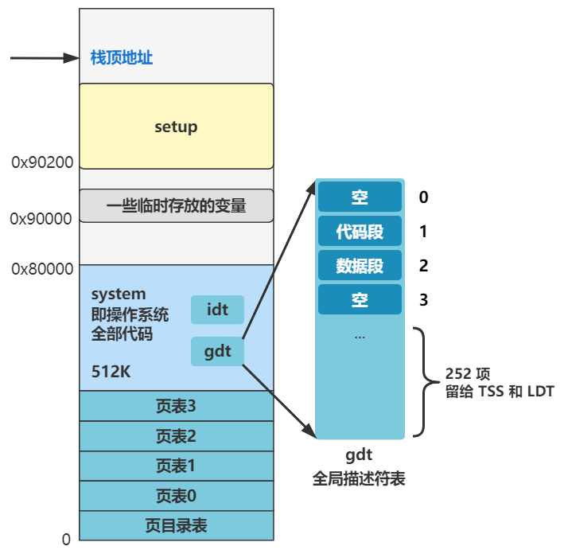

忘了的看一下[第八回 | 烦死了又要重新设置一遍 idt 和 gdt](http://mp.weixin.qq.com/s?__biz=Mzk0MjE3NDE0Ng==&mid=2247499734&idx=1&sn=89045b51e41d2e74754f5475d25d7b54&chksm=c2c5857bf5b20c6d1698df2abd0e1eea601e83612ee6af58dc8eb79f93c751f73d7c62e565ce&scene=21#wechat_redirect)，这就说明之前看似没用的细节有多重要了，大家一定要有耐心。

说回这两行代码，其实就是往后又加了两项，分别是 TSS 和 LDT。 

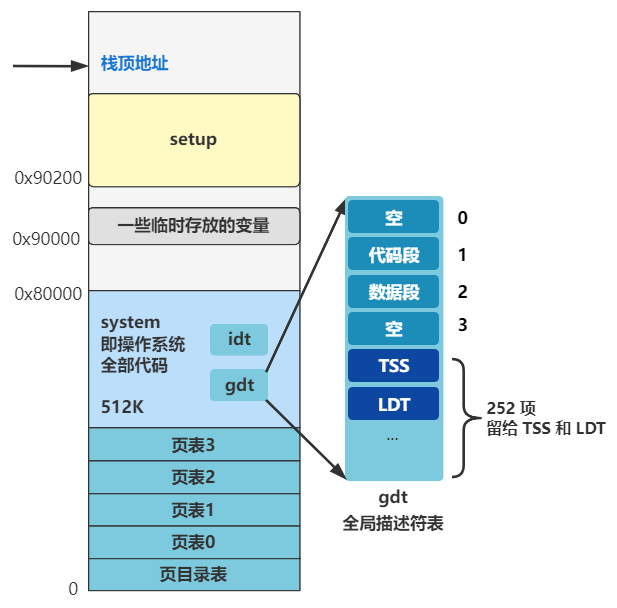

好，那再说说这俩结构是干嘛的，不过本篇先简单理解，后面会详细讲到。

TSS 叫**任务状态段**，就是**保存和恢复进程的上下文的**，所谓上下文，其实就是各个寄存器的信息而已，这样进程切换的时候，才能做到保存和恢复上下文，继续执行。

由它的数据结构你应该可以看出点意思。

```c
struct tss_struct{
    long back_link;
    long esp0;
    long ss0;
    long esp1;
    long ss1;
    long esp2;
    long ss2;
    long cr3;
    long eip;
    long eflags;
    long eax, ecx, edx, ebx;
    long esp;
    long ebp;
    long esi;
    long edi;
    long es;
    long cs;
    long ss;
    long ds;
    long fs;
    long gs;
    long ldt;
    long trace_bitmap;
    struct i387_struct i387;
};
```

而 LDT 叫**局部描述符表**，是与 GDT 全局描述符表相对应的，内核态的代码用 GDT 里的数据段和代码段，而用户进程的代码用每个用户进程自己的 LDT 里得数据段和代码段。

先不管它，我这里放一张超纲的图，你先找找感觉。

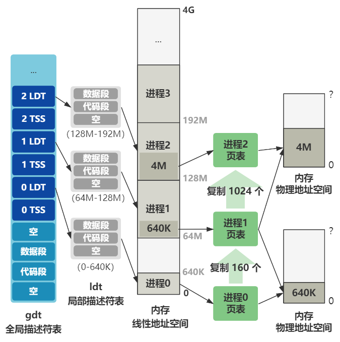

我们接着往下看。

```c
struct desc_struct {
    unsigned long a,b;
}

struct task_struct * task[64] = {&(init_task.task), };

void sched_init(void) {
    ...
    int i;
    struct desc_struct * p;
        p = gdt+6;
    for(i=1;i<64;i++) {
        task[i] = NULL;
        p->a=p->b=0;
        p++;
        p->a=p->b=0;
        p++;
    }
    ...
}
```

这段代码有个循环，干了两件事。

一个是给一个长度为 64，结构为 **task_struct** 的数组 task 附上初始值。

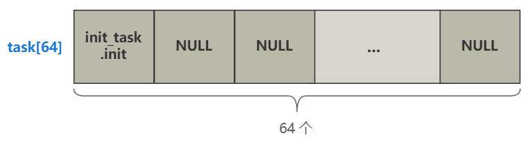

这个 task_struct 结构就是代表**每一个进程的信息**，这可是个相当相当重要的结构了，把它放在心里。

```c
struct task_struct {
/* these are hardcoded - don't touch */
    long state; /* -1 unrunnable, 0 runnable, >0 stopped */
    long counter;
    long priority;
    long signal;
    struct sigaction sigaction[32];
    long blocked; /* bitmap of masked signals */
  /* various fields */
    int exit_code;
    unsigned long start_code,end_code,end_data,brk,start_stack;
    long pid,father,pgrp,session,leader;
    unsigned short uid,euid,suid;
    unsigned short gid,egid,sgid;
    long alarm;
    long utime,stime,cutime,cstime,start_time;
    unsigned short used_math;
  /* file system info */
    int tty;  /* -1 if no tty, so it must be signed */
    unsigned short umask;
    struct m_inode * pwd;
    struct m_inode * root;
    struct m_inode * executable;
    unsigned long close_on_exec;
    struct file * filp[NR_OPEN];
  /* ldt for this task 0 - zero 1 - cs 2 - ds&ss */
    struct desc_struct ldt[3];
  /* tss for this task */
    struct tss_struct tss;
};
```

这个循环做的另一件事，是给 gdt 剩下的位置填充上 0，也就是把剩下留给 TSS 和 LDT 的描述符都先附上空值。

 

 

往后展望一下的话，就是以后每创建一个新进程，就会在后面添加一组 TSS 和 LDT 表示这个进程的任务状态段以及局部描述符表信息。

还记得刚刚的超纲图吧，未来整个内存的规划就是这样的，不过你先不用理解得很细。


那为什么一开始就先有了一组 TSS 和 LDT 呢？现在也没创建进程呀。错了，现在虽然我们还没有建立起进程调度的机制，但我们正在运行的代码就是会作为**未来的一个进程的指令流**。

也就是当未来进程调度机制一建立起来，正在执行的代码就会化身成为**进程 0** 的代码。所以我们需要提前把这些未来会作为进程 0 的信息写好。

如果你觉得很疑惑，别急，等后面整个进程调度机制建立起来，并且让你亲眼看到进程 0 以及进程 1 的创建，以及它们后面因为进程调度机制而切换，你就明白这一切的意义了。

好，收回来，初始化了一组 TSS 和 LDT 后，再往下看两行。

```c
#define ltr(n) __asm__("ltr %%ax"::"a" (_TSS(n)))
#define lldt(n) __asm__("lldt %%ax"::"a" (_LDT(n)))

void sched_init(void) {
    ...
    ltr(0);
    lldt(0);
    ...
}
```

这又涉及到之前的知识咯。

还记得 **lidt** 和 **lgdt** 指令么？一个是给 idtr 寄存器赋值，以告诉 CPU 中断描述符表 idt 在内存的位置；一个是给 gdtr 寄存器赋值，以告诉 CPU 全局描述符表 gdt 在内存的位置。 

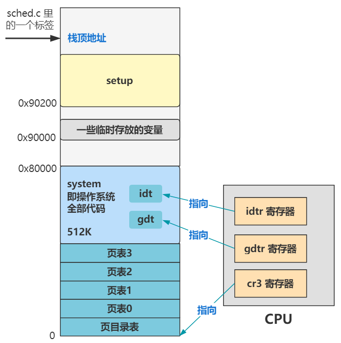

那这两行和刚刚的类似，**ltr** 是给 **tr** 寄存器赋值，以告诉 CPU 任务状态段 TSS 在内存的位置；**lldt** 一个是给 **ldt** 寄存器赋值，以告诉 CPU 局部描述符 LDT 在内存的位置。 

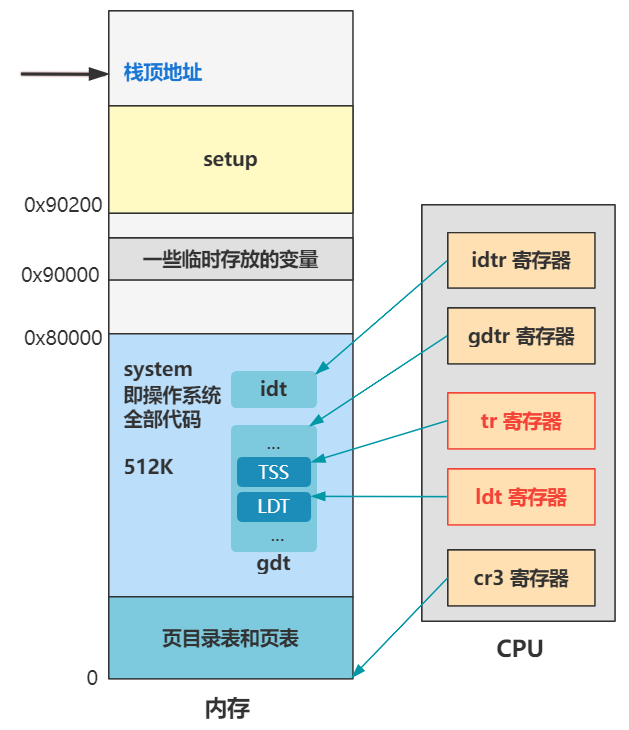

这样，CPU 之后就能通过 tr 寄存器找到当前进程的任务状态段信息，也就是上下文信息，以及通过 ldt 寄存器找到当前进程在用的局部描述符表信息。 

我们继续看。

```c
void sched_init(void) {
    ...
    outb_p(0x36,0x43);      /* binary, mode 3, LSB/MSB, ch 0 */
    outb_p(LATCH & 0xff , 0x40);    /* LSB */
    outb(LATCH >> 8 , 0x40);    /* MSB */
    set_intr_gate(0x20,&timer_interrupt);
    outb(inb_p(0x21)&~0x01,0x21);
    set_system_gate(0x80,&system_call);
    ...
}
```

四行端口读写代码，两行设置中断代码。

端口读写我们已经很熟悉了，就是 CPU 与外设交互的一种方式，之前讲硬盘读写以及 CMOS 读写时，已经接触过了。

而这次交互的外设是一个**可编程定时器**的芯片，这四行代码就开启了这个定时器，之后这个定时器变会**持续的、以一定频率的向 CPU 发出中断信号**。


而这段代码中设置的两个中断，第一个就是**时钟中断**，中断号为 **0x20**，中断处理程序为 **timer_interrupt**。那么每次定时器向 CPU 发出中断后，便会执行这个函数。

这个定时器的触发，以及时钟中断函数的设置，是操作系统主导进程调度的一个关键！没有他们这样的外部信号不断触发中断，操作系统就没有办法作为进程管理的主人，通过强制的手段收回进程的 CPU 执行权限。

 第二个设置的中断叫系统调用 **system_call**，中断号是 **0x80**，这个中断又是个非常非常非常非常非常非常非常重要的中断，所有用户态程序想要调用内核提供的方法，都需要基于这个系统调用来进行。

比如 Java 程序员写一个 read，底层会执行汇编指令 **int 0x80**，这就会触发系统调用这个中断，最终调用到 Linux 里的 sys_read 方法。

这个过程之后会重点讲述，现在只需要知道，在这个地方，偷偷把这个极为重要的中断，设置好了。

所以你看这一章的内容，偷偷设置了影响进程和影响用户程序调用系统方法的两个重量级中断处理函数，不简单呀~

到目前为止，中断已经设置了不少了，我们现在看看所设置好的中断有哪些。

| 中断号   | 中断处理函数           |
| -------- | ---------------------- |
| 0 ~ 0x10 | trap_init 里设置的一堆 |
| 0x20     | timer_interrupt        |
| 0x21     | keyboard_interrupt     |
| 0x80     | system_call            |

其中 **0-0x10** 这 17 个中断是 trap_init 里初始化设置的，是一些基本的中断，比如除零异常等。这个在 [第14回 中断初始化 trap_init](https://mp.weixin.qq.com/s?__biz=Mzk0MjE3NDE0Ng==&mid=2247500119&idx=1&sn=f46331f70677aba168243040a96be1c0&scene=21#wechat_redirect) 有讲到。

之后，在控制台初始化 con_init 里，我们又设置了 **0x21** 键盘中断，这样按下键盘就有反应了。这个在 [第16回 控制台初始化 tty_init](http://mp.weixin.qq.com/s?__biz=Mzk0MjE3NDE0Ng==&mid=2247500190&idx=1&sn=b0bebe846b55f7e29fc009e1b6587214&chksm=c2c5bb33f5b23225845ab699d1b8fcee39a04ca98a48ebf0e2c22584b638fa0b0839d1212485&scene=21#wechat_redirect) 有讲到。

现在，我们又设置了 **0x20** 时钟中断，并且开启定时器。最后又偷偷设置了一个极为重要的 **0x80** 系统调用中断。

找到些感觉没，有没有越来越发现，操作系统有点靠中断驱动的意思，各个模块不断初始化各种中断处理函数，并且开启指定的外设开关，让操作系统自己慢慢“活”了起来，逐渐通过中断忙碌于各种事情中，无法自拔。

恭喜你，我们已经逐渐在接近操作系统的本质了。

回顾一下我们今天干了什么，就三件事。

**第一**，我们往全局描述符表写了两个结构，TSS 和 LDT，作为未来进程 0 的任务状态段和局部描述符表信息。


**第二**，我们初始化了一个结构为 task_struct  的数组，未来这里会存放所有进程的信息，并且我们给数组的第一个位置附上了 init_task.init 这个具体值，也是作为未来进程 0 的信息。


**第三**，设置了时钟中断 0x20 和系统调用 0x80，一个作为进程调度的起点，一个作为用户程序调用操作系统功能的桥梁，非常之重要。

后面，我们将会逐渐看到，这些重要的事情，是如何紧密且精妙地结合在一起，发挥出奇妙的作用。

## 我居然会认为权威书籍写错了...

在 Linux 0.11 的设计中，进程 0 创建进程 1 时，复制了 **160** 个页表项。进程 1 创建进程 2 时，复制了 **1024** 个页表项。之后进程 2 创建进程 3，进程 3 创建进程 4，通通都是复制 1024 个页表项。


《Linux 内核设计的艺术》一书中就是这样描述的。

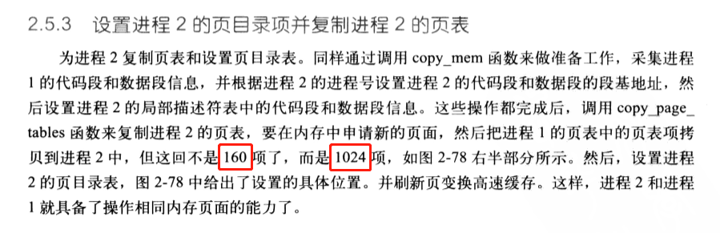

《Linux 内核完全注释》一书中也是这么描述的。

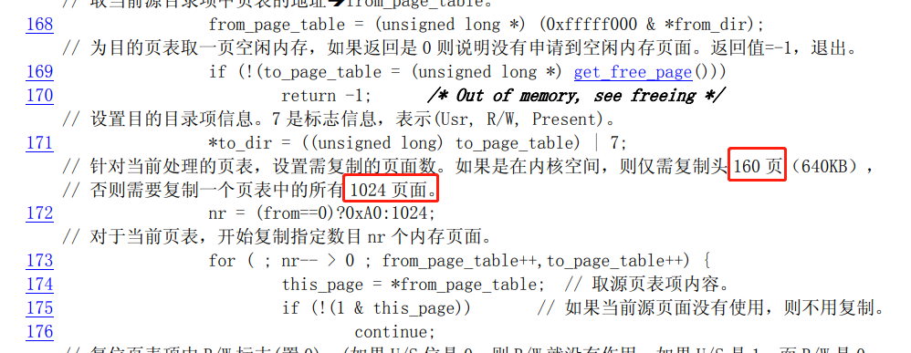

看源代码，也能很直观地看到这两个数字。

```
int copy_page_tables(unsigned long from,unsigned long to,long size) {
        ...
        nr = (from==0)?0xA0:1024;      
        for ( ; nr-- > 0 ; from_page_table++,to_page_table++) {
                ...
        }
        ...
}
```

0xA0 用十进制表示就是 160。

没什么好怀疑的，但我今天用 bochs 想调试一下证明这个事情，结果却和我预期的有点不符。

断点打在刚刚开启分页机制的时候，看一下页目录表信息，有四个页目录项，符合预期。

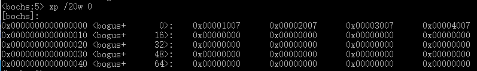

继续将断点打在进程 0 创建出进程 1 之后，看一下页目录表，发现多出一项。

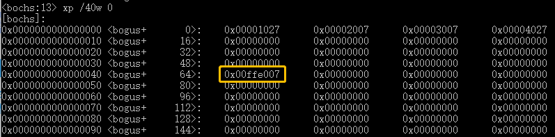

符合预期，因为进程 0 创建的进程 1，需要复制进程 0 的页表，而进程 1 的线性地址空间是 64M，所以自然在第 17 个页目录项的位置新增了一个。（一个页目录项可以管理 4M 内存空间）

再看看开篇的图，看不懂也不要紧。注意进程 1 在线性地址空间中的起始位置。


页目录项里的数据就表示**页表地址**，刚刚新增的页目录项的值是 **0x00ffe007**，那我们去这里看看是不是复制了 160 个页表项。

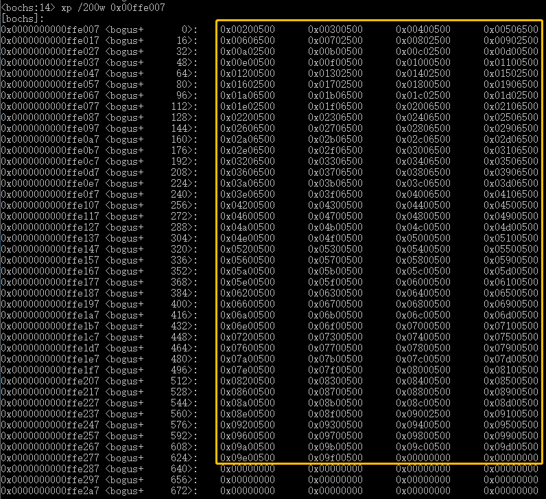

有问题了，这个黄色的框里面一共是 160 项，但最后两个是 0，也就是一共才复制了 **158** 项。

这咋回事，难道书上都说错了？

就为这个事，我又重新启动，调试了好几次，debug 断点也改了好多地方，因为我怀疑是不是复制页表的代码还没有执行完，刚好少了两个。

但无论咋试，全都是精准的 158 项，不多不少。

我又改了下源码，把原来的 160 项改成了 4 项，看看会有啥结果。

```
int copy_page_tables(unsigned long from,unsigned long to,long size) {
        ...
        nr = (from==0)? 4: 1024;      
        for ( ; nr-- > 0 ; from_page_table++,to_page_table++) {
                ...
        }
        ...
}
```

结果再次调试发现，一共只复制了 2 项页表！还是少了俩！

我又怀疑是不是因为触发了写时复制，页表项被改到了别的位置？但我怎么看源码，都没看到复制页表的那段代码之后，有什么操作可以导致写时复制。

于是乎，我这时竟然产生了，所有 Linux 0.11 的书上这块都写错了的自信！还发到了我的操作系统催更群里求证。

但就过了几秒钟，我一拍脑门，想起了问题所在。

就是个非常二逼且简单的问题，**页目录项中记录的，不仅仅是页表地址**... 它的结构是这样的。

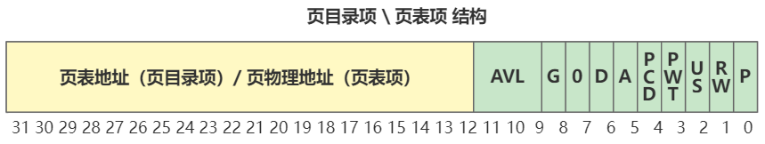

所以刚刚的页表项 0x00ffe007 换成二进制是 

**00000000111111111110000000000111**

对照结构分析出，页表地址为 **0x00ffe000**，存在位 P 为 1，读写位 RW 为 1，用户态内核态位 US 为 1。

所以，看页表地址，不应该是 0x00ffe007，而应该是 0x00ffe000。

就这么简单个事，我画页表结构都画了无数遍了，居然实际调试的时候还是直接把页目录项的值当成页表地址...

别说了，再次验证下吧。

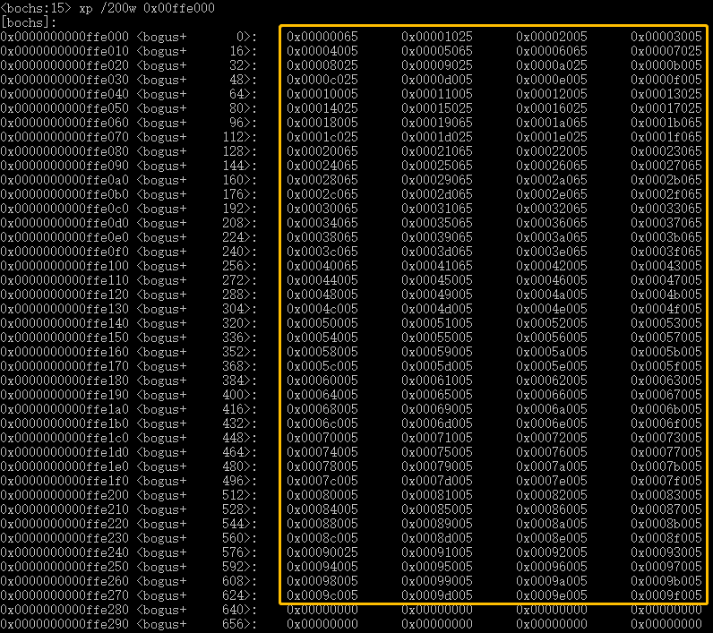

看，这回妥妥的 160 项了，终于可以睡个好觉了！

而且注意到，这里的页表都是**只读**状态，比如第一个页表项 0x00000065 换成二进制是

00000000000000000000000001100101

对照上面的页表结构发现，**RW 位是 0**，不再是原来的 1 了，说明从可读写，变成了只读状态。这就为之后的**写时复制**做了准备。

源码中很简单，就是强行把新复制的页表的 RW 位置 0，毫无神秘感。

```
int copy_page_tables(unsigned long from,unsigned long to,long size) {
        ...    
        for ( ; nr-- > 0 ; from_page_table++,to_page_table++) {
                ...
                this_page &= ~2;
                ...
        }
        ...
}
```

这里不展开了。

本篇文章就是想说，即便是再觉得自己已经熟悉的事情，也会有脑残的时候。但这也恰恰证明了自己还不够熟悉，仅仅是记住了页表和页目录表的结构，还没有在实践中真正“玩”过它们。

另外大家遇到难啃的骨头，奇怪的问题时，也不要害怕，**在源码面前一切秘密都不存**在。不存在魔幻的事情，要么是你的操作有问题，要么是源码有问题，大胆去证明，去折腾，就好了。

## 第19回 | 操作系统就是用这两个面试常考的结构管理的缓冲区

书接上回，上回书我们说到了进程调度的初始化，定义了一个长度为 64 的 task 数组用于管理全部进程的结构。


之后在 GDT 中预定义了进程调度需要用到的 TSS 和 LDT 结构。 

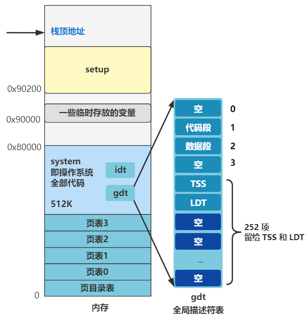

之后开启了定时器，准备迎接时钟中断的到来，进而触发进程调度。


那接下来我们就冷静下，回到 main 函数，继续看下一个初始化的过程。

那就是缓冲区初始化 buffer_init，加油，没剩多少了！

```c
void main(void) {
    ...
    mem_init(main_memory_start,memory_end);
    trap_init();
    blk_dev_init();
    chr_dev_init();
    tty_init();
    time_init();
    sched_init();
    buffer_init(buffer_memory_end);
    hd_init();
    floppy_init();
    sti();
    move_to_user_mode();
    if (!fork()) {
        init();
    }
    for(;;) pause();
}
```

首先要注意到，这个函数传了个参数 buffer_memory_end，这个是在老早之前就设置好的，就在[第12回 | 管理内存前先划分出三个边界值](https://mp.weixin.qq.com/s?__biz=Mzk0MjE3NDE0Ng==&mid=2247500061&idx=1&sn=6cb3382d7ac35ebeac52bbba3a89db4e&scene=21#wechat_redirect)，回顾下。

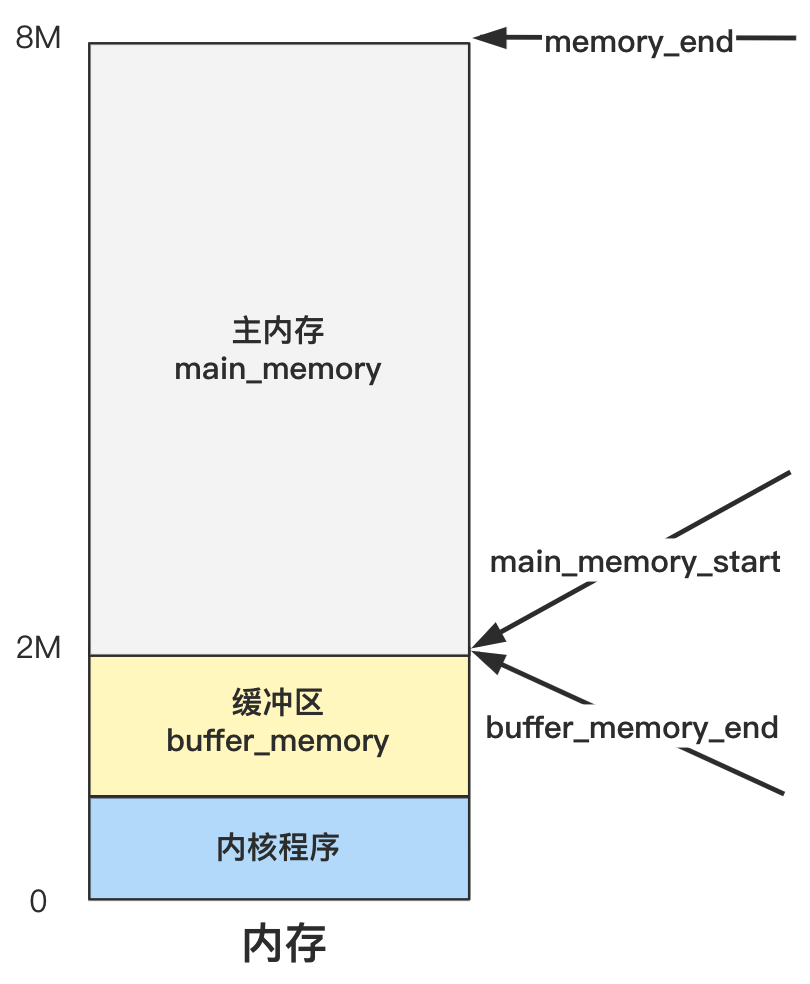

想起来了吧？而且我们在 [第13回 | 主内存初始化 mem_init](https://mp.weixin.qq.com/s?__biz=Mzk0MjE3NDE0Ng==&mid=2247500089&idx=1&sn=9a3fd6e585b0fd1ec528599ead6677c6&scene=21#wechat_redirect) 中，用 mem_init 设置好了主内存的管理结构 mam_map。

 

再想不起来那就需要把前面的章节再读一读咯，不然后面越来越难。

前面是把主内存区管理起来了，所以今天就是把剩下的缓冲区部分，也初始化管理起来。目的就是这么单纯，我们看代码。

我们还是采用之前的方式，就假设内存只有 8M，把一些不相干的分支去掉，方便理解。

```c
extern int end;
struct buffer_head * start_buffer = (struct buffer_head *) &end;

void buffer_init(long buffer_end) {
    struct buffer_head * h = start_buffer;
    void * b = (void *) buffer_end;
    while ( (b -= 1024) >= ((void *) (h+1)) ) {
        h->b_dev = 0;
        h->b_dirt = 0;
        h->b_count = 0;
        h->b_lock = 0;
        h->b_uptodate = 0;
        h->b_wait = NULL;
        h->b_next = NULL;
        h->b_prev = NULL;
        h->b_data = (char *) b;
        h->b_prev_free = h-1;
        h->b_next_free = h+1;
        h++;
    }
    h--;
    free_list = start_buffer;
    free_list->b_prev_free = h;
    h->b_next_free = free_list;
    for (int i=0;i<307;i++)
        hash_table[i]=NULL;
}
```

虽然很长，但其实就造了**两个数据结构**而已。

不过别急，我们先看这一行代码。

```c
extern int end;
void buffer_init(long buffer_end) {
    struct buffer_head * start_buffer = (struct buffer_head *) &end;
    ...
}
```

这里有个外部变量 **end**，而我们的缓冲区开始位置 **start_buffer** 就等于这个变量的内存地址。

这个外部变量 end 并不是操作系统代码写就的，而是由**链接器 ld** 在链接整个程序时设置的一个外部变量，帮我们计算好了整个内核代码的末尾地址。

那在这之前的是内核代码区域肯定不能用，在这之后的，就给 buffer 用了。所以我们的内存分布图可以更精确一点了。 

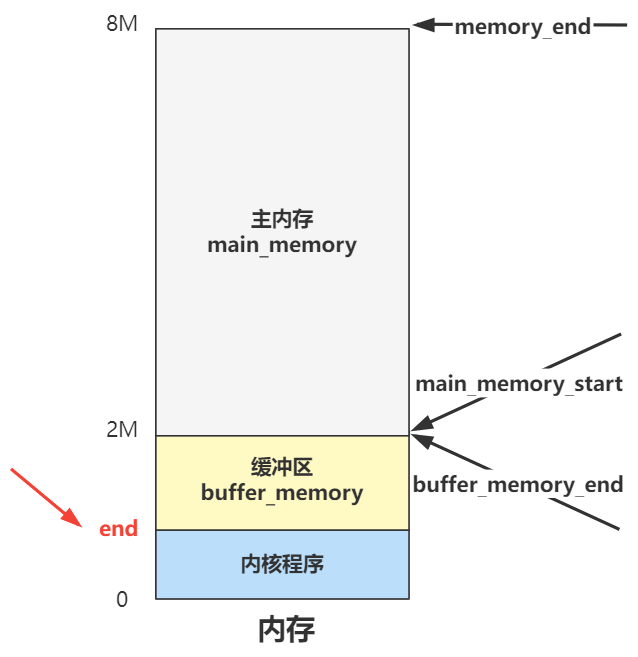

你看，之前的疑惑解决了吧？很好理解嘛，内核程序和缓冲区的划分，肯定有个分界线，这个分界线就是 end 变量的值。

这个值定多少合适呢？

像主内存和缓冲区的分界线，就直接代码里写死了，就是上图中的 2M。

可是内核程序占多大内存在写的时候完全不知道，就算知道了如果改动一点代码也会变化，所以就由程序编译链接时由链接器程序帮我们把这个内核代码末端的地址计算出来，作为一个外部变量 end 我们拿来即用，就方便多了。

好，回过头我们再看看，**整段代码创造了哪两个管理结构**？

我们先看这段结构。

```c
void buffer_init(long buffer_end) {
    struct buffer_head * h = start_buffer;
    void * b = (void *) buffer_end;
    while ( (b -= 1024) >= ((void *) (h+1)) ) {
        ...
        h->b_data = (char *) b;
        h->b_prev_free = h-1;
        h->b_next_free = h+1;
        h++;
    }
    ...
}
```

就俩变量。

一个是 **buffer_head** 结构的 **h**，代表缓冲头，其指针值是 start_buffer，刚刚我们计算过了，就是图中的内核代码末端地址 end，也就是缓冲区开头。

一个是 **b**，代表缓冲块，指针值是 buffer_end，也就是图中的 2M，就是缓冲区结尾。

缓冲区结尾的 b 每次循环 -1024，也就是一页的值，缓冲区结尾的 h 每次循环 +1（一个 buffer_head 大小的内存），直到碰一块为止。

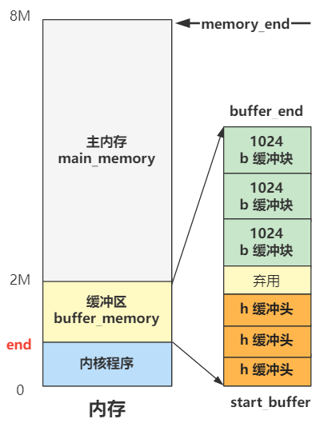

可以看到，其实这个 b 就代表缓冲块，h 代表缓冲头，一个从上往下，一个从下往上。

而且这个过程中，h 被附上了属性值，其中比较关键的是这个 buffer 所表示的数据部分 **b_data**，也就是指向了上面的缓冲块 b。

还有这个 buffer 的前后空闲 buffer 的指针 **b_prev_free** 和 **b_next_free**。

那画成图就是如下这样。

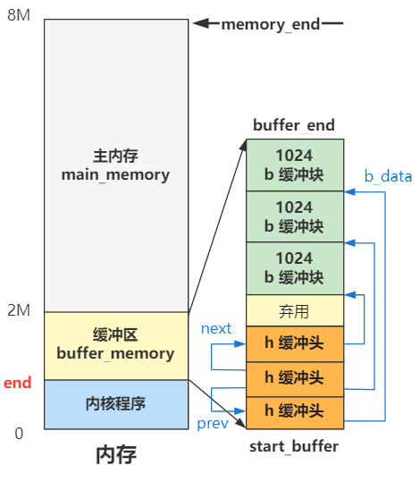

当缓冲头 h 的所有 next 和 prev 指针都指向彼此时，就构成了一个双向链表。继续看。

```c
void buffer_init(long buffer_end) {
    ...
    free_list = start_buffer;
    free_list->b_prev_free = h;
    h->b_next_free = free_list;
    ...
}
```

这三行代码，结合刚刚的双向链表 h，我画出图，你就懂了。

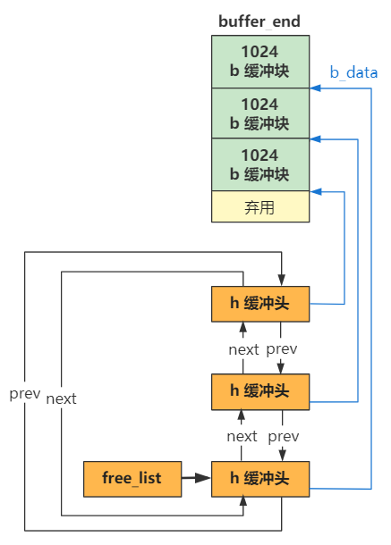

看，free_list 指向了缓冲头双向链表的第一个结构，然后就可以顺着这个结构，从双向链表中遍历到任何一个**缓冲头**结构了，而通过缓冲头又可以找到这个缓冲头对应的**缓冲块**。

简单说，**缓冲头就是具体缓冲块的管理结构，而 free_list 开头的双向链表又是缓冲头的管理结构**，整个管理体系就这样建立起来了。

现在，从 free_list 开始遍历，就可以找到这里的所有内容了。

不过，还有最后一个事，能帮助更好管理，往下看。

```c
void buffer_init(long buffer_end) {
    ...
    for (i=0;i<307;i++)
        hash_table[i]=NULL;
}
```

一个 307 大小的 **hash_table** 数组，这是干嘛的呢？

其实今天的这个代码在 **buffer.c** 中，而 buffer.c 是在 **fs** 包下的，也就是**文件系统**包下的。所以它今后是为文件系统而服务，具体是内核程序如果需要访问块设备中的数据，就都需要经过缓冲区来间接地操作。

也就是说，读取块设备的数据（硬盘中的数据），需要先读到缓冲区中，如果缓冲区已有了，就不用从块设备读取了，直接取走。

那怎么知道缓冲区已经有了要读取的块设备中的数据呢？从双向链表从头遍历当然可以，但是这效率可太低了。所以需要一个 hashmap 的结构方便快速查找，这就是 hash_table 这个数组的作用。

现在只是**初始化**这个 hash_table，还并没有哪个地方用到了它，所以我就先简单剧透下。

之后当要读取某个块设备上的数据时，首先要搜索相应的缓冲块，是下面这个函数。

```c
#define _hashfn(dev,block) (((unsigned)(dev^block))%307)
#define hash(dev,block) hash_table[_hashfn(dev,block)]

// 搜索合适的缓冲块 
struct buffer_head * getblk(int dev,int block) {
    ...
    struct buffer_head bh = get_hash_table(dev,block)；
    ...
}

struct buffer_head * get_hash_table(int dev, int block) {
    ...    
    find_buffer(dev,block);
    ...
}

static struct buffer_head * find_buffer(int dev, int block) { 
    ...     
    hash(dev,block);
    ...
}
```

一路跟下来发现，就是通过

**dev^block % 307**

即

**(设备号^逻辑块号) Mod 307**

找到在 hash_table 里的索引下标，接下来就和 Java 里的 HashMap 类似，如果哈希冲突就形成链表，画成图就是这样。

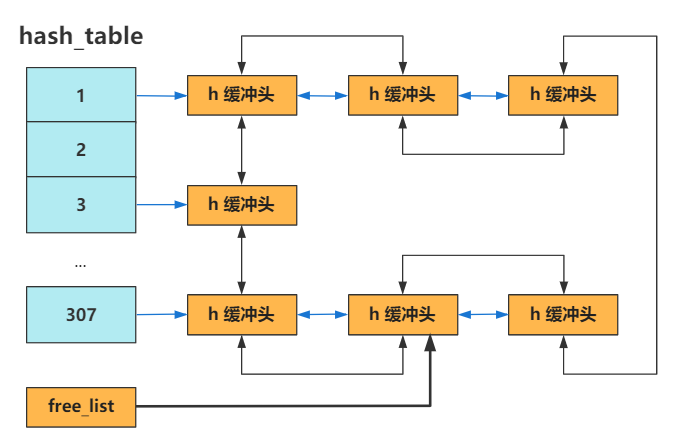

**哈希表 + 双向链表**，如果刷算法题多了，很容易想到这可以实现 **LRU 算法**，没错，之后的缓冲区使用和弃用，正是这个算法发挥了作用。

也就是之后在讲通过文件系统来读取硬盘文件时，都需要使用和弃用这个缓冲区里的内容，缓冲区即是用户进程的内存和硬盘之间的桥梁。

好了好了，再多说几句就把文件系统里读操作讲出来了，压力太大，本章还是主要就了解这个缓冲区的管理工作是如何初始化的，为后面做铺垫。

回过头来看看我们目前的进度吧！

```c
void main(void) {
    ...
    mem_init(main_memory_start,memory_end);
    trap_init();
    blk_dev_init();
    chr_dev_init();
    tty_init();
    time_init();
    sched_init();
    buffer_init(buffer_memory_end);
    hd_init();
    floppy_init();
    
    sti();
    move_to_user_mode();
    if (!fork()) {init();}
    for(;;) pause();
}
```

整个初始化的部分，就差 **hd_init** 和 **floppy_init** 这两个块设备的初始化还没讲了。

而且幸运的是，floppy_init 是软盘初始化，现在软盘几乎都被淘汰了，计算机中也没有软盘驱动器了，所以这个我们完全可以不看，那就剩下一个 **hd_init 硬盘初始化**了，非常简单！

还记得小时候我特别喜欢收集软盘，里面分门别类存上我做的 Flash 动画，然后在软盘上的那个纸标签上写上文字，表示软盘存了什么，想想看还是回忆呢。

扯远了。

之前的各种初始化工作所建立的数据结构，会在后面各个模块发挥最最核心的作用，**任何操作系统的管理都离不开这些初始化工作所建立的数据结构**，所以一定要把这些根基搭建好，别急别慌。

等初始化工作全部完成，我会专门用一回给大家梳理一下，大家就尽可能把初始化这一大部分的数据结构记在心里吧！

 
