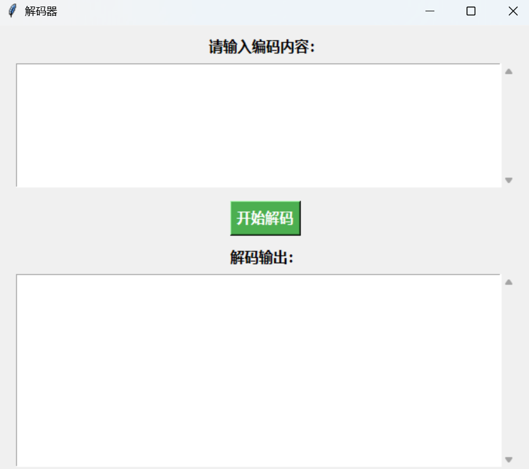
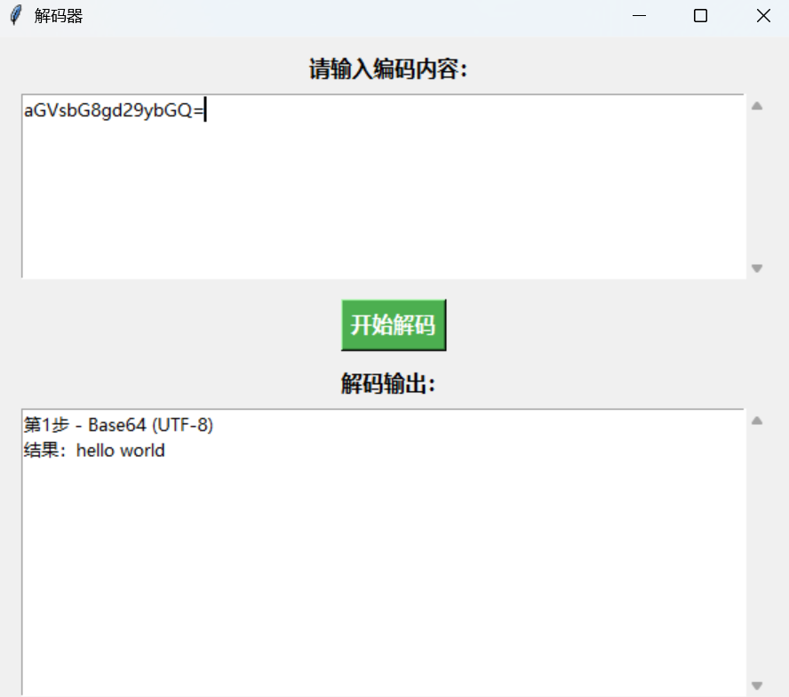
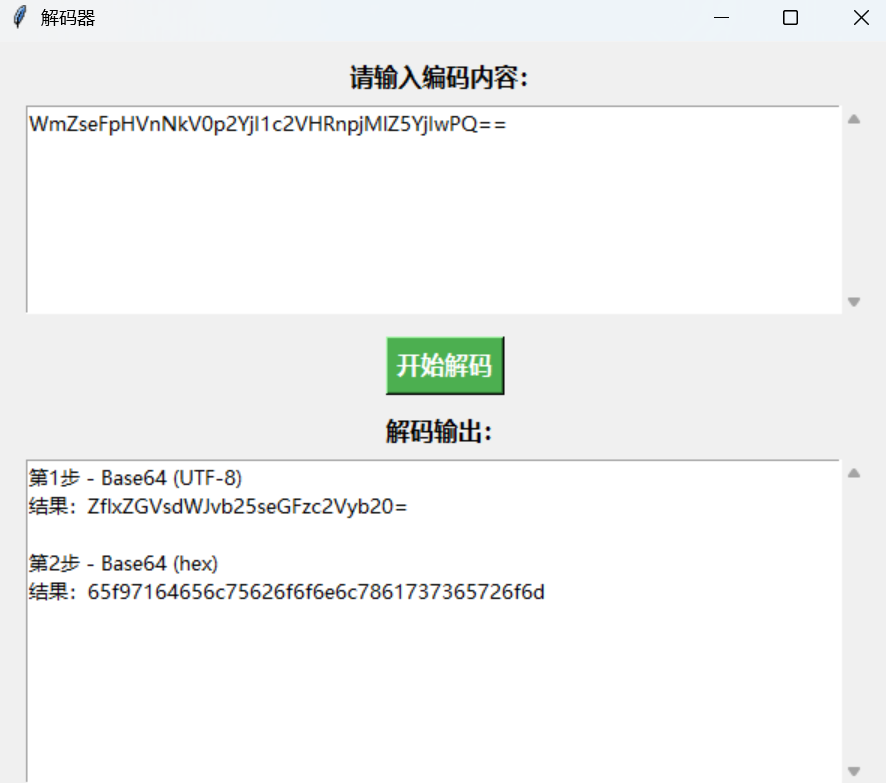

用Python写了一个自动解码的软件，可以自动进行多轮的base 32，58，64，91，二进制以及hex解码。

（后续可能会更新。）

## **效果**



如果可以成功解码成text，则直接输出text：



如果不能，则输出hex作为保底：




## **代码**

```python
import tkinter as tk
from tkinter import scrolledtext
import base64
import re
import base58
import base91


def is_binary(s):
    return all(c in '01' for c in s) and len(s) % 8 == 0


def decode_bytes(byte_data):
    try:
        text = byte_data.decode('utf-8')
        return text, True
    except UnicodeDecodeError:
        return byte_data.hex(), False


def looks_like_base64(s):
    return len(s) % 4 == 0 and re.fullmatch(r'[A-Za-z0-9+/=]+', s) is not None


def looks_like_base32(s):
    return len(s) % 8 == 0 and re.fullmatch(r'[A-Z2-7=]+', s, re.IGNORECASE) is not None


def looks_like_base58(s):
    return all(c in base58.alphabet.decode() for c in s)


def looks_like_base91(s):
    return all(33 <= ord(c) <= 126 for c in s)


def try_decode(s, func):
    decoded = func(s)
    return decode_bytes(decoded)


def recursive_decode(s, path=None, all_paths=None, max_depth=10):
    if path is None:
        path = []
    if all_paths is None:
        all_paths = []
    if len(path) >= max_depth:
        return all_paths

    decoders = [
        ('Base64', looks_like_base64, base64.b64decode),
        ('Base32', looks_like_base32, base64.b32decode),
        ('Base58', looks_like_base58, base58.b58decode),
        ('Base91', looks_like_base91, base91.decode),
        ('Binary', is_binary, lambda x: bytes(int(x[i:i+8], 2) for i in range(0, len(x), 8))),
        ('Hex', lambda x: True, lambda x: bytes.fromhex(x)),
    ]

    for name, detector, func in decoders:
        if detector(s):
            try:
                text, is_utf8 = try_decode(s, func)
            except Exception:
                continue
            mode = '(UTF-8)' if is_utf8 else '(hex)'
            new_path = path + [(name, text, mode)]
            all_paths.append(new_path)
            if is_utf8:
                recursive_decode(text, new_path, all_paths, max_depth)
    return all_paths


def select_final_path(paths):
    utf_paths = [p for p in paths if p[-1][2] == '(UTF-8)']
    if utf_paths:
        max_len = max(len(p) for p in utf_paths)
        for p in utf_paths:
            if len(p) == max_len:
                return p
    max_len = max(len(p) for p in paths)
    for p in paths:
        if len(p) == max_len:
            return p


def decode_input():
    raw = input_text.get('1.0', tk.END).strip().replace(' ', '')
    output_text.delete('1.0', tk.END)
    if not raw:
        return

    paths = recursive_decode(raw)
    if not paths:
        output_text.insert(tk.END, '无法识别或解码此内容。')
        return

    final = select_final_path(paths)
    for i, (name, text, mode) in enumerate(final, 1):
        output_text.insert(tk.END, f"第{i}步 - {name} {mode}\n结果：{text}\n\n")

    # 如果只有一步且为 UTF-8，但结果仍可能是编码串，则额外尝试一次解码并输出 hex
    if len(final) == 1 and final[0][2] == '(UTF-8)':
        s = final[0][1]
        extra_decoders = [
            ('Base64', looks_like_base64, base64.b64decode),
            ('Base32', looks_like_base32, base64.b32decode),
            ('Base58', looks_like_base58, base58.b58decode),
            ('Base91', looks_like_base91, base91.decode),
            ('Binary', is_binary, lambda x: bytes(int(x[i:i+8], 2) for i in range(0, len(x), 8)))
        ]
        for name, detector, func in extra_decoders:
            if detector(s):
                try:
                    data = func(s)
                    hex_out = data.hex()
                    output_text.insert(tk.END, f"第2步 - {name} (hex)\n结果：{hex_out}\n")
                    break
                except Exception:
                    continue

# GUI
root = tk.Tk()
root.title('解码器')
root.geometry('600x500')
font_title = ('微软雅黑', 12, 'bold')
font_text = ('微软雅黑', 10)

tk.Label(root, text='请输入编码内容：', font=font_title).pack(pady=(10,0))
input_text = scrolledtext.ScrolledText(root, height=6, font=font_text, wrap=tk.WORD)
input_text.pack(fill=tk.BOTH, padx=20, pady=5, expand=True)
tk.Button(root, text='开始解码', font=font_title, bg='#4CAF50', fg='white', command=decode_input).pack(pady=10)
tk.Label(root, text='解码输出：', font=font_title).pack()
output_text = scrolledtext.ScrolledText(root, height=10, font=font_text, wrap=tk.WORD)
output_text.pack(fill=tk.BOTH, padx=20, pady=5, expand=True)
root.mainloop()

```


## **打包**

可以用`pyinstaller`将这个程序打包成.exe软件。

如果没有安装，则运行：

```
pip install pyinstaller
```

安装好后运行（先将当前python脚本保存为`decoder.py`）：

```cmd
pyinstaller --noconfirm --windowed --onefile .\decoder.py
```

.exe文件应该会生成在当前目录下的：

```
dist/decoder.exe
```


## **测试**

随机生成一段进行过多轮base编码的内容：

```python
import base64
import base58
import random

text = "hello world"
data = text.encode('utf-8')

encodings = ['base64', 'base32', 'base58']

history = []

for i in range(10):
    encoding = random.choice(encodings)
    history.append(encoding)

    if encoding == 'base64':
        data = base64.b64encode(data)
    elif encoding == 'base32':
        data = base64.b32encode(data)
    elif encoding == 'base58':
        data = base58.b58encode(data)

print("Final encoded result:", data.decode('utf-8'))
print("Encoding history:", history)

# Final encoded result: VlRKek1WWldTbFphUmxwU1RWWktUVlJyVWt0U2JGRjRXa1ZXVm1FeVVsQlZha1pYVld4YVZsUnJUbFJoTUhCaFZtMXpkMlZzVWtkUmF6RlNWbTE0VmxWNlFYaFVSbHBYVVd0T1dGWnNXa1ZXTW5SUFUxWktObFpzYUZkV1YwNDJWbFJDVjFWRk5WZGhSVnBWVm14d1ZGWXhWWGhXTVZKV1YydG9WV0V3TlZaV1JFWmhVbFpLY2xac1pGWk5SRVpLVlcxd1MxTkdVbGRYYkZKVFZsUldVRlpGVmxOV1JsWnlWVmhzVldFelFsQlZiRkpUVjJ4VmVHSkZPVlZoTWxKSlZtcEdTMVV4Vm5KUFZtUlNUVVp3VTFZeFVrdFVRVDA5
# Encoding history: ['base64', 'base64', 'base32', 'base58', 'base58', 'base32', 'base64', 'base64', 'base64', 'base64']

```

程序的输出为：

```
第1步 - Base64 (UTF-8)
结果：VTJzMVZWSlZaRlpSTVZKTVRrUktSbFF4WkVWVmEyUlBVakZXVWxaVlRrTlRhMHBhVm1zd2VsUkdRazFSVm14VlV6QXhURlpXUWtOWFZsWkVWMnRPU1ZKNlZsaFdWV042VlRCV1VFNVdhRVpVVmxwVFYxVXhWMVJWV2toVWEwNVZWREZhUlZKclZsZFZNREZKVW1wS1NGUldXbFJTVlRWUFZFVlNWRlZyVVhsVWEzQlBVbFJTV2xVeGJFOVVhMlJJVmpGS1UxVnJPVmRSTUZwU1YxUktUQT09

第2步 - Base64 (UTF-8)
结果：U2s1VVJVZFZRMVJMTkRKRlQxZEVVa2RPUjFWUlZVTkNTa0paVmswelRGQk1RVmxVUzAxTFZWQkNXVlZEV2tOSVJ6VlhWVWN6VTBWUE5WaEZUVlpTV1UxV1RVWkhUa05VVDFaRVJrVldVMDFJUmpKSFRWWlRSVTVPVEVSVFVrUXlUa3BPUlRSWlUxbE9Ua2RIVjFKU1VrOVdRMFpSV1RKTA==

第3步 - Base64 (UTF-8)
结果：Sk5URUdVQ1RLNDJFT1dEUkdOR1VRVUNCSkJZVk0zTFBMQVlUS01LVVBCWVVDWkNIRzVXVUczU0VPNVhFTVZSWU1WTUZHTkNUT1ZERkVWU01IRjJHTVZTRU5OTERTUkQyTkpORTRZU1lOTkdHV1JSUk9WQ0ZRWTJL

第4步 - Base64 (UTF-8)
结果：JNTEGUCTK42EOWDRGNGUQUCBJBYVM3LPLAYTKMKUPBYUCZCHG5WUG3SEO5XEMVRYMVMFGNCTOVDFEVSMHF2GMVSENNLDSRD2NJNE4YSYNNGGWRRROVCFQY2K

第5步 - Base32 (UTF-8)
结果：KfCPSW4GXq3MHPAHqVmoX151TxqAdG7mCnDwnFV8eXS4SuFRVL9tfVDkV9DzjZNbXkLkF1uDXcJ

第6步 - Base58 (UTF-8)
结果：4npCTEQcUgxRUY2DRDCpq4jmaCGw8BXZ557XUXvaYf6cK63oEYV1SwW

第7步 - Base58 (UTF-8)
结果：LFKWIV3DGJFEQT2HMRVU22TMGVMWWZCSKBIT2PI=

第8步 - Base32 (UTF-8)
结果：YUdWc2JHOGdkMjl5YkdRPQ==

第9步 - Base64 (UTF-8)
结果：aGVsbG8gd29ybGQ=

第10步 - Base64 (UTF-8)
结果：hello world

```
